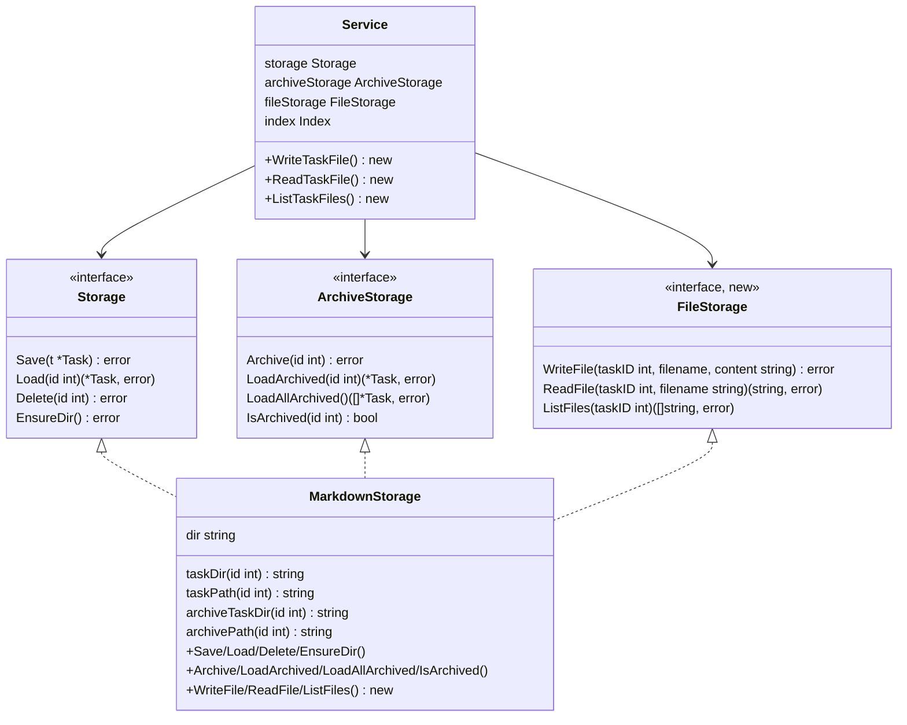
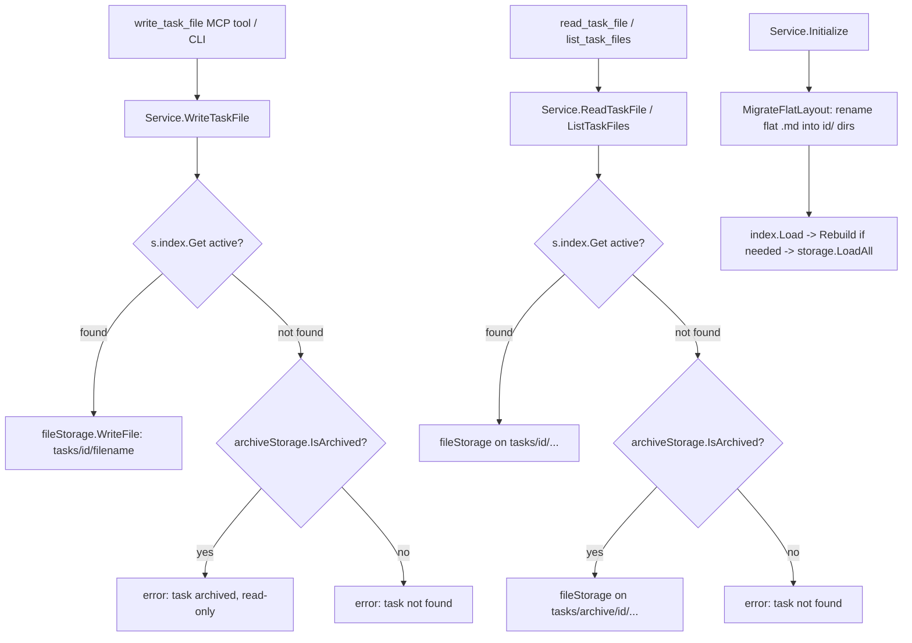
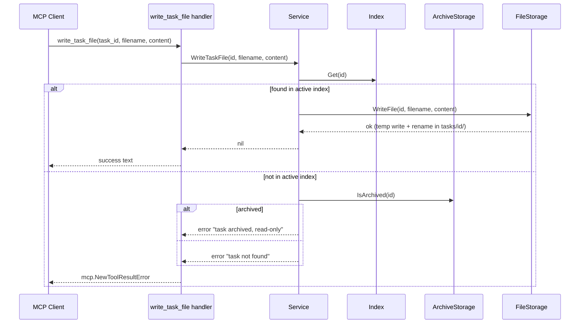
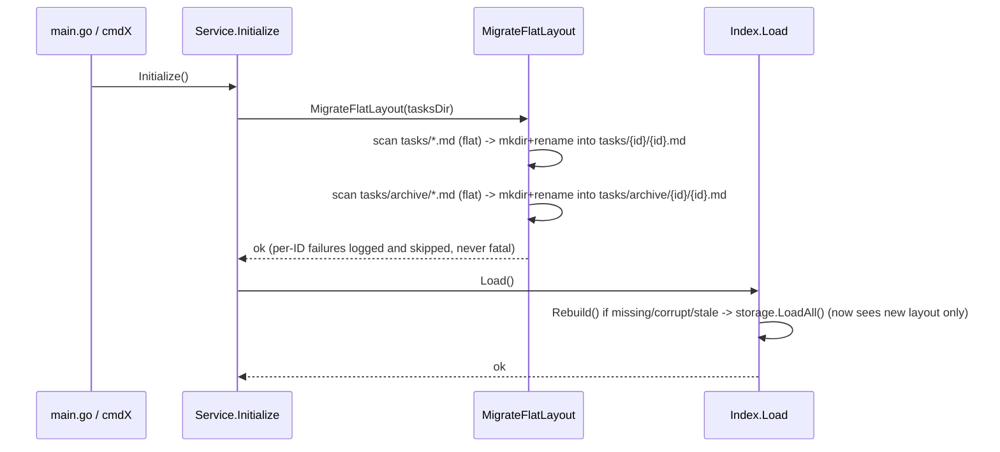

# Design: task-file-storage

### Design Summary

Two coupled changes, both confined almost entirely to `internal/storage/` and `internal/task/service.go`:

1. **Storage restructuring**: move task markdown files from flat `tasks/{id}.md` / `tasks/archive/{id}.md` to per-task directories `tasks/{id}/{id}.md` / `tasks/archive/{id}/{id}.md`. On startup, any task still found in the old flat layout is migrated in place, once, before the index loads.
2. **Attached files**: add `write_task_file`, `read_task_file`, `list_task_files` (MCP tools + CLI subcommands), backed by a new `FileStorage` interface that reads/writes/lists plain files inside a task's directory. Because attached files live in the same directory as `{id}.md`, `Archive`/`Delete` moving or removing that directory already carries them along — no new cascade code is needed for that part.

The two changes are ordered: restructuring must land first (attached files have nowhere per-task to live under the flat layout), then file-attachment tools build on top of the new directory shape.

### Current-State Evidence

- Flat layout, single file per task: `taskPath(id)` → `tasks/NNN.md`, `archivePath(id)` → `tasks/archive/NNN.md` — [markdown.go:33-35](internal/storage/markdown.go#L33-L35), [markdown.go:208-210](internal/storage/markdown.go#L208-L210).
- `Save`/`Load`/`Delete` operate on that single path — [markdown.go:38-92](internal/storage/markdown.go#L38-L92). Atomic write is `<path>.tmp` + `os.Rename` — [markdown.go:72-77](internal/storage/markdown.go#L72-L77).
- `LoadAll`/`LoadAllArchived` enumerate `s.dir` with `os.ReadDir` and explicitly skip directory entries (`entry.IsDir()`) — [markdown.go:95-127](internal/storage/markdown.go#L95-L127), [markdown.go:230-260](internal/storage/markdown.go#L230-L260). Under the new layout every task lives inside a directory, so this skip condition must invert to "descend one level into task-ID directories" instead of "skip directories."
- `NextID`/`maxMarkdownTaskID` derive the numeric ID by stripping `.md` off a **filename** and also skip directories — [markdown.go:268-307](internal/storage/markdown.go#L268-L307). Under the new layout the ID must come from the **directory name** instead.
- `Archive(id)` = `MkdirAll(tasks/archive/)` + `Rename(taskPath, archivePath)` — [markdown.go:212-219](internal/storage/markdown.go#L212-L219). This is the only "mkdir then move" precedent in the repo, and it moves a single file into a *shared* directory, not a task-specific one — under the new layout the equivalent is a directory rename (`tasks/{id}/` → `tasks/archive/{id}/`), a materially different (heavier, more failure-prone) operation with no rollback precedent to copy.
- Repo-wide grep confirms `taskPath`/`archivePath`/`%03d`/`.md"` construction is confined to `internal/storage/markdown.go` — no other package builds a task-ID path or touches the filesystem directly. This bounds the blast radius of the restructuring to that one file (+ its test file).
- `Storage`/`ArchiveStorage`/`Index` interfaces are declared in `internal/task/service.go:17-66`, not in a `storage` package file — `MarkdownStorage` is one concrete implementation injected into `Service` via `NewService` — [service.go:17-86](internal/task/service.go#L17-L86).
- `Service.Initialize()` is the single call reached by both the MCP server (`cmd/mcp-task-manager/main.go`, once at process start) and every CLI subcommand (`internal/cli/commands.go`'s `initServiceWithConfig`, once per invocation) before `s.index.Load()` runs — [service.go:102-116](internal/task/service.go#L102-L116). This is the only place a migration step can be inserted such that it always completes before any `LoadAll`/`Rebuild` call.
- `Index.Load()`/`Rebuild()`'s only filesystem dependency is `storage.LoadAll()` — [index.go references from research, not re-read here] — so index rebuild logic needs no changes itself, provided `LoadAll` is updated and migration runs strictly before `index.Load()`.
- No archived-task write guard exists anywhere: `Update`/`StartTask`/`CompleteTask` all call `s.Get(id)` ([service.go:178-190](internal/task/service.go#L178-L190)), which falls back to the archive on a miss — so today an update against an archived task ID may silently succeed against stale data rather than being rejected. This is a pre-existing gap, not introduced by this feature, but `write_task_file` needs its own explicit `archiveStorage.IsArchived(id)` guard rather than assuming `Get`'s behavior rejects archived writes.
- Concrete MCP tool template (schema + handler + error convention): `add_relation`/`remove_relation` — [relations.go:12-78](internal/tools/relations.go#L12-L78). Handler signature `func(svc *task.Service) server.ToolHandlerFunc`; errors always returned as `mcp.NewToolResultError(err.Error()), nil`, never a Go `error`.
- Read-tool guard pattern: `svc.EnsureProjectExists()` before reads — [management.go:169-171](internal/tools/management.go#L169-L171).
- `Config` has no file-size/name-limit fields today — [config.go:16-23](internal/config/config.go#L16-L23) — confirming there's no existing precedent to extend for file-attachment limits; this design adds none (see Non-Goals).
- Real on-disk state: 87 archived files, all `NNN.md`, one ID gap (071/072 missing, deleted not archived), all committed to git (only `.index.json` is gitignored) — meaning a migration bug is recoverable via `git checkout` in the worst case.
- `docs/plans/2026-03-13-task-archiving-design.md` establishes this repo's own "Changes by Area" convention for design docs, reused below in File Impact Map.

### Proposed Architecture

**1. Path layer (`internal/storage/markdown.go`)**

Replace the two path helpers so every task ID maps to a directory, not a bare file:

- `taskDir(id) = tasks/{id}/`, `taskPath(id) = tasks/{id}/{id}.md`
- `archiveTaskDir(id) = tasks/archive/{id}/`, `archivePath(id) = tasks/archive/{id}/{id}.md`

`{id}` uses the same zero-padded `%03d` form as today (no change to the ID's textual representation — only where it appears: as a directory name in addition to a filename stem). This keeps `{id}.md`'s own content format, atomic-write mechanics (`.tmp` + rename within the same directory), and YAML frontmatter completely untouched.

- `Save`: `MkdirAll(taskDir(id))` before the existing temp-write+rename (creating the per-task directory on first write, mirroring how `EnsureDir` already creates `s.dir` lazily).
- `Load`/`Delete`: read/remove `taskPath(id)` unchanged in spirit, just at the new location. `Delete` removes the file; since attached files live in the same directory, deleting the *task* must remove the whole `taskDir(id)` (see below), not just the `.md` file, so `Delete` becomes `os.RemoveAll(taskDir(id))`.
- `LoadAll`/`LoadAllArchived`: enumerate directory entries where `entry.IsDir()` **and** the name parses as a positive integer; for each, read `{dir}/{name}/{name}.md`. Skip (don't fail) entries that don't parse as an ID or whose expected `.md` file is missing — mirrors today's tolerant "skip and continue on parse error" style ([markdown.go:119-122](internal/storage/markdown.go#L119-L122)).
- `NextID`/`maxMarkdownTaskID`: derive the max ID from **directory names** instead of filenames (`entry.IsDir()` becomes the required condition, and the name itself — no `.md` suffix — is parsed as the integer).
- `Archive(id)`: becomes `MkdirAll(tasks/archive/)` + `os.Rename(taskDir(id), archiveTaskDir(id))` — a single directory rename, which atomically carries any attached files along for free. This is the key simplification the per-directory layout buys: no explicit "move attached files" cascade code is needed anywhere.

**2. Migration (new, e.g. `internal/storage/migrate.go`)**

A single function, `MigrateFlatLayout(dir string) error`, called from `Service.Initialize()` immediately before `s.index.Load()`:

- Scan `dir` (and `dir/archive`) with `os.ReadDir` for entries that are **files** (not directories) matching `^\d+\.md$` — this is exactly the old `LoadAll` skip-condition, inverted, so it only ever matches genuinely old-format files and never touches anything already migrated.
- For each match with numeric id `N`: `MkdirAll(dir/N)` (or `dir/archive/N`), then `os.Rename(oldFlatPath, dir/N/N.md)` (or the archive equivalent).
- Idempotent by construction: after a match is migrated, the flat file no longer exists, so a re-run finds nothing to do for that ID. A crash between `MkdirAll` and `Rename` leaves an empty `{id}/` directory and the original flat file both present — the next startup's scan still finds the flat file (its existence is the only trigger condition) and just re-runs the same `MkdirAll` (no-op, directory exists) + `Rename` for that ID, self-healing without special-casing "directory already exists."
- Collision case (a stray `tasks/{id}/` already exists with unexpected content while `tasks/{id}.md` also exists): `os.Rename` of the flat file into that directory does not fail merely because the directory exists — it only fails if the destination path `dir/N/N.md` is itself an existing non-empty conflict (e.g. a directory at that exact path). **Resolved**: on a per-ID migration failure, `MigrateFlatLayout` logs the error (`log.Printf`, mirroring `RunAutoArchive`'s existing per-item-tolerant pattern at [service.go:644-658](internal/task/service.go#L644-L658)) and continues migrating the remaining IDs rather than aborting startup. The offending task stays in its old flat-file location — invisible to `LoadAll` until fixed manually — but the server/CLI still starts and every other task remains usable. Given the confirmed real-world state has no such anomalies, this path is defensive-only today.
- No new "migration marker" or lock file: consistent with the codebase's existing no-locking, single-process MVP assumption, and consistent with the only existing migration precedent (index rebuild-on-unmarshal-failure), which is also marker-free and relies purely on re-derivable source-of-truth state.

**3. Attached files (`FileStorage`, new interface + `MarkdownFileStorage` implementation)**

A new interface declared alongside `Storage`/`ArchiveStorage` in `internal/task/service.go`, mirroring the existing "one interface per storage concern" convention:

```go
type FileStorage interface {
    WriteFile(taskID int, filename, content string) error
    ReadFile(taskID int, filename string) (string, error)
    ListFiles(taskID int) ([]string, error)
}
```

Implementation (`internal/storage/files.go`, new file) resolves `taskDir(id)`/`archiveTaskDir(id)` the same way `MarkdownStorage` does (reusing its path helpers — `FileStorage` and `MarkdownStorage` share the same `dir` root and are natural methods on the *same* `MarkdownStorage` struct rather than a separate type, since they address the same directory and there's no independent lifecycle to justify a second struct):
- `WriteFile`: atomic temp-write + rename within `taskDir(id)`, identical pattern to `Save`. Refuses (returns an error) if `{id}.md` itself is the requested filename, or if `filename` contains a path separator / `..` (directory traversal guard — the one validation this design does add, since `filename` is caller-controlled and used directly in a path join).
- `ReadFile`: plain `os.ReadFile(taskDir(id)/filename)`, clear "file not found" error distinguished from "task not found" (check task existence first via the existing `Get`-style lookup at the service layer, then read the specific file).
- `ListFiles`: `os.ReadDir(taskDir(id))`, return names excluding `{id}.md` itself.

At the `Service` layer (`internal/task/service.go`), three new methods parallel the shape of existing operations:

- `Service.WriteTaskFile(taskID int, filename, content string) error` — looks up the task via `s.index.Get(taskID)` (active only, **not** `s.Get` which falls back to archive); if not found in the active index, checks `archiveStorage.IsArchived(taskID)` to produce a clear "task is archived, files are read-only" error distinct from "task not found" (this is the new, explicit archived-write guard flagged as missing in research — introduced here rather than reusing any existing mechanism, because none exists).
- `Service.ReadTaskFile(taskID int, filename string) (string, error)` — uses `s.Get(taskID)` (archive-fallback allowed, matching the existing "reads work on archived tasks" rule), then delegates to `fileStorage.ReadFile`, resolving whether to read from the active or archive directory based on `archiveStorage.IsArchived(taskID)`.
- `Service.ListTaskFiles(taskID int) ([]string, error)` — same archive-aware resolution as `ReadTaskFile`.

**Resolved — `NewService` signature**: `NewService` gains a new positional parameter, `fileStorage FileStorage`, inserted after `archiveStorage` — matching the constructor's existing positional-parameter style (this codebase has no options/builder pattern anywhere). Both call sites, `cmd/mcp-task-manager/main.go` and `internal/cli/commands.go`'s `initServiceWithConfig`, are updated in lockstep, exactly as when `archiveStorage` itself was added alongside `storage`.

**Why not persist a file list in the index or frontmatter**: `IndexEntry` stores no path information today (paths are always re-derived from the ID at read time), and file names are content-bearing, not small reference-like values comparable to `Relation`. Listing is a cheap `os.ReadDir` per call (single directory, no recursion), consistent with how `LoadArchived`/`ListArchived` already accept an O(files) scan rather than maintaining a second index. This keeps `FileStorage` fully decoupled from `Index`/`IndexEntry` — no index schema change, no rebuild-path change.

**4. MCP tools (new `internal/tools/files.go`, registered as a fourth `registerFileTools` call from `tools.Register`)**

Three tools, following the `add_relation`/`remove_relation` template exactly (schema via `mcp.NewTool` + `mcp.With*`, handler `func(svc *task.Service) server.ToolHandlerFunc`, errors via `mcp.NewToolResultError`):

- `write_task_file(task_id, filename, content)` — required task_id (number), filename (string), content (string).
- `read_task_file(task_id, filename)` — required task_id, filename; read-only, so calls `svc.EnsureProjectExists()` first, matching `getTaskHandler`'s guard.
- `list_task_files(task_id)` — required task_id; same read guard.

**5. CLI (`internal/cli/cli.go` + `commands.go` + `output.go`)**

Three new subcommands (`write-task-file`, `read-task-file`, `list-task-files`) following the existing flaggy-subcommand + `cmdX` + formatter three-part split used by every other command (e.g. `archive`/`cmdArchive`).

- **Resolved — none of the three new subcommands take a `--json` flag.** Every existing subcommand's `--json` mode earns its keep because the underlying data is genuinely structured (a task has `id`/`title`/`status`/`priority`/... fields, and JSON vs. table/text are two real, different renderings of the same structured value). File content and a list of filenames don't have that property: `read-task-file`'s output is a single opaque string, and `list-task-files`' JSON form (`["a.md","b.md"]`) is not meaningfully different from its plain form (one name per line) — a `--json` mode there would just be a second, redundant serialization of the exact same flat data, not a real alternative shape. So all three commands are plain-text-only, unconditionally:
  - `write-task-file` prints a plain success message (`Wrote file "notes.md" to task #12.`), no JSON variant.
  - `read-task-file` prints the file's exact raw content to stdout, nothing else.
  - `list-task-files` prints one filename per line (matching how multi-value plain-text output already looks elsewhere in this CLI, e.g. blocked-by listings), nothing else.
  This is a deliberate, scoped exception to the otherwise-universal `jsonOutput bool` convention every other subcommand follows — their `cmdX` functions simply don't take a `jsonOutput` parameter at all, and their `flaggy` definitions don't register a `--json` flag.

### Context Diagram

```mermaid
graph LR
    subgraph Entry Points
        MCP[MCP Server main.go]
        CLI[CLI commands.go]
    end
    subgraph Service Layer
        SVC[task.Service]
    end
    subgraph Storage Layer
        MS[MarkdownStorage
        taskDir/archiveTaskDir]
        FS[FileStorage
        same dir root]
        IDX[Index / .index.json]
        MIG[MigrateFlatLayout]
    end
    subgraph Disk
        ACTIVE[tasks/{id}/{id}.md
        + attached files]
        ARCHIVE[tasks/archive/{id}/{id}.md
        + attached files]
    end

    MCP --> SVC
    CLI --> SVC
    SVC -->|Save/Load/Delete/Archive| MS
    SVC -->|WriteFile/ReadFile/ListFiles| FS
    SVC -->|Load/Set/Delete/Rebuild| IDX
    SVC -->|Initialize, before index.Load| MIG
    MIG --> ACTIVE
    MIG --> ARCHIVE
    MS --> ACTIVE
    MS --> ARCHIVE
    FS --> ACTIVE
    FS --> ARCHIVE
    IDX -->|Rebuild calls LoadAll| MS
```

### Structure Diagram



`MarkdownStorage` implements all three interfaces from one struct (same `dir` field, same path helpers) — no new type is introduced, avoiding an artificial split between "task file storage" and "attached file storage" that would otherwise need to agree on the same directory-naming logic twice.

### Data Flow Diagram



### Sequence Diagram





### ADR

- **Title**: Per-task directory layout with attached files sharing the task's directory
- **Status**: Proposed
- **Date**: 2026-09-05
- **Context**: Tasks need to support zero or more free-form named text files (research notes, design docs) attached over their lifetime, discoverable and read/writable by an agent, and required to move/delete together with the task on archive/delete — consistent with the existing relation-cleanup cascade philosophy. The current storage is strictly one flat `.md` file per task with no room for sibling artifacts.
- **Decision**: Restructure storage to `tasks/{id}/{id}.md` (and `tasks/archive/{id}/{id}.md`), and place attached files as sibling files inside that same per-task directory. Archive/Delete operate on the whole directory (`os.Rename`/`os.RemoveAll`) rather than a single file, so attached-file cascade behavior falls out of the existing archive/delete code paths for free rather than requiring new, separately-invoked cascade logic. Migrate old flat-layout tasks automatically inside `Service.Initialize()`, before `index.Load()`, using file-existence (not a version marker) as the sole migration trigger — mirroring the codebase's only existing migration precedent (index rebuild-on-unmarshal-failure), which is also trigger-by-detection rather than explicit versioning. A per-task migration failure is logged and skipped, not treated as fatal — matching `RunAutoArchive`'s existing tolerance for per-item failures during a bulk operation — so one bad task can never block the whole server/CLI from starting.
- **Consequences**:
  - Archive/Delete become directory-level filesystem operations (`Rename`/`RemoveAll` on a directory) instead of single-file operations — new failure modes (partial rename, non-empty-directory edge cases) that the flat layout never had, with no existing rollback precedent in this codebase to copy from.
  - `LoadAll`/`LoadAllArchived`/`NextID` all change their directory-enumeration logic (skip condition inverts from "skip dirs" to "descend into ID-named dirs"); this is the single largest code-shape change and is fully contained to `internal/storage/markdown.go`.
  - Six hardcoded flat-path assertions in `internal/storage/storage_test.go` must be rewritten to the new nested paths.
  - Every one of CLAUDE.md/AGENTS.md's five layout-describing lines (and README's three) needs updating; CLAUDE.md and AGENTS.md remain byte-identical and must be edited in lockstep.
  - `FileStorage` needs no config additions (no size/name limits) — keeping `Config`'s existing scope (task/relation/archive only) unchanged.
  - The three new CLI subcommands break the otherwise-universal `--json` convention (every existing subcommand accepts it) — a deliberate, scoped exception, since file content and filename lists have no structured shape for JSON to meaningfully re-render; this is the first precedent in the codebase for a subcommand without `--json`, worth noting if a future contributor assumes the flag is unconditional.
  - Startup gets strictly more expensive on first run after upgrade (one-time `os.Rename` per existing task, ~87 in the real repo today) but is a no-op on every subsequent run once migration completes, since the trigger condition (a flat `.md` file existing) no longer holds.
- **Alternatives Rejected**:
  - *Keep flat `.md` files, store attached files in a separate parallel tree keyed by task ID (e.g. `tasks/files/{id}/{filename}`)* — rejected because it reintroduces exactly the kind of explicit cascade code (move/delete attached files as a second step alongside the `.md` file move/delete) that the acceptance criteria explicitly want to avoid ("naturally carries attached files along... replaces/simplifies the need for separate cascade logic"), and doubles the number of places archive/delete must touch.
  - *Store attached-file content inside the task's YAML frontmatter or as base64 blobs in `.index.json`* — rejected: files are open-ended, potentially large free text (research/design docs), unlike the small reference-shaped `Relation` struct; embedding them would bloat the index (which is meant to stay a lightweight, rebuildable metadata cache) and complicate the existing rebuild-from-`.md`-files self-healing story.
  - *Version-marker-based migration (e.g. a `.migrated` sentinel file or a schema-version field)* — rejected in favor of pure file-existence detection, matching the only precedent in this codebase (index rebuild-on-unmarshal-failure) and avoiding introducing a wholly new "versioned migration" concept for a one-time, self-terminating transformation.
  - *Separate `FileAttachmentStorage` struct independent of `MarkdownStorage`* — rejected: both need the identical `taskDir(id)`/`archiveTaskDir(id)` resolution logic and the same archived-vs-active directory choice; a second struct would either duplicate that logic or need to depend on the first, with no independent lifecycle or construction parameters to justify the split.

### Risk Analysis

- **Correctness — migration collision**: a pre-existing stray `tasks/{id}/` directory with unexpected content colliding with a to-be-migrated flat `tasks/{id}.md`. Mitigated by logging the failure for that one ID and skipping it (startup continues, that task simply stays un-migrated and temporarily invisible to `LoadAll` until fixed manually); confirmed absent in the real current dataset, so this is a defensive-only concern, not a known live bug.
- **Correctness — interrupted migration**: crash between `MkdirAll` and `Rename` for a given ID. Mitigated by design: the migration trigger is "flat file still exists," which remains true after a crash at that point, so the next startup naturally retries that exact ID with an idempotent `MkdirAll` (no-op) + `Rename`.
- **Lifecycle/ordering — migration vs. index load**: if migration ran *after* (or concurrently with) `index.Load()`/`Rebuild()`, a rebuild could scan a partially-migrated tree and silently miss tasks. Mitigated by placing the migration call at the top of `Service.Initialize()`, strictly before `s.index.Load()` — the one call path both the MCP server and every CLI invocation always go through first.
- **Lifecycle/ordering — archived-task write guard**: `write_task_file` must not silently succeed against an archived task via `Get`'s existing archive-fallback. Mitigated by having `Service.WriteTaskFile` check `s.index.Get` (active-only) directly rather than `s.Get` (which falls back to archive), with an explicit `IsArchived` check to produce the correct error message.
- **Performance**: migration is O(existing task count) one-time file renames on first startup after upgrade (~87 in the real repo) — negligible, and zero-cost on every subsequent startup. `ListFiles`/attached-file reads are O(files in one task's directory), consistent with existing O(files-in-directory) costs already accepted for `LoadAll`/`LoadAllArchived`.
- **Compatibility**: `IndexEntry`/`.index.json` schema is unchanged (no path or file-list field added), so no index-format migration is needed beyond the existing rebuild-on-any-inconsistency behavior. File paths are never part of this project's public surface (MCP tools and CLI subcommands only ever take a task `id`, never a filesystem path — confirmed by the tool/CLI schemas above), so there is no code-level compatibility concern here at all; see Open Questions for the one residual caveat (out-of-repo scripts poking at `tasks/` directly).
- **Codegen**: none — this project has no code-generation step to consider.

### Testing Strategy

- **`internal/storage/storage_test.go`** (extend existing real-filesystem, `t.TempDir()`-based tests):
  - Update the six hardcoded flat-path assertions (`storage_test.go:38,1511,1642,2097,2107,2112` per research) to the new `tasks/{id}/{id}.md` / `tasks/archive/{id}/{id}.md` shapes.
  - New: `TestMarkdownStorage_SaveCreatesTaskDir`, `TestMarkdownStorage_LoadAll_NestedLayout`, `TestMarkdownStorage_NextID_NestedLayout`, `TestMarkdownStorage_Archive_MovesWholeDirectory` (asserting an attached file placed alongside `{id}.md` survives the archive rename), `TestMarkdownStorage_Delete_RemovesWholeDirectory`.
  - New file, `internal/storage/migrate_test.go`: `TestMigrateFlatLayout_ActiveAndArchived`, `TestMigrateFlatLayout_Idempotent` (run twice, second run is a no-op), `TestMigrateFlatLayout_PreservesContent` (byte-for-byte body/frontmatter equality before/after), `TestMigrateFlatLayout_NoFlatFiles_NoOp`.
  - New: `TestMarkdownStorage_WriteFile/ReadFile/ListFiles` — basic round-trip, overwrite semantics, filename-traversal rejection (`../`, absolute paths, path separators), "file not found" vs "task not found" error distinction.
- **`internal/task/service_test.go`** (extend existing mock-based tests, following `newServiceWithArchive` convention):
  - `TestService_WriteTaskFile_ActiveTask`, `TestService_WriteTaskFile_RejectsArchivedTask`, `TestService_WriteTaskFile_RejectsUnknownTask`.
  - `TestService_ReadTaskFile_ActiveAndArchived`, `TestService_ListTaskFiles_ActiveAndArchived`.
  - Extend `TestService_ArchiveTask_*` and `TestService_Delete_*` with an "attached file present" variant asserting the mock file storage sees no separate move/delete call (since the directory-move already handles it) — or, if `FileStorage` is mocked independently of `Storage`/`ArchiveStorage`, assert it is untouched during `ArchiveTask`/`Delete` (proving the "no cascade code needed" design claim).
- **`internal/tools/tools_test.go`**: schema-shape assertions for `write_task_file`/`read_task_file`/`list_task_files` (required params, no enum needed), following `TestRegisterDocumentsAllowedTypeValues`'s existing style.
- **`internal/cli/cli_test.go`**: `TestWriteTaskFileCommand`/`TestReadTaskFileCommand`/`TestListTaskFilesCommand`, following the `t.TempDir()` + `MCP_TASKS_DIR` + `RunWithArgs` pattern used by `TestArchiveCommand`. No JSON-output variants — these three commands have no `--json` flag (see Proposed Architecture §5).
- **Manual validation**: run the CLI against the real `tasks/` directory (or a copy of it) once, post-migration, and spot-check a handful of the 87 real archived tasks resolve correctly via `get --archived` / `list --archived`, confirming migration didn't corrupt real production data. Since all 87 files are git-tracked, this can be done safely against a throwaway branch/copy with `git checkout` as a fallback.

### Codegen Impact

Not applicable — this project has no code-generation step.

### File Impact Map

**`config/config.go`** — no changes (no new config surface for this feature).

**`storage/markdown.go`**
- Replace `taskPath`/`archivePath` with directory-aware `taskDir`/`taskPath`/`archiveTaskDir`/`archivePath`.
- `Save`: add `MkdirAll(taskDir(id))` before the existing temp-write+rename.
- `Delete`: `os.RemoveAll(taskDir(id))` instead of `os.Remove(taskPath(id))`.
- `LoadAll`/`LoadAllArchived`: invert the `entry.IsDir()` skip to descend into ID-named directories and read `{id}/{id}.md`.
- `Archive`: `os.Rename(taskDir(id), archiveTaskDir(id))` instead of a single-file rename.
- `NextID`/`maxMarkdownTaskID`: derive max ID from directory names, not filenames.

**`storage/files.go`** (new)
- `MarkdownStorage` methods: `WriteFile`, `ReadFile`, `ListFiles` (implementing the new `FileStorage` interface), reusing `taskDir`/`archiveTaskDir`.

**`storage/migrate.go`** (new)
- `MigrateFlatLayout(dir string) error` — detects and migrates old flat `{id}.md` files (active + archive) into the new per-directory layout.

**`task/service.go`**
- New `FileStorage` interface declaration (alongside `Storage`/`ArchiveStorage`).
- `Service` gains a `fileStorage FileStorage` field; `NewService` gains a parameter (or a new constructor variant, matching how `archiveStorage` was added).
- New methods: `WriteTaskFile`, `ReadTaskFile`, `ListTaskFiles`.
- `Initialize()`: call `MigrateFlatLayout` before `s.index.Load()`.

**`tools/files.go`** (new)
- `registerFileTools(s, svc)` registering `write_task_file`/`read_task_file`/`list_task_files`, following `relations.go`'s template.

**`tools/tools.go`**
- `Register` gains a fourth call to `registerFileTools`.

**`cli/cli.go`**
- Three new `flaggy.NewSubcommand` blocks (`write-task-file`, `read-task-file`, `list-task-files`) + dispatch branches in `RunWithArgs`. None register a `--json` flag (see CLI section of Proposed Architecture).

**`cli/commands.go`**
- Three new `cmdX` functions, structurally similar to `cmdArchive`/`cmdDelete` but each without a `jsonOutput` parameter (see below) — plain-text-only by design.

**`cli/output.go`**
- No changes. All three new commands write plain text directly in their `cmdX` function; there is no JSON rendering path to add, and no call to `FormatJSON`/`FormatJSONMessage` for any of them.

**`cmd/mcp-task-manager/main.go`**
- Construct the file-storage dependency (or confirm `MarkdownStorage` alone suffices since it implements `FileStorage` too) and thread it into `task.NewService(...)`.

**`internal/storage/storage_test.go`, `internal/storage/migrate_test.go` (new), `internal/task/service_test.go`, `internal/tools/tools_test.go`, `internal/cli/cli_test.go`** — per Testing Strategy above.

**`CLAUDE.md`, `AGENTS.md`** (identical, edit both)
- Architecture diagram (`./tasks/*.md` → `./tasks/{id}/{id}.md`), Storage bullets, Task Identification filename description, Archiving → Storage bullet, `archive_task` tool table row, MCP Tools table (add `write_task_file`/`read_task_file`/`list_task_files` under a new "Attached Files" section), Project Structure tree if it shows `tasks/` shape.

**`README.md`**
- Intro sentence and "Markdown-based storage" bullet, Project Structure ASCII tree, CLI command table (already missing `archive` — fix in the same pass since this feature's CLI additions make the drift worse if left uncorrected), MCP tool table.

**`docs/plans/`**
- No changes to historical entries (`2026-03-13-task-archiving-design.md` etc.) per repo convention of not retroactively editing past design docs; this design itself may later be copied into `docs/plans/YYYY-MM-DD-task-file-storage-design.md` at implementation time, following the existing naming convention, distinct from this `.tasks/task-file-storage/design.md` working artifact.

### Open Questions

The four questions from earlier drafts are resolved and already folded into the sections above (migration failures are logged-and-skipped per §Proposed Architecture/2 and Risk Analysis; `NewService` takes a new positional `fileStorage` parameter per §Proposed Architecture/3; external-tooling path assumptions have no code impact per Risk Analysis/Compatibility; none of the three CLI subcommands take `--json` per §Proposed Architecture/5). Two new, smaller questions fell out of that last decision and remain open:

1. **Empty-result convention for `list_task_files`/`list-task-files`.** Existing "list" surfaces special-case the empty result rather than returning bare emptiness: `listTasksHandler` returns the plain text `"No tasks found"` instead of `[]`, and `list_tasks(archived: true)` does the same for `"No archived tasks found"` ([management.go:286-288,326](internal/tools/management.go#L286-L288)). Should the MCP `list_task_files` tool follow that same convention (`"No files attached to task N"` instead of an empty JSON array), and should the CLI's plain-text `list-task-files` print an explicit "no files" line or simply produce empty output? Left for implementation-phase judgment, but should be decided before writing the handler, not during.
2. **Filename validation strictness.** The design commits to rejecting path separators, `..`, and the reserved `{id}.md` name (§Proposed Architecture/3), but leaves unresolved whether to also reject: an empty/whitespace-only filename, leading dots (hidden files), or names that collide only under case-insensitive filesystems (e.g. `Notes.md` vs `notes.md` on macOS/Windows, relevant since this repo is actively developed on macOS). None of these are exercised by any existing test or convention in this codebase, so there's no precedent to fall back on — needs an explicit decision before implementation.
