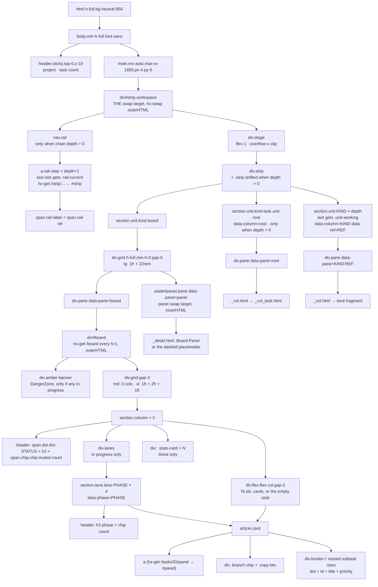
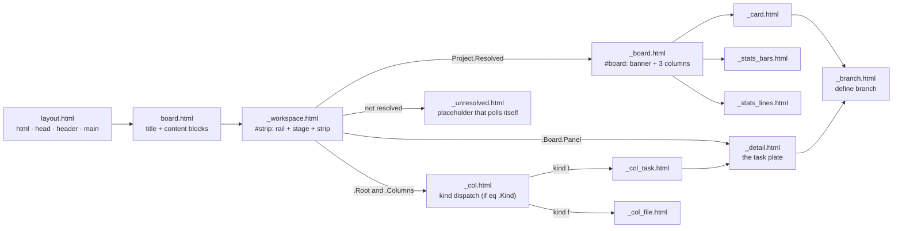
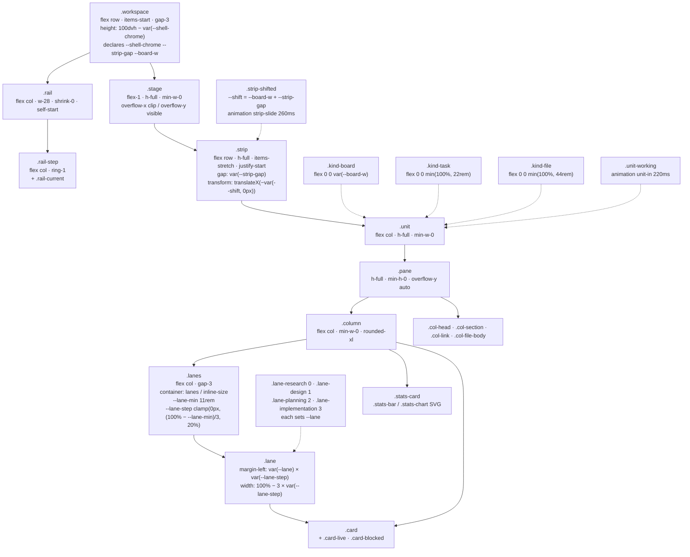
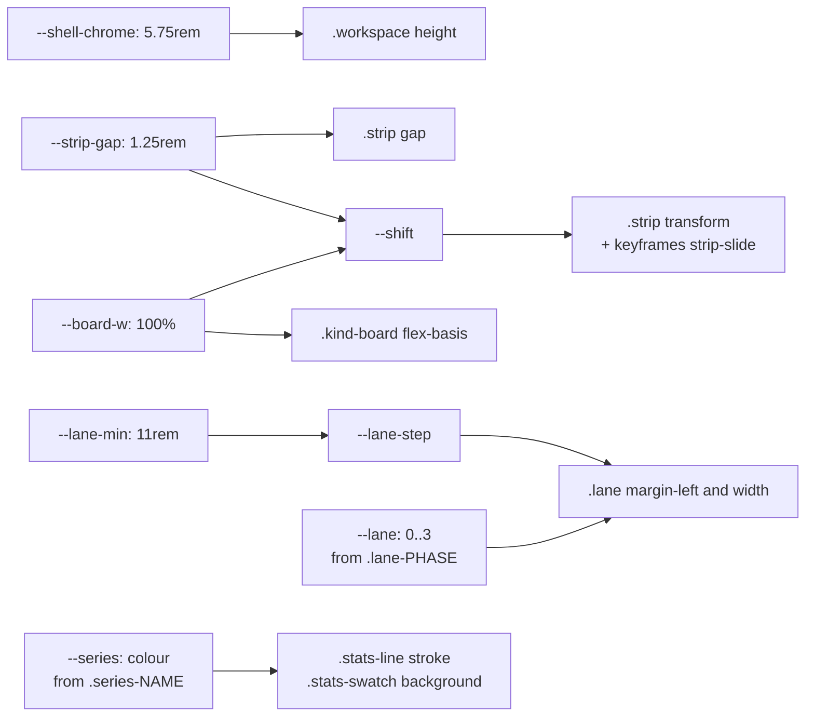
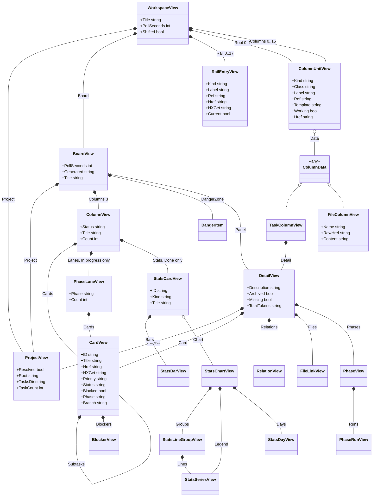
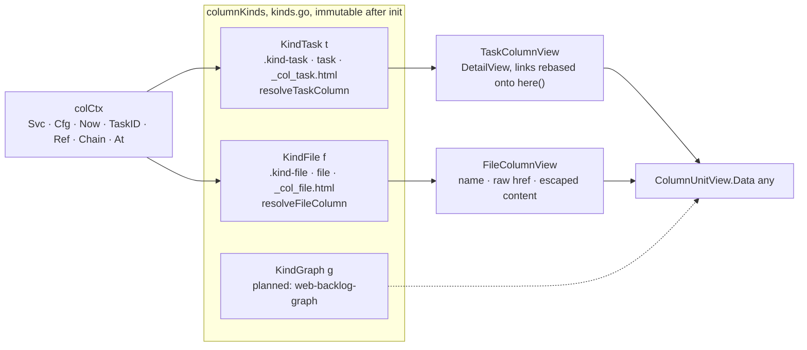
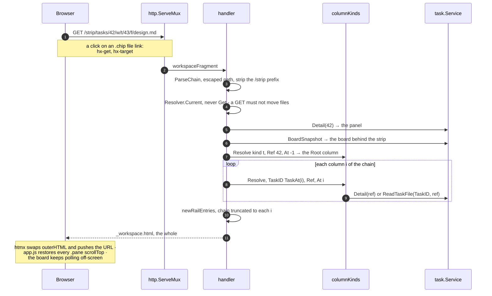

# Task workspace: how the page is put together

How the dashboard's workspace page is composed — the DOM, the template graph,
the CSS boxes that make the grid, and the Go view types behind them. Source of
truth is the code: `internal/web/templates/`, `internal/web/assets/input.css`,
`internal/web/{view,chain,kinds,handlers}.go`. Diagrams are Mermaid.

The workspace has one page template (`board.html`) and one swap target
(`#strip`). Every state — the bare board, a task's panel, a chain of open
columns — is that same page, so a URL never switches surface.

---

## 1. The page, as a picture

### Depth 0 — `/` or `/tasks/{id}`

No rail, no shift. The board is the strip's only unit and fills the stage; the
side panel is the right half of the board unit's own grid.

```
┌ header.sticky ────────────────────────────────────────────────────────┐
│ Task board    .tasks                            read-only · N tasks  │
└───────────────────────────────────────────────────────────────────────┘
main.mx-auto.max-w-1600
┌ #strip.workspace ────────────── height: 100dvh − var(--shell-chrome) ─┐
│ ┌ .stage  (flex-1, overflow-x: clip) ───────────────────────────────┐ │
│ │ ┌ .strip  (flex row, gap var(--strip-gap)) ─────────────────────┐ │ │
│ │ │ ┌ .unit.kind-board   flex: 0 0 var(--board-w) = 100% ───────┐ │ │ │
│ │ │ │  grid  lg: 1fr + 22rem                                    │ │ │ │
│ │ │ │ ┌ .pane data-pane=board ──────────┐ ┌ aside#panel.pane ─┐ │ │ │ │
│ │ │ │ │ #board  hx-get /board every 5s  │ │ _detail.html      │ │ │ │ │
│ │ │ │ │ ┌ To do ┐ ┌ In progress ┐ ┌Done┐│ │ (or the dashed    │ │ │ │ │
│ │ │ │ │ │ cards │ │ lanes ×4    │ │stat││ │  "pick a card")   │ │ │ │ │
│ │ │ │ │ └───────┘ └─────────────┘ └────┘│ │                   │ │ │ │ │
│ │ │ │ └─────────────────────────────────┘ └───────────────────┘ │ │ │ │
│ │ │ └───────────────────────────────────────────────────────────┘ │ │ │
│ │ └───────────────────────────────────────────────────────────────┘ │ │
│ └───────────────────────────────────────────────────────────────────┘ │
└───────────────────────────────────────────────────────────────────────┘
```

### Depth 2 — `/tasks/42/w/t/43/f/design.md`

The rail appears outside the stage, `.strip-shifted` slides the whole strip
left by exactly one board width plus the gap, and the **root task's own
column** takes the leftmost slot. Columns are placed from there rightwards, so
free space may remain on the right — the strip is left-aligned, not
right-aligned.

```
┌ #strip.workspace ─────────────────────────────────────────────────────┐
│ ┌ nav.rail ┐ ┌ .stage ──────────────────────────────────────────────┐ │
│ │ task     │ │ ┌ .strip.strip-shifted ────────────────────────────┐ │ │
│ │ 42       │ │ │ translateX(−(var(--board-w) + var(--strip-gap))) │ │ │
│ │ ┈┈┈┈┈┈┈┈ │ │ │                                                  │ │ │
│ │ task     │ │ │ ← .unit.kind-board (off-screen left, still polls) │ │ │
│ │ 43       │ │ │ ┆                                                │ │ │
│ │ ┈┈┈┈┈┈┈┈ │ │ │ ┆┌ root t/42 ─┐ ┌ t/43 ──────┐ ┌ f/design.md ─┐  │ │ │
│ │ file     │ │ │ ┆│ .kind-task │ │ .kind-task │ │ .kind-file   │  │ │ │
│ │ design.  │ │ │ ┆│ 22rem      │ │ 22rem      │ │ 44rem        │  │ │ │
│ │ md ←cur  │ │ │ ┆│ _detail    │ │ _detail    │ │ .unit-working│  │ │ │
│ └──────────┘ │ │ ┆└────────────┘ └────────────┘ └──────────────┘  │ │ │
│    w-28      │ └──────────────────────────────────────────────────┘ │ │
│              └──────────────────────────────────────────────────────┘ │
└───────────────────────────────────────────────────────────────────────┘
```

Each unit is one screen tall (`.unit { h-full }`) and scrolls **inside** its
own `.pane`, so the page itself never scrolls and no column can drift out of
line with its neighbour.

---

## 2. Markup tree



Two nodes are the whole htmx contract: **`#strip`** (a chain state, swapped
`outerHTML`) and **`#panel`** (one task's plate, swapped `innerHTML`).
`#board` replaces itself on a timer and is nested inside `.pane[data-pane=board]`,
which is why `static/app.js` saves and restores pane scroll offsets by their
`data-pane` key across a swap.

---

## 3. Template graph



Three of these fragments are also HTTP responses on their own
(`internal/web/server.go`):

| Route | Renders | Target |
|---|---|---|
| `GET /{$}`, `GET /tasks/{id}`, `GET /tasks/{id}/w/{rest...}` | `board.html` (whole page) | — |
| `GET /board` | `_board.html` | `#board`, outerHTML |
| `GET /tasks/{id}/panel` | `_detail.html` | `#panel`, innerHTML |
| `GET /strip/{rest...}` | `_workspace.html` | `#strip`, outerHTML |

`_col.html` is the kind registry's dispatch: Go templates cannot take a
template name from data, so that `if`/`else if` chain is the one place a kind's
tag maps to its fragment.

---

## 4. CSS: the boxes that make the grid

Composition of the component classes in `internal/web/assets/input.css`.
A solid arrow is "contains"; a dashed arrow is "modifies".



### Custom-property flow

Geometry lives in CSS; Go only says *whether* the board is away
(`.strip-shifted`), never how many pixels.



Because exactly one unit ever leaves the stage, the offset is a single width —
the board's — not a sum over the kinds scrolled past. One property carries it.

Two details that are structural rather than scripted:

* `overflow-x: clip` on `.stage`, not `hidden`: `hidden` would make the stage a
  scroll container and drag the vertical axis away from `visible`. With `clip`
  there is no scroll container at all, so "the strip cannot be panned" needs no
  wheel handler.
* The slide is a **keyframe animation**, not a transition: htmx replaces the
  whole `#strip`, and a freshly inserted element has no previous value to
  transition from.

### The numbers, in one place

| Name | Value | Where |
|---|---|---|
| `--shell-chrome` | `5.75rem` | `.workspace` height subtrahend |
| `--strip-gap` | `1.25rem` | gap between units, part of `--shift` |
| `--board-w` | `100%` | board unit width, part of `--shift` |
| `.kind-task` | `min(100%, 22rem)` | same width as the side panel |
| `.kind-file` | `min(100%, 44rem)` | |
| `.rail` | `w-28` (7rem) | outside the stage |
| `--lane-min` | `11rem` | minimum card width in a lane |
| lane indent off | `< 14rem` | `@container lanes` |
| stack / unpin | `< 64rem` (`lg`) | strip stacks, panes grow, page scrolls |
| slide / entrance | `260ms` / `220ms` | both off under `prefers-reduced-motion` |
| `maxChainDepth` | `16` | `internal/web/chain.go` |

---

## 5. Go view types

What the templates are handed. `WorkspaceView` is the only thing `board.html`
and `_workspace.html` ever see.



There is no inheritance anywhere — Go has none and the view layer uses none.
The one polymorphic seam is `ColumnUnitView.Data any`, filled by the kind
registry (§6). Two reuse facts carry the layout's promises:

* **`DetailView` is shared** by the side panel, a task column and the panel's
  plate — which is why a task column looks the same at 22rem wherever it sits.
* **`CardView` is recursive** (`Subtasks []CardView`), which is how a nested
  subtask row renders with the same fields as a top-level card.

---

## 6. The kind registry and the chain

One entry per column type declares the URL tag, the width class, the rail
label, the fragment, and how a ref becomes view data. Adding a kind is one
entry, one fragment and one branch in `_col.html`; the chain, the layout and
the routes are not reopened.



The chain (`chain.go`) is the whole navigation state, carried in the path:

| Operation | Meaning | Used by |
|---|---|---|
| `ParseChain(EscapedPath)` | URL → `Chain`; any failure is one 404 | both workspace handlers |
| `Append(kind, ref)` | open something from a column | file and subtask links |
| `TruncateTo(n)` | roll back to column `n` | rail entries, root column href |
| `TaskAt(i)` | nearest task column before `i`, else root | a file column's owner |
| `Path()` / `Fragment()` | `/tasks/...` / `/strip/tasks/...` | `href` / `hx-get` |

`/tasks/{root}` *is* the depth-0 chain, so there is no `/w/` zero-column form.
Refs are taken by segment index from the **escaped** path and each one is
unescaped on its own, so one `%2F` in a file name cannot forge a segment
boundary; every ref then goes through `task.ValidateNameSegment`.

---

## 7. One request, end to end



Any failure on that path — malformed chain, unknown kind, missing task,
missing file, unresolved project — is the same **404**: the chain is part of
the URL, so a chain that names nothing is a URL that names nothing.

---

## 8. Below `lg` (`< 64rem`)

Everything structural reverts, with no JavaScript involved:

```
.workspace  → h-auto, flex-col          .unit  → h-auto
.stage      → h-auto, overflow-x visible .pane → h-auto, overflow-y visible
.strip      → flex-col, transform none, animation none
.kind-*     → flex 0 0 auto             .rail → w-full, flex-row, flex-wrap
```

The strip stacks, the panes grow to their content, and the page scrolls
normally. Under `prefers-reduced-motion: reduce` the slide and the column
entrance are switched off — the project's first such rule.
