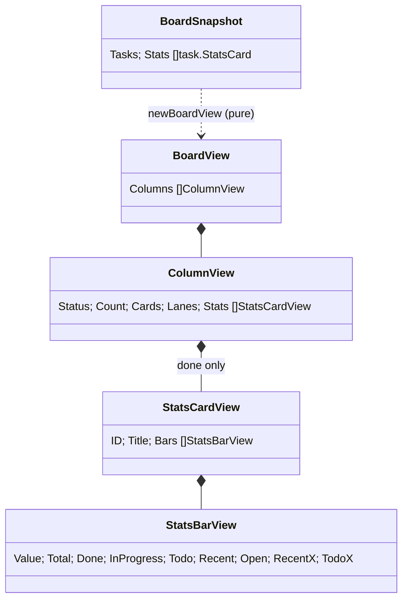
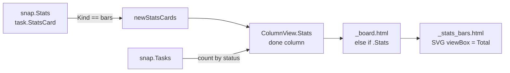

# Design: done-stats-bars

### Design Summary

The Done column stops rendering task cards. In their place it renders the
bars cards from `BoardSnapshot.Stats`, in config order. The column header
count stays.

- `ColumnView` gets a `Stats []StatsCardView` field. It is set only for the
  Done column, like `Lanes` is set only for In progress. The Done column's
  `Cards` is left nil.
- A new partial, `_stats_bars.html`, draws one row per value:
  - the value name;
  - the label `done/total · N open · +M`;
  - a stacked bar drawn as an **inline SVG** whose `viewBox` is the row's
    raw counts.

  The bar uses no `style` attribute, and Go computes no percentages or pixels.
- Lines cards are not rendered yet; `done-stats-lines` adds them. The mapper
  passes only bars cards to the view.
- The Tailwind build is made deterministic with `source(none)`, so that
  `app.css` stops depending on whatever words `tasks/*.md` happens to contain.

**Scope:** `internal/web` (view model, templates, CSS, tests), the Tailwind
entry and build script comment, and the docs (CLAUDE.md Web UI, README).

**Non-goals:**
- lines cards and their legend toggles (`done-stats-lines`, `done-stats-toggles`);
- any change to `internal/task` or `internal/config`;
- validating the config (`done-stats-config-errors`).

### Current-State Evidence

- `BoardSnapshot.Stats []task.StatsCard` arrives from the same locked read as
  the columns (`internal/task/view.go:41-43,79-88`).
  - `StatsBar{Value, Total, Done, InProgress, Todo, ClosedRecently}`.
  - `ClosedRecently` is a part of `Done`.
  - Rows come in domain order; values with no tasks are absent.
  - An unknown field gives `Bars == nil` (`internal/task/stats.go`).
- `ColumnView{Status, Title, Count, Cards, Lanes}`.
  - `Count` is computed from `snap.Tasks`, independently of `Cards`
    (`internal/web/view.go:205-221`).
  - `Lanes` is set only for In progress, and `_board.html` branches on
    `{{ if .Lanes }}`.
- There is no `style=` anywhere in `internal/web/templates`. The lanes design
  rejected inline style (`tasks/in-progress-phase-columns/design`).
- html/template passes integers through unchanged in attribute context. An SVG
  with `viewBox="0 0 Total 1" preserveAspectRatio="none"` and `<rect x width>`
  in raw counts renders exact proportions (research, gap 1, variant B).
- Tailwind scan scope depends on the working directory. A build from the repo
  root scans Go and `tasks/*.md`, which adds stray classes. With
  `@import "tailwindcss" source(none)` plus `@source "../templates"`, the build
  drops 19 selectors from today's `app.css`: `.absolute .collapse .contents
  .filter .fixed .grow .hidden .inline .invert .invisible .isolate .lowercase
  .relative .resize .ring .static .table .transition .visible`. None of them is
  used by a template or by `static/app.js`, which sets `style` and not classes.
  This was re-measured for this design with a scratch build.
- Measured widths and contrast (research gaps 3 and 4):
  - The card's inner width is 155-249 px.
  - The typical label fits on one line. Value plus label fits on one line only
    from 1440 px.
  - Contrast against the card background: emerald-500 7.49, amber-400 10.74,
    neutral-500 3.90, emerald-200 14.41. Emerald-200 against emerald-500 is
    1.92.
- These tests rely on done cards:
  - `TestBoardRendersThreeColumns` ("Old chore");
  - `TestBoardShowsBranchChip` (`dev/4-old-chore`, 2 copy buttons);
  - `TestCopyButtonHasNoHtmxAttributes` (its only branch is on done task 4);
  - `TestBoardEmptyInProgressShowsFourStubs` (one `>empty</p>` from Done).

  `TestLanesPartitionTheColumn` only asserts In progress.

### Proposed Architecture

**View model** (`internal/web/view.go`)

```go
// ColumnView gains:
//   Stats are the Done column's statistics cards, in config order; nil for
//   every other column. Done renders them instead of task cards.
Stats []StatsCardView

// StatsCardView is one bars card of the Done column.
type StatsCardView struct {
    ID    string // config card id: data-stats-card, the key later toggles use
    Title string
    Bars  []StatsBarView
}

// StatsBarView is one value's row. Every number is a task count: the bar is
// an SVG whose viewBox is Total wide, so the browser does the scaling.
type StatsBarView struct {
    Value      string
    Total      int
    Done       int
    InProgress int
    Todo       int
    Recent     int // closed in the last 24 h, part of Done
    Open       int // InProgress + Todo
    RecentX    int // Done - Recent: the recent part sits at the end of done
    TodoX      int // Done + InProgress
}
```

- `newStatsCards(cards []task.StatsCard) []StatsCardView` keeps the cards whose
  `Kind == config.StatsKindBars`. Lines cards wait for `done-stats-lines`.
- `newBoardView` handles the Done column this way:
  - `cv.Stats = newStatsCards(snap.Stats)`;
  - `cv.Cards = nil`. Done task cards are no longer built into any column, but
    they are still counted.
- Card views for done tasks are still built for `byID`. That map is used for
  nesting, which now never targets Done. The cost stays negligible.

**Template** (`_board.html`): the branch order is `{{ if .Lanes }} … {{ else if .Stats }} … {{ else }}` followed by the cards or the `empty` stub.

- With `cards: []`, or only lines cards, Done falls through to the `empty`
  stub. Its `Cards` is nil, so no done task can leak back in.

**Partial** `_stats_bars.html` (template name `_stats_bars.html`)

```html
<section class="stats-card" data-stats-card="{{ .ID }}">
  <h3 class="text-[11px] font-medium uppercase tracking-wider text-neutral-400">{{ .Title }}</h3>
  {{ range .Bars }}
  <div class="stats-row" data-value="{{ .Value }}">
    <div class="flex flex-wrap items-baseline gap-x-2">
      <span class="min-w-0 truncate text-xs text-neutral-300" title="{{ .Value }}">{{ .Value }}</span>
      <span class="meta ml-auto min-w-0 truncate">{{ .Done }}/{{ .Total }}{{ if .Open }} &middot; {{ .Open }} open{{ end }}{{ if .Recent }} &middot; <span class="stats-recent">+{{ .Recent }}</span>{{ end }}</span>
    </div>
    <svg class="stats-bar" viewBox="0 0 {{ .Total }} 1" preserveAspectRatio="none" role="img"
         aria-label="{{ .Value }}: {{ .Done }} done ({{ .Recent }} in the last 24 h), {{ .InProgress }} in progress, {{ .Todo }} to do">
      {{ if .Done }}<rect class="bar-done" x="0" width="{{ .Done }}" height="1"/>{{ end }}
      {{ if .Recent }}<rect class="bar-recent" x="{{ .RecentX }}" width="{{ .Recent }}" height="1"/>{{ end }}
      {{ if .InProgress }}<rect class="bar-in_progress" x="{{ .Done }}" width="{{ .InProgress }}" height="1"/>{{ end }}
      {{ if .Todo }}<rect class="bar-todo" x="{{ .TodoX }}" width="{{ .Todo }}" height="1"/>{{ end }}
    </svg>
  </div>
  {{ else }}
  <p class="meta mt-2">no tasks</p>
  {{ end }}
</section>
```

- **Label rule.** `done/total` always appears. `N open` appears when N > 0.
  `+M` appears when M > 0.
  - The acceptance criteria require only that `+M` is dropped at 0. Also
    dropping `0 open` keeps the resolution card, which never has open tasks,
    readable as `7/7`.
- **Narrow width.** The value and the label share a `flex-wrap` row. Below
  about 1440 px the label wraps under the value; when even that line is too
  short (1024 px, a 4-digit label), it truncates.
- **SVG attributes.** `data-stats-card` and `data-value` are plain attributes
  for html/template, because only names with `on`, `src`, `url` or `uri` (or a
  `style` name) are special. `viewBox`, `x` and `width` hold integers only.

**CSS** (`assets/input.css`, components)

```css
/* Done-column statistics. A bar is an inline SVG whose viewBox is the row's
 * total, so segment widths are task counts and the browser scales them; Go
 * never computes geometry and no style attribute is needed. Segment colours
 * match the column dots; the 24 h part is a light emerald inside done. */
.stats-card  { @apply rounded-lg border border-white/10 bg-neutral-900/60 p-3; }
.stats-row   { @apply mt-2; }
.stats-bar   { @apply mt-1 block h-1.5 w-full overflow-hidden rounded-full bg-white/5; }
.bar-done        { fill: var(--color-emerald-500); }
.bar-recent      { fill: var(--color-emerald-200); }
.bar-in_progress { fill: var(--color-amber-400); }
.bar-todo        { fill: var(--color-neutral-500); }
.stats-recent    { color: var(--color-emerald-300); }
```

- `--color-emerald-200` and `--color-emerald-300` become newly emitted
  variables, because they are referenced through `var()` inside a component.
- `@import "tailwindcss" source(none);` keeps `@source "../templates";`, and the
  header comment becomes true again. The `build-css.sh` comment changes to
  match: the result no longer depends on the working directory.

### Context Diagram

Not required for this trivial change: no subsystem boundary moves. The data
still flows from `task.Service.BoardSnapshot` into `internal/web` and on to the
template, exactly as the Lanes do.

### Structure Diagram



### Data Flow Diagram



### Sequence Diagram

Not required for this trivial change. The request path (`/` or `/board` →
`BoardSnapshot` → `newBoardView` → template) and the htmx poll are unchanged;
only one column's content changes.

### ADR

- **Title:** Done column bars as count-scaled inline SVG
- **Status:** Accepted
- **Date:** 2026-10-06
- **Context:** Each row needs four proportional segments whose sizes are data,
  not a fixed set of states. The board's precedents rule out geometry
  computed in Go and inline `style` attributes. The Tailwind build must emit
  the new classes and colours reproducibly.
- **Decision:**
  - Draw every bar as `<svg viewBox="0 0 Total 1" preserveAspectRatio="none">`
    with one `<rect>` per non-empty segment. `x` and `width` are task counts,
    and the offsets are sums of counts done in the mapper.
  - The recent part is drawn over the end of the done segment, next to In
    progress.
  - Colours come from `bar-<status>` component classes that reuse the column
    dot colours; recent is emerald-200.
  - Mapping keeps only bars cards for now.
  - The Tailwind entry uses `source(none)`.
- **Consequences:**
  - There are no inline styles and no percentages, and the bar is safe under a
    future `style-src` CSP.
  - The rendering is exact at any width, and zero segments simply do not
    render.
  - The view model carries two derived offsets (`RecentX`, `TodoX`).
  - `app.css` loses 19 unused selectors and gains the stats classes; later
    rebuilds no longer depend on the working directory.
  - The Done column no longer shows a delivered task's final branch; it stays
    in the detail view's Git block.
- **Alternatives Rejected:**
  - *Flex `flex-grow: N` or grid `fr` through `style`.* These are the first
    inline styles in the codebase and break under a strict CSP, against the
    lanes precedent.
  - *Percent widths computed in Go.* This is geometry in Go and needs rounding.
  - *`--w` custom property plus `w-[calc(var(--w)*1%)]`.* This still needs a
    `style` attribute.
  - *`<meter>` / `<progress>`.* Each shows a single value and cannot stack.
  - *A fixed class set such as `w-1/12 … w-12/12`.* It is approximate and
    unbounded once totals vary.
  - *Keep the root-scanned build.* Its output depends on task notes, and
    rebuilding now would add noise classes such as `.bg-amber-400` and
    `.container` from `tasks/*.md`.
  - *Render lines cards as title-only placeholders.* That would put
    half-finished UI on the board between subtasks; `done-stats-lines` adds
    them whole.

### Risk Analysis

- **Correctness.**
  - `Total` is never 0 for a mapped row, because the service emits rows only
    for values with tasks. The mapper also drops a row with `Total <= 0`
    defensively, since `viewBox="0 0 0 1"` is invalid.
  - `Recent <= Done` holds by construction, so `RecentX >= 0`.
- **Template escaping.** An SVG inside HTML is parsed by html/template as
  ordinary markup. Integer attributes pass through, and `Value` and `Title`
  are escaped as text in attributes.
  - A hostile value cannot come through the seeded service, because the
    fields are enums and the creator is the test identity. The escaping test
    therefore runs the partial directly on a crafted view.
- **Lifecycle / ordering.** The cards come in the config order of
  `snap.Stats`. The htmx outerHTML poll re-renders the column; there is no
  client state yet.
- **Performance.** The work is O(cards × values) string rendering per poll, a
  few dozen elements, with no extra lock or I/O; the stats are computed by the
  service in the same read.
- **Codegen.** There is no codegen; `app.css` is a vendored build artifact,
  regenerated by the script, never hand-edited.
- **Compatibility.**
  - Users lose done task cards on the board. This was decided in the parent's
    clarifications.
  - Detail URLs `/tasks/{id}` still serve done and archived tasks.
  - The 19 dropped CSS selectors are unused.

### Testing Strategy

Tests live in `internal/web`; there are no new service tests.

- **View mapping** (`view_test.go`):
  - `TestDoneColumnHasStatsNotCards`: done tasks are counted in `Count`, `Cards`
    is empty, and `Stats` comes from `snap.Stats`.
  - `TestStatsCardsKeepBarsInConfigOrder`: lines cards are dropped and the
    order is kept.
  - `TestStatsBarOffsets`: `Open`, `RecentX` and `TodoX` for a full row, and
    zero segments.
  - `TestStatsBarSkipsEmptyTotal`.
  - `TestLanesPartitionTheColumn` additionally asserts that done task `e`
    appears in no column's cards.
- **Handlers** (`handlers_test.go`):
  - `TestBoardDoneColumnRendersStats`: the seeded board has default cards. The
    test checks:
    - the `data-stats-card="bars-priority"` / `bars-type` / `bars-resolution`
      sections are present;
    - the label `1/1` and `+1` are present for task 4 (bug, done, closed
      now);
    - the `bar-done` rect is present;
    - the title "Old chore" is not present anywhere on `/board`.
  - `TestBoardDoneColumnEmptyWithoutCards`: with `cards: []` set on the
    service's config, the Done column shows the `empty` stub and no stats.
  - `TestStatsBarsEscaping`: run the `_stats_bars.html` fragment directly on a
    `StatsCardView` whose title and value hold `<script>`. The text must come
    out escaped. Hostile values cannot be seeded through the service: the
    identity is fixed, and the other fields are enums.
- **Rewritten:**
  - `TestBoardRendersThreeColumns`: drop "Old chore" from the expected cards
    and assert it is absent.
  - `TestBoardShowsBranchChip`: the board shows task 3's wip branch only, with
    1 copy button; `dev/4-old-chore` is absent from `/board` and present on
    `/tasks/4`.
  - `TestCopyButtonHasNoHtmxAttributes`: put the branch on task 3, which is in
    progress.
  - `TestBoardEmptyInProgressShowsFourStubs`: count the empty stubs inside the
    In progress lanes (`>empty</p>` → 0), plus four `data-phase` lanes. Done
    now holds stats cards.
- **Assets** (`assets_test.go`): `TestAppCSSDefinesStatsClasses` checks
  `.stats-card{`, `.stats-bar{`, `.bar-done{`, `.bar-recent{`,
  `.bar-in_progress{`, `.bar-todo{` and `--color-emerald-200`.
- **Gates:** `gofmt -l`, `go vet ./...`, `go build ./...`, and
  `go test -race ./internal/web/... ./internal/task/...`, then the whole
  `go test ./...`.
- **Manual:** run `serve web` against this repo and look at the Done column at
  1024 and 1440 px: the bars, the wrap and the colours on the dark board.

### Codegen Impact

There is no code generation. `internal/web/static/app.css` is regenerated with
`scripts/build-css.sh` after `input.css` and the templates change; it is never
edited by hand. A full rebuild is required, because it is a single file.

### File Impact Map

| File | Change |
|---|---|
| `internal/web/view.go` | `ColumnView.Stats`, `StatsCardView`, `StatsBarView`, `newStatsCards`; Done column gets Stats, no Cards |
| `internal/web/templates/_board.html` | `else if .Stats` branch |
| `internal/web/templates/_stats_bars.html` | new partial |
| `internal/web/assets/input.css` | `source(none)`, comment, stats component classes |
| `scripts/build-css.sh` | comment: scan scope is templates only |
| `internal/web/static/app.css` | regenerated |
| `internal/web/view_test.go`, `handlers_test.go`, `branch_test.go`, `assets_test.go` | tests above |
| `CLAUDE.md` | Web UI: Done column stats, final branch only in the detail view, build scope |
| `README.md` | Web Dashboard bullet: Done column shows the statistics cards |

### Open Questions

None blocking. The `0 open` omission and the placement of the recent part (at
the end of done) are presentation choices recorded above; both are easy to
revisit.
