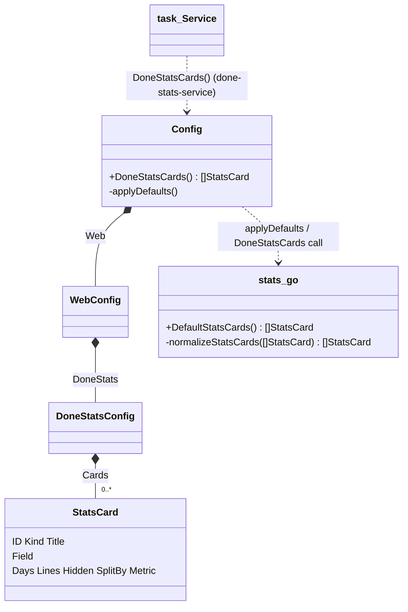

# Design: done-stats-config

### Design Summary

Add `web.done_stats.cards` to `internal/config`: an ordered list of statistics card definitions, `bars` or `lines`, that later subtasks compute (`done-stats-service`) and render (`done-stats-bars`, `done-stats-lines`, `done-stats-toggles`).

**Scope**
- New types `DoneStatsConfig` and `StatsCard`, plus name constants.
- One constructor for the default list, filled into `DefaultConfig`.
- One pure normalizer that fills per-card defaults, a stable card `ID` and a title. `applyDefaults` and a nil-safe read accessor `(*Config).DoneStatsCards()` both use it.
- Tests, the reference `mcp-tasks.yaml`, and the Configuration sections of CLAUDE.md and README.

**Non-goals**
- Rejecting or reporting invalid entries (unknown kind, field or line name; negative days): see `done-stats-config-errors`. This subtask only fills defaults; it never drops or rejects a card.
- Deciding which fields the service supports (`done-stats-service`).
- Any web or service code.

**Assumptions**
- The cumulative variants are line names (`created_cumulative`, `closed_cumulative`), and `metric` accepts the same four names. Whether a cumulative total starts at 0 is the service's decision.
- Config changes take effect on restart or a roots change, as today.

### Current-State Evidence

- `WebConfig{Enabled, Addr, WithMCP}`, `DefaultConfig`, `Resolve` → `yaml.Unmarshal` → `applyDefaults` → `applyEnvOverrides` (`internal/config/config.go:101-287`).
- `DefaultConfig` copies `BaseBranches` so callers cannot mutate the package default. `TestDefaultBaseBranchesNotAliased` guards it (`config.go:164-166`, `git_test.go:102`).
- yaml.v3, decoding into the pre-filled default (`done-stats-config/research.md` §2):
  - absent or null `web` / `done_stats`, and `done_stats: {}`, keep the default list;
  - `cards:` (null) resets it to nil;
  - `cards: []` gives a non-nil empty slice;
  - every list item starts from zero.
- Test backlogs copy `config.DefaultConfig().Web` without calling `applyDefaults` (`testsupport.go:33`, `gitbacklog.go:100`). Bare literals and a nil config are common in task and web tests (`web/view_test.go:25-47`).
- Nothing serializes `Config`, and `version` prints only the resolution (`cli.go:238-243`).
- `config` imports only the standard library and yaml, so it cannot use the `task` enums. Names are plain strings, as `TaskTypes` already are.

### Proposed Architecture

New file `internal/config/stats.go`, next to `config.go`, which keeps the section types and the per-section logic. `config.go` gains one field and two calls.

```go
// WebConfig gains:
DoneStats DoneStatsConfig `yaml:"done_stats"`

type DoneStatsConfig struct {
    // Cards in board order. nil (absent or `cards:`) means the defaults;
    // an empty list (`cards: []`) means no cards.
    Cards []StatsCard `yaml:"cards"`
}

type StatsCard struct {
    ID      string   `yaml:"id,omitempty"`       // stable key (localStorage); derived when blank
    Kind    string   `yaml:"kind,omitempty"`     // bars | lines; inferred when blank
    Title   string   `yaml:"title,omitempty"`    // derived when blank
    Field   string   `yaml:"field,omitempty"`    // bars: the field to group on
    Days    int      `yaml:"days,omitempty"`     // lines: window, today included
    Lines   []string `yaml:"lines,omitempty"`    // lines without split_by
    Hidden  []string `yaml:"hidden,omitempty"`   // line keys (or split values) off by default
    SplitBy string   `yaml:"split_by,omitempty"` // lines: one line per value of this field
    Metric  string   `yaml:"metric,omitempty"`   // lines with split_by: which line name to split
}
```

**Constants:**
- `StatsKindBars = "bars"` and `StatsKindLines = "lines"`;
- `StatsLineCreated`, `StatsLineClosed`, `StatsLineCreatedCumulative` and `StatsLineClosedCumulative`;
- `DefaultStatsDays = 14`.

**`DefaultStatsCards() []StatsCard`** returns a fresh list on every call, inner slices included:
- `{bars priority}`, `{bars type}`, `{bars resolution}`;
- `{lines, days 14, lines [created, closed]}`;
- IDs and titles filled by the normalizer.

**`normalizeStatsCards(in []StatsCard) []StatsCard`** is pure: it never writes to `in` and returns new slices.
- `nil` → `DefaultStatsCards()`. An empty non-nil list → an empty non-nil list.
- **Strings:** every string is trimmed. Blank entries are dropped from `Lines` and `Hidden`. Case is kept, because type values are user-defined.
- **Kind:** when blank, a card with `Field` set is `bars`; otherwise it is `lines`.
- **`lines` cards:**
  - `Days <= 0` → `DefaultStatsDays`, matching the `AfterDays` rule;
  - with `SplitBy`: a blank `Metric` → `closed`, and `Lines` is left as written (the service ignores it);
  - without `SplitBy`: an empty `Lines` → `[created, closed]`.
- **`bars` cards:** nothing is defaulted. A blank `Field` stays blank for the errors task.
- **Title, when blank:**
  - bars: the field humanized (`priority` → `Priority`, `created_by` → `Created by`);
  - lines: `Last <days> days`;
  - split lines: `<Metric> by <field>, <days> days` (`Closed by priority, 30 days`; `closed_cumulative` → `Closed cumulative`).
- **ID, when blank:** derived from content, slugged to `[a-z0-9-]`:
  - `bars-<field>`;
  - `lines-<days>d`;
  - `lines-<split_by>-<metric>-<days>d`.
- **Uniqueness:** IDs are made unique in list order by appending `-2`, `-3`, …. The check covers explicit IDs too, so the result is always unique.
- **Idempotent:** a second pass changes nothing.

**Wiring:**
- `DefaultConfig()` sets `Web.DoneStats.Cards = DefaultStatsCards()`.
- `applyDefaults()` sets `c.Web.DoneStats.Cards = normalizeStatsCards(c.Web.DoneStats.Cards)`. This refills nil (from `cards:`) and fills the per-card fields of a written list.
- `func (c *Config) DoneStatsCards() []StatsCard` is the consumer API:
  - it is nil-safe and returns `normalizeStatsCards(c.Web.DoneStats.Cards)`;
  - so a bare literal or a nil config gets the defaults;
  - every caller gets its own copy, which keeps the config shared across request goroutines unwritten. Allocation per call is a handful of small slices, which is negligible next to the board poll.

### Context Diagram

Not required for this trivial change. No package boundary or dependency direction changes. `config` stays a leaf, and the existing `resolved.Config` path already carries the new field to `task` and `web`.

### Structure Diagram



### Data Flow Diagram

```mermaid
flowchart LR
    D[DefaultConfig: DefaultStatsCards] --> U[yaml.Unmarshal mcp-tasks.yaml]
    U -->|absent / done_stats null| K[default list kept]
    U -->|cards: null| N[nil]
    U -->|cards: []| E[empty list]
    U -->|cards: items| I[zero-based items]
    K & N & E & I --> A[applyDefaults → normalizeStatsCards]
    A --> C[Config.Web.DoneStats.Cards]
    C --> R["(*Config).DoneStatsCards() copy"]
    L[literal / nil Config in tests] --> R
    R --> S[task.Service stats, later subtask]
```

### Sequence Diagram

Not required for this trivial change. There is no new lifecycle: the existing `Resolve` sequence gains one step inside `applyDefaults`.

### ADR

- **Title:** Done-column card config — defaults in `DefaultConfig` plus a nil-safe normalizing accessor; derived stable card IDs.
- **Status:** Proposed
- **Date:** 2026-10-06
- **Context:**
  - Cards must be easy to write in YAML, with sensible defaults when the section is absent, and `cards: []` must mean no cards.
  - yaml.v3 zeroes list items, and `cards:` (null) resets the pre-filled list.
  - Test backlogs bypass `applyDefaults`, and many tests use bare or nil configs.
  - The toggles subtask needs a per-card key that survives config edits.
- **Decision:**
  - Put the default list in `DefaultConfig`, normalize in `applyDefaults`, and read through `(*Config).DoneStatsCards()`, which normalizes again (idempotently) and returns a copy.
  - Give cards an optional `id`. When blank, derive it from the card's content (`bars-<field>`, `lines-<days>d`, `lines-<split>-<metric>-<days>d`) and make it unique in list order.
  - Derive blank titles and infer a blank kind.
- **Consequences:**
  - The default does not depend on how a config was built.
  - Consumers never see aliased or partially filled cards.
  - Reordering cards or editing a title keeps the viewer's toggles. Changing a card's field, days, split or metric resets them, unless the card has an explicit `id`.
  - Two cards with the same content get `-2` suffixes, so their keys follow list order.
  - Silent defaulting of `days <= 0` matches `AfterDays`; the errors task may tighten it for negatives.
- **Alternatives Rejected:**
  - *Default only in `applyDefaults`*: test backlogs and nil configs would show no cards.
  - *Default only in the accessor, with `DefaultConfig` leaving nil*: works, but `Resolve`'s stored config would not reflect what is shown, which is unlike every other section.
  - *Key by index*: breaks on reorder. *Key by title*: breaks on a title edit and is not slug-safe.
  - *Require `id`*: hurts "easy to define".
  - *Lowercase names*: would corrupt case-sensitive type values in `hidden`.
  - *`KnownFields` strict decoding*: belongs to the errors decision and would break every tool on a typo.

### Risk Analysis

- **Correctness:**
  - Accidentally mutating the input list in the normalizer would race with concurrent web reads. Mitigation: build new slices, plus a test that the input is unchanged.
  - Non-idempotent ID dedup: a second pass would see `x-2` already used, but every ID is already unique, so nothing changes. Covered by an idempotence test.
- **Aliasing:** `DefaultStatsCards` returns fresh inner slices. A test mutates a returned list and checks a fresh call.
- **Compatibility:**
  - Old configs without the section get the defaults. YAML keys are new, so no existing key changes meaning.
  - A YAML type error (`days: abc`) is a hard `Resolve` error, as for any other section. This is documented, not changed.
- **Lifecycle / ordering:** `applyEnvOverrides` does not touch the section. No env variable is added.
- **Performance:** the accessor allocates O(cards) per call; this is negligible.
- **Codegen:** none.

### Testing Strategy

New file `internal/config/stats_test.go`, following the `git_test.go` pattern with a `resolveDoneStats(t, body)` helper over `writeConfig`, `isolateEnv` and `tempDir`.
- **Defaults:**
  - no file;
  - `web: {enabled: true}`;
  - `web:\n  done_stats:\n` (null);
  - `done_stats: {}`;
  - `cards:` (null).
  - All of these equal `DefaultStatsCards()`, which has 4 cards with IDs `bars-priority`, `bars-type`, `bars-resolution` and `lines-14d`, and titles `Priority`, `Type`, `Resolution` and `Last 14 days`.
- **`cards: []`:** non-nil and empty, and `DoneStatsCards()` returns empty.
- **Per-card defaults (table):**
  - a lines card with only `kind`;
  - a split card (metric `closed`, title, ID);
  - an explicit `days`, `lines`, `hidden`, `title` and `id` kept;
  - inferred kind (`field` only → bars; `days` only → lines);
  - trimmed strings and blank entries dropped;
  - `days: 0` and `days: -3` → 14.
- **IDs:** duplicate content → `x`, `x-2`; an explicit ID that collides with a derived one; non-slug characters in a field slugged.
- **Normalizer properties:** idempotent (normalize twice is DeepEqual to normalize once); input not mutated.
- **Accessor:** `(*Config)(nil).DoneStatsCards()` and `(&Config{}).DoneStatsCards()` → defaults. Mutating the result does not change the config.
- **Aliasing:** mutating `DefaultConfig().Web.DoneStats.Cards[3].Lines[0]` does not change `DefaultStatsCards()`.
- **YAML type error** `days: abc` → `Resolve` error.
- **Regression:** `go test ./...`, `go vet ./...` and `gofmt -l`; `go test -race ./internal/config`.
- **Manual:** `go run ./cmd/mcp-task-manager version` is unchanged, and the server starts with this repo's updated `mcp-tasks.yaml`.

### Codegen Impact

None. The project has no code generation, and the Tailwind CSS is untouched.

### File Impact Map

| File | Change |
|------|--------|
| `internal/config/stats.go` | new: types, constants, `DefaultStatsCards`, `normalizeStatsCards`, `(*Config).DoneStatsCards` |
| `internal/config/config.go` | `WebConfig.DoneStats` field; `DefaultConfig` fills it; one line in `applyDefaults` (plus a comment line) |
| `internal/config/stats_test.go` | new tests listed above |
| `mcp-tasks.yaml` | `web.done_stats.cards`, written out to equal the defaults, plus a commented split-card example |
| `CLAUDE.md` | Configuration YAML block and partial-section paragraph; Validation "Config:" line; Project Structure (`stats.go`) |
| `README.md` | Config File YAML block and partial-section paragraph (461-493) |

### Open Questions

- None blocking.
- The errors task should revisit whether negative `days` stays silently defaulted, and whether duplicate explicit IDs deserve a warning rather than a suffix.
