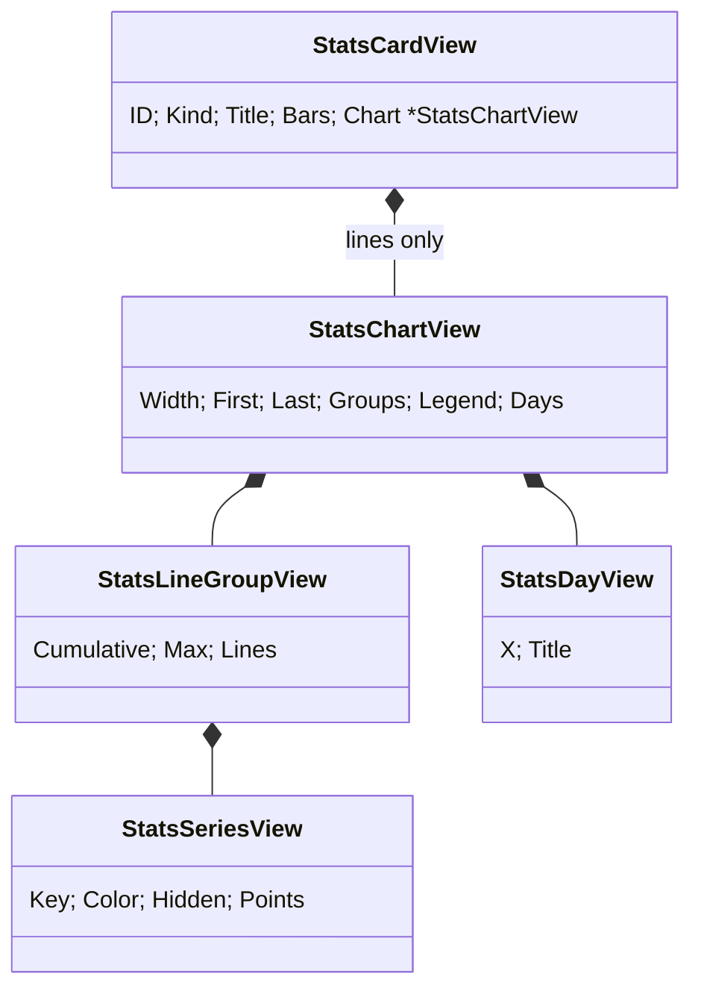
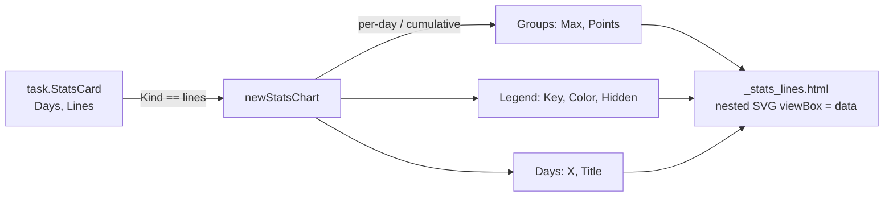

# Design: done-stats-lines

### Design Summary

The Done column draws its `lines` cards next to the bars cards, in config
order. Each lines card is an inline SVG line chart rendered by the server,
with a legend, two day labels, the scale of each line group, and a per-day
`<title>` tooltip. No JS charting library and no `style` attribute.

- **Coordinates are data, like the bars.** The chart's `viewBox` is the data
  range in raw units: x is twice the day index (`2i+1`, the centre of day
  `i`'s column of width 2), y is `max - count`. Go prints integers only; the
  browser scales them (`preserveAspectRatio="none"`), and strokes stay 1.5 px
  through `vector-effect: non-scaling-stroke`. This keeps the bars precedent:
  no percentages, no pixels, no floats in Go.
- **Two scales per card, not one.** Per-day lines (`created`, `closed`, a
  per-day split) and running totals (`*_cumulative`, a cumulative split)
  differ by an order of magnitude; on one scale the per-day lines lie flat.
  Lines are grouped by kind, and each group is a nested `<svg>` with its own
  `viewBox` height (`max` of the group, at least 1). The scale of each group
  is written under the chart (`peak 3/day`, `total 25`).
- **Day labels and scales are HTML, not SVG text**, because stretched SVG
  distorts text and uniform SVG text changes size with the card width
  (research gap 3). First day left, last day right.
- **Tooltips per day, not per point.** One transparent `<rect>` per day
  covering the chart height, holding a `<title>` with every line's value
  (`Oct 5 · created 3 · closed 1`). It is a wide hover target at any width,
  and hovering highlights the day column.
- **Legend** of `<button type="button" aria-pressed>` items with a colour
  swatch. Each series and its legend item carry `data-stats-line="<key>"`; the
  card section already carries `data-stats-card="<id>"`. The toggle behaviour
  itself is `done-stats-toggles`.
- **Hidden lines** render with the `stats-off` class (`display: none`) and an
  `aria-pressed="false"` legend item.

**Scope:** `internal/web` (view model, a new partial, board branch, CSS,
tests), regenerated `app.css`, docs (CLAUDE.md Web UI, README).

**Non-goals:**
- the toggle JS and localStorage (`done-stats-toggles`);
- any change to `internal/task` or `internal/config`;
- a light theme: the board is dark-only today;
- per-point markers and a full y axis with ticks.

### Current-State Evidence

- `task.StatsCard` for a lines card: `Days []time.Time` (local midnights in
  the clock's zone, oldest first, at least one), `Lines []StatsLine{Key,
  Values, Hidden}` with `len(Values) == len(Days)`; `Field` / `Metric` set for
  a split card (`internal/task/stats.go:15-54,117-176`). An unknown metric
  gives `Lines == nil`; split lines exist only for values with a count in the
  window, so the set of keys varies day to day.
- Plain line keys are the four names `created`, `closed`,
  `created_cumulative`, `closed_cumulative` (`config.StatsLine*`). Split keys
  are raw field values, including free text (`created_by`, user types).
- `newStatsCards` maps bars cards only and drops lines cards
  (`internal/web/view.go:311-337`). `_board.html` renders every `Stats` entry
  with `_stats_bars.html`.
- html/template (research gap 1, measured): `viewBox`, `points`, numeric
  attributes and `class` pass through; `<title>` and `aria-label` are escaped
  as text; `data-stats-line`, `data-stats-card` are plain attributes; names
  containing `url`, `uri`, `src` or starting with `on` are not.
- Chrome (research gap 3): `preserveAspectRatio="none"` keeps strokes uniform
  with `non-scaling-stroke` but distorts circles and text; a one-point
  polyline paints nothing; `NaN` in `points` empties the polyline.
- Card inner width is 155-249 px; at 14 days a day is about 12 px wide, at
  90 days about 2 px.
- Contrast on the card background (research gap 4): sky-400 8.45, amber-400
  10.74, emerald-400 9.54, rose-400 6.45, violet-400 6.47, lime-400 12.02,
  orange-400 7.76, fuchsia-400 7.14. Tailwind emits a `--color-*` variable
  when a component references it with `var()`.
- Handler tests use the real clock (`testsupport.NewBacklog` has no
  `WithClock`), so rendered day labels depend on the machine date.

### Proposed Architecture

**View model** (`internal/web/view.go`)

```go
// StatsCardView gains:
Kind  string          // config.StatsKindBars | config.StatsKindLines
Chart *StatsChartView // lines cards only; nil when the card has no lines

// StatsChartView is a lines card's chart. Coordinates are data, as in the
// bars: day i spans x 2i..2i+2 and its points sit at 2i+1, so Width is
// 2*len(days); each group's own viewBox is Max high and y = Max - value.
type StatsChartView struct {
    Width  int
    First  string // first day, "Jan 2"
    Last   string // last day (today)
    Groups []StatsLineGroupView // per-day group first, then cumulative
    Legend []StatsSeriesView    // every line, in card order
    Days   []StatsDayView       // hover columns
}

type StatsLineGroupView struct {
    Cumulative bool
    Max        int // at least 1; the scale label shows it
    Lines      []StatsSeriesView
}

type StatsSeriesView struct {
    Key    string // data-stats-line
    Color  string // series-<name> for a plain line, series-<i mod 8> for a split value
    Hidden bool
    Points string // "1,3 3,0 …", integers only
}

type StatsDayView struct {
    X     int    // 2i
    Title string // "Oct 5 · created 3 · closed 1"
}
```

- `newStatsCards` maps both kinds. A lines card gets `Chart` from
  `newStatsChart(days, lines, split)`; with no lines (`Lines == nil`) `Chart`
  stays nil and the partial says `no data`.
- **Groups.** A plain line is cumulative when its key ends in `_cumulative`;
  a split card's lines are cumulative when its `Metric` is. Empty groups are
  dropped, so a card has one or two groups.
- **Max** of a group is the largest value of all its lines, hidden included,
  floored at 1. Hidden lines are therefore never clipped once toggled on, and
  an all-zero group draws a flat line on the baseline. No division anywhere.
- **Points.** `x = 2i+1`, `y = Max - v`, joined with `strconv.Itoa`. A
  one-day window gets `0,y 2,y`, a flat segment across the day, because a
  one-point polyline paints nothing.
- **Colours.** Plain lines use a fixed class per name: `series-created`
  (sky-400), `series-closed` (emerald-400), `series-created_cumulative`
  (violet-400), `series-closed_cumulative` (lime-400). Split values use
  `series-<i mod 8>` by position: sky, amber, emerald, rose, violet, lime,
  orange, fuchsia. Every class is named in CSS like `chip-<priority>`, so Go
  only picks a name.
- **Day titles.** `Jan 2` of the day, then `key value` for every line in
  card order, joined with ` · `.

**Board branch** (`_board.html`): inside `{{ range .Stats }}`,
`{{ if eq .Kind "lines" }}{{ template "_stats_lines.html" . }}{{ else }}{{ template "_stats_bars.html" . }}{{ end }}`.

**Partial** `_stats_lines.html`

```html
<section class="stats-card" data-stats-card="{{ .ID }}">
  <h3 class="text-[11px] font-medium uppercase tracking-wider text-neutral-400">{{ .Title }}</h3>
  {{ with .Chart }}
  <ul class="stats-legend">
    {{ range .Legend }}
    <li><button type="button" class="stats-legend-item" data-stats-line="{{ .Key }}" aria-pressed="{{ not .Hidden }}"><span class="stats-swatch {{ .Color }}"></span>{{ .Key }}</button></li>
    {{ end }}
  </ul>
  <svg class="stats-chart" viewBox="0 0 {{ .Width }} 1" preserveAspectRatio="none" role="img"
       aria-label="{{ $.Title }}, {{ .First }} to {{ .Last }}">
    {{ range .Groups }}
    <svg viewBox="0 0 {{ $.Chart.Width }} {{ .Max }}" preserveAspectRatio="none" width="100%" height="100%">
      {{ range .Lines }}<polyline class="stats-line {{ .Color }}{{ if .Hidden }} stats-off{{ end }}" data-stats-line="{{ .Key }}" points="{{ .Points }}"/>{{ end }}
    </svg>
    {{ end }}
    {{ range .Days }}<rect class="stats-day" x="{{ .X }}" width="2" height="1"><title>{{ .Title }}</title></rect>{{ end }}
  </svg>
  <div class="meta flex justify-between gap-2">
    <span>{{ .First }}</span>
    <span class="truncate">{{ range $i, $g := .Groups }}{{ if $i }} &middot; {{ end }}{{ if .Cumulative }}total {{ .Max }}{{ else }}peak {{ .Max }}/day{{ end }}{{ end }}</span>
    <span>{{ .Last }}</span>
  </div>
  {{ else }}
  <p class="meta mt-2">no data</p>
  {{ end }}
</section>
```

(`$.Chart.Width` is reachable because `$` is the card; the implementation may
copy `Width` into each group instead if that reads cleaner.)

**CSS** (`assets/input.css`, components)

```css
/* Lines cards: the viewBox is the data range (x = 2 per day, y = count), so
 * Go prints integers and the browser scales; non-scaling-stroke keeps the
 * lines 1.5 px wide when the chart is stretched. A series-<name> class names
 * a line's colour for both the polyline and its legend swatch. */
.stats-chart  { @apply mt-2 block h-16 w-full overflow-visible; }
.stats-line   { fill: none; stroke: var(--series); stroke-width: 1.5;
                stroke-linejoin: round; stroke-linecap: round;
                vector-effect: non-scaling-stroke; }
.stats-off    { display: none; }
.stats-day    { fill: transparent; }
.stats-day:hover { fill: rgb(255 255 255 / 0.06); }
.stats-legend { @apply mt-1 flex flex-wrap gap-x-2 gap-y-0.5; }
.stats-legend-item { @apply inline-flex items-center gap-1 font-mono text-[11px] text-neutral-400 aria-pressed:false:…; }
.stats-swatch { @apply inline-block h-0.5 w-2.5 rounded-full; background: var(--series); }
.series-created { --series: var(--color-sky-400); }
… one rule per plain name and per index 0-7 …
```

- A legend item whose line is off is dimmed through
  `.stats-legend-item[aria-pressed="false"]` (line-through, neutral-600), so
  the next subtask only flips the attribute and the class.
- The new `--color-*` variables appear in `app.css` because the components
  reference them.

### Context Diagram

Not required: no boundary moves. Data flows `BoardSnapshot.Stats` →
`newBoardView` → `_board.html` exactly as for the bars cards.

### Structure Diagram



### Data Flow Diagram



### Sequence Diagram

Not required: the request path and the htmx poll are unchanged.

### ADR

- **Title:** Lines charts as data-unit inline SVG with per-kind scales
- **Status:** Accepted
- **Date:** 2026-10-06
- **Context:** Line points are data, not a fixed set of states, so CSS classes
  cannot place them, and percent coordinates do not work for polylines. The
  bars precedent keeps Go free of pixel and percentage geometry. Per-day and
  cumulative lines live on very different scales. Card widths are 155-249 px
  and windows can be 1 to 90+ days.
- **Decision:** viewBox in data units (2 per day, counts high), integer points
  from the mapper, nested `<svg>` per line kind, `non-scaling-stroke`, HTML
  labels, per-day `<rect><title>` hover columns, named colour classes, a
  `stats-off` class plus `aria-pressed` for hidden lines.
- **Consequences:** exact at every width with integers only; no `style`
  attribute; two scales printed under the chart; hidden lines count toward
  their group's max, so a toggle never needs a rescale; the toggle subtask has
  stable hooks (`data-stats-card`, `data-stats-line`, `stats-off`,
  `aria-pressed`).
- **Alternatives Rejected:**
  - *Normalized 0..100 float coordinates in Go* — first float geometry in Go,
    long `points` strings, and no gain over data units.
  - *One shared y scale* — the default "Last 2 weeks" example with hidden
    cumulative lines would flatten the visible per-day lines.
  - *A scale per line* — comparing two lines would lie.
  - *Max over visible lines only* — a line toggled on later would be clipped.
  - *Per-point circles with `<title>`* — distorted to ellipses by the
    stretched viewBox, and under 6 px apart from 30 days on.
  - *SVG `<text>` labels* — distorted or width-dependent size.
  - *Colours per field value* (priority hues like the chips) — needs a class
    per value of every field, including free-text ones.

### Risk Analysis

- **Correctness.** No division: Max is floored at 1, points are `Max - v`
  with `0 <= v <= Max`. `len(Values) == len(Days)` is the service contract;
  the mapper indexes values by day defensively (a short slice reads as 0).
- **Escaping.** Keys (free text for `created_by` and types) go into a plain
  `data-*` attribute, a `class`-free text node and a `<title>`; all escaped.
  Colour classes come only from the fixed name set or the index, never from a
  key, so a key cannot inject a class. Escaping test on the fragment.
- **Layout.** Long legends wrap; long keys truncate inside the legend item.
  At 90 days hover columns are about 2 px wide, still contiguous.
- **Performance.** O(days × lines) string building per poll, a few hundred
  integers.
- **Codegen.** None; `app.css` is regenerated by `scripts/build-css.sh`.
- **Compatibility.** Lines cards appear on the Done column where nothing was
  shown before; bars rendering is unchanged.

### Testing Strategy

- **View mapping** (`view_test.go`):
  - `TestStatsCardsKeepConfigOrder` (replaces the bars-only order test):
    bars and lines cards are both mapped, in order, with `Kind`.
  - `TestStatsChartPoints`: 3 days, values `[1 0 2]` → `Width 6`,
    `Max 2`, points `1,1 3,2 5,0`.
  - `TestStatsChartGroupsByKind`: created + created_cumulative → two groups
    with their own Max, per-day first; a split card with a cumulative metric →
    one cumulative group.
  - `TestStatsChartZeroAndSingleDay`: all zeros → Max 1, points on the
    baseline; one day → `0,y 2,y`.
  - `TestStatsChartColours`: plain names get `series-<name>`, split values
    `series-<i mod 8>` (ninth value wraps to `series-0`).
  - `TestStatsChartHiddenAndTitles`: Hidden carried to series and legend; day
    titles `Oct 5 · created 1 · closed 0`.
  - `TestStatsChartNoLines`: `Lines == nil` → `Chart == nil`.
- **Handlers** (`handlers_test.go`):
  - `TestBoardDoneColumnRendersLines`: seeded board, default cards: the
    `lines-14d` section after `bars-resolution`, `viewBox="0 0 28 1"`, two
    polylines with `data-stats-line="created"` / `"closed"`, legend buttons
    with `aria-pressed="true"`, 14 `stats-day` rects, no `style=`, no `hx-`
    in the card. Date-independent: today's bucket holds the five seeded tasks,
    so the created polyline ends at `27,0`.
  - `TestBoardHiddenLineRendersOff`: config with `hidden: [closed]` →
    `stats-off` on the closed polyline and `aria-pressed="false"`.
  - `TestStatsLinesEscaping`: run `_stats_lines.html` on a crafted view whose
    key and title hold `<script>` and a quote.
  - `TestBoardDoneColumnRendersStats`: unchanged (bars).
- **Assets** (`assets_test.go`): `.stats-chart{`, `.stats-line{`,
  `.stats-off{`, `.stats-day{`, `.stats-legend-item`, `.series-created{`,
  `.series-7{`, and the new colour variables.
- **Gates:** `gofmt -l`, `go vet ./...`, `go build ./...`,
  `go test -race ./internal/web/... ./internal/task/...`, `go test ./...`.
- **Manual:** `serve web` on this repo, headless or real Chrome, at 1024 and
  1440 px: lines, legend, scales and hover.

### Codegen Impact

None. `internal/web/static/app.css` is regenerated with
`scripts/build-css.sh`.

### File Impact Map

| File | Change |
|---|---|
| `internal/web/view.go` | `StatsCardView.Kind/Chart`, chart view types, `newStatsChart`; `newStatsCards` maps lines cards |
| `internal/web/templates/_board.html` | branch on `.Kind` inside the stats range |
| `internal/web/templates/_stats_lines.html` | new partial |
| `internal/web/assets/input.css` | chart, legend and series classes |
| `internal/web/static/app.css` | regenerated |
| `internal/web/view_test.go`, `handlers_test.go`, `assets_test.go` | tests above |
| `CLAUDE.md` | Web UI: Done column bullet (lines drawn), lines chart bullet |
| `README.md` | Web Dashboard bullet: lines cards |

### Open Questions

None blocking. Colours per field value (to match the priority chips) and a
rescale on toggle are possible follow-ups.
