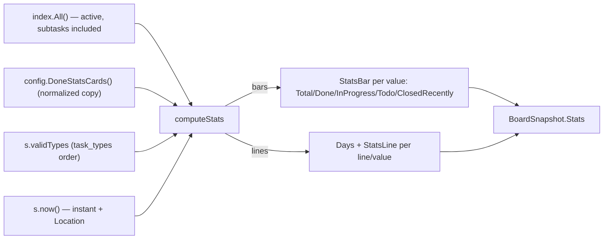
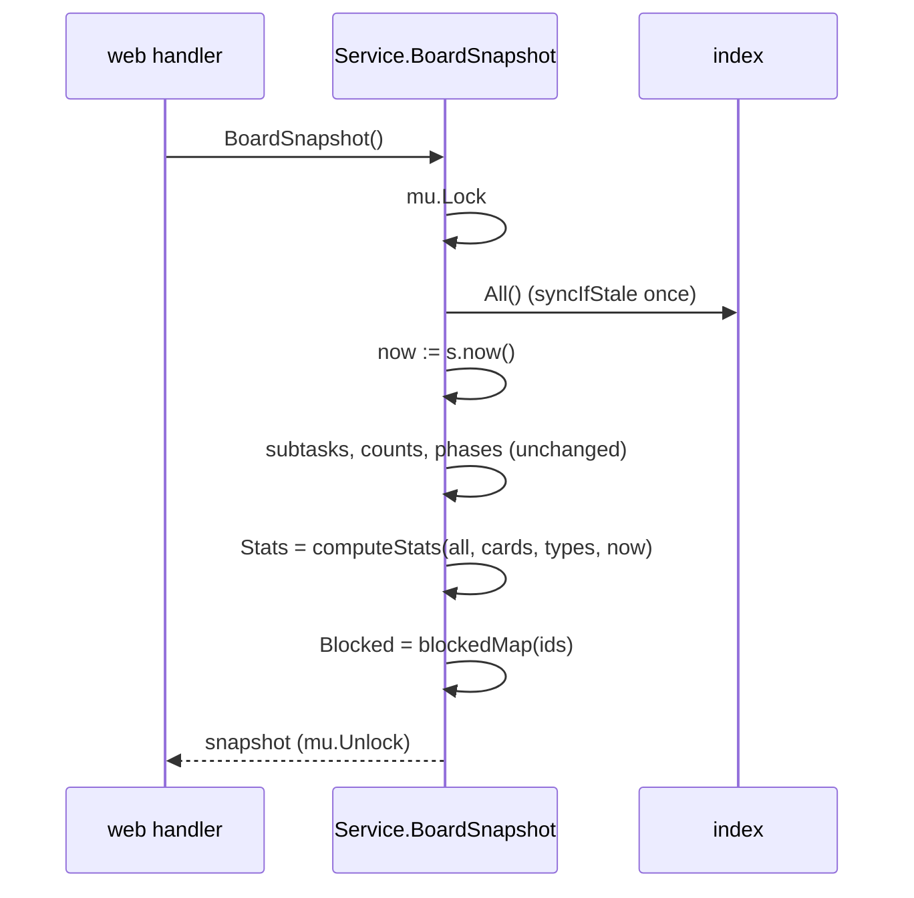

# Design: done-stats-service

### Design Summary

`task.Service` computes the Done-column statistics for the configured cards (`(*Config).DoneStatsCards()`, landed in `done-stats-config`). The computation runs inside the existing `BoardSnapshot`, over the same `index.All()` read and under the same lock. Its result is a new `BoardSnapshot.Stats` field. The web subtasks (`done-stats-bars`, `done-stats-lines`, `done-stats-toggles`) only map and render it.

**Scope**
- New file `internal/task/stats.go`:
  - result types `StatsCard`, `StatsBar` and `StatsLine`;
  - one pure function, `computeStats`, with its field and value helpers.
- `BoardSnapshot` gains `Stats []StatsCard`. `boardSnapshot` reads the clock once, and both `TakenAt` and `Stats` use that reading.
- An injectable clock: a `Service.now func() time.Time` field, defaulting to `time.Now`, set through a new `WithClock(func() time.Time) ServiceOption`.
- Unit tests for every counting rule, plus a snapshot-level test with a pinned clock.

**Non-goals**
- Rendering, CSS and toggles: the sibling subtasks.
- Reporting invalid cards (`done-stats-config-errors`). Here an unknown kind, field, line name or metric yields an empty card or omits that line. It never errors and never panics.
- Moving the existing `time.Now().UTC()` stamping sites (create, update, relations, archive, phases) to the injected clock.
- Any archive scan.

**Assumptions**
- The cards come normalized from `DoneStatsCards()`:
  - lines cards have `Days > 0`;
  - non-split lines cards have `Lines`;
  - split cards have `Metric`.
- "Local time" means the location of the clock's reading. In production that is `time.Now()`, which is `time.Local`.

### Current-State Evidence

- `boardSnapshot` reads `s.index.All()` once under `s.mu`, builds subtask counts, phases and blocked state, and stamps `TakenAt: time.Now().UTC()` (`internal/task/view.go:67-115`). It has two callers, both web handlers (`handlers.go:60,88`).
- `Index.All()` → `syncIfStale()` costs one `ReadDir` plus one `Stat` per task on every call (`storage/index.go:202-248`). A second read per poll doubles that, and the second lock window could tear the board against the column counts.
- `NewService(..., opts ...ServiceOption)` already uses options for write-once collaborators (`task/git.go:66-87`). A new option changes no caller.
- Field data on index entries: `Status`, `Priority`, `Type`, `CreatedBy`, `CreatedAt`, `UpdatedAt`, `Resolution` and `ClosedAt` (`storage/index.go:29-100`).
- Ordering helpers:
  - `Priority.Order()`, which returns 99 for an unknown priority;
  - `Resolutions()`;
  - `EffectiveResolution()`, which gives "" for an open task and `completed` for an empty resolution on a done task (`task.go`);
  - `s.validTypes` (= `cfg.TaskTypes`).
- Stored times are UTC or fixed-offset, and loading does not validate enum values (`storage/markdown.go:218-286`).
- Auto-archive removes done tasks from the index (`service.go:1093-1118`).
- `newConcurrentService()` has no `Web` config, so it gets the default cards. `BoardSnapshot` is already in `TestServiceRace` and `TestServiceNoSelfDeadlock` (`concurrency_test.go:86,143,149`).

### Proposed Architecture

**Clock**
```go
// Service gains (write-once, set in NewService):
now func() time.Time // the stats clock; its Location() is the day-bucket zone

// task/git.go, next to the other options:
// WithClock sets the clock the board statistics read; nil keeps time.Now.
func WithClock(now func() time.Time) ServiceOption
```
`NewService` sets `now: time.Now` before applying the options.

**Result types** (`internal/task/stats.go`)
```go
// StatsCard is one computed Done-column card, in config order.
type StatsCard struct {
    ID, Kind, Title string   // copied from the config card
    Field  string            // bars: the grouped field; split lines: split_by
    Metric string            // split lines only
    Bars   []StatsBar        // bars: one row per present value, in value order
    Days   []time.Time       // lines: start of each day (local midnight), oldest first, today last
    Lines  []StatsLine       // lines: one per line, len(Values) == len(Days)
}

type StatsBar struct {
    Value                         string
    Total, Done, InProgress, Todo int
    ClosedRecently                int // done tasks closed in the last 24 h (part of Done)
}

type StatsLine struct {
    Key    string // line name, or the split value
    Values []int
    Hidden bool   // starts switched off (Key is in the card's hidden list)
}
```

**Computation**: `computeStats(all []*Task, cards []config.StatsCard, types []string, now time.Time) []StatsCard`, pure, in config order.

- **Field values.** `statsValue(t, field) (string, bool)`:
  - `priority`, `type`, `status` and `created_by` return the raw string;
  - `resolution` returns `EffectiveResolution()`, so only done tasks have one;
  - an empty value is dropped (ok=false);
  - an unsupported field drops every task, which gives a card with no rows or lines.
- **Value order.** `statsOrder(field, types, present)`:
  - known values first, in domain order: priority critical→low, type in `task_types` order, resolution in `Resolutions()` order, status todo→in_progress→done;
  - then any other present values, alphabetically;
  - `created_by` is all alphabetical;
  - only values that occur are emitted.
- **Close time.** `closeTime(t)` is `*ClosedAt` when set, else `UpdatedAt`. It applies to done tasks only.
- **Bars.** Per value, count Total and the per-status split. `ClosedRecently` counts done tasks whose close time is in `(now-24h, now]`, so a future-stamped close does not count. A resolution card counts done tasks only, as `statsValue` already implies, so Done equals Total there.
- **Days.**
  - `loc := now.Location()`.
  - Day i (0 = oldest) starts at `time.Date(y, m, d-(Days-1-i), 0, 0, 0, 0, loc)`, where y, m, d are `now.In(loc).Date()`.
  - A timestamp maps to a bucket through its civil date in `loc`, via a map keyed by `(year, month, day)`. This is DST-safe because no 24 h arithmetic is involved.
  - A timestamp outside the window, or a zero timestamp, is ignored.
- **Base series.**
  - `created`: every task by `CreatedAt`.
  - `closed`: done tasks by close time.
- **Cumulative series.** `created_cumulative` and `closed_cumulative` are the running sum of the base series, **starting at 0 at the window start**.
- **Plain lines card.** One `StatsLine` per entry of `Lines`, in order. Unknown or repeated names are skipped.
- **Split card.**
  - `metric` picks the base series. A cumulative metric is the running sum of that value's base series.
  - Lines are emitted for the present values, in value order, whose base series has a nonzero sum in the window. An unknown metric gives no lines.
- **Hidden.** `Hidden` is true when `Key` appears in the card's `Hidden` list.
- **Unknown kind.** The card comes back with ID, Kind and Title and no data.

**Wiring in `boardSnapshot`**
```go
now := s.now()
snap.TakenAt = now.UTC()
snap.Stats = computeStats(all, s.config.DoneStatsCards(), s.validTypes, now)
```
`DoneStatsCards()` is nil-safe and returns a copy, so the shared config is never written. No exported method is added. The twin discipline is unchanged, and the existing `BoardSnapshot` entries in `TestServiceRace` and `TestServiceNoSelfDeadlock` now exercise the stats path, because the mock config yields the default cards.

### Context Diagram

Not required for this change. No package boundary moves: `task` already imports `config`, the web layer already receives `*BoardSnapshot`, and nothing new reaches storage.

### Structure Diagram

```mermaid
classDiagram
    Service --> Index : All() once per snapshot
    Service --> "config.Config" : DoneStatsCards()
    Service : -now func() time.Time
    Service : +BoardSnapshot() *BoardSnapshot
    BoardSnapshot *-- "0..*" StatsCard : Stats
    StatsCard *-- "0..*" StatsBar : Bars
    StatsCard *-- "0..*" StatsLine : Lines
    class stats_go {
        computeStats(all, cards, types, now) []StatsCard
        statsValue(t, field) (string, bool)
        statsOrder(field, types, present) []string
        closeTime(t) time.Time
    }
    Service ..> stats_go : boardSnapshot calls
    web_newBoardView ..> BoardSnapshot : reads Stats (later subtasks)
```

### Data Flow Diagram



### Sequence Diagram



### ADR

- **Title:** Done-column statistics are computed in `boardSnapshot` with a clock option whose location sets the day buckets.
- **Status:** Proposed
- **Date:** 2026-10-06
- **Context:**
  - The board polls every 5 s, and the statistics must agree with the column counts drawn from the same backlog.
  - Day buckets must be local and DST-correct, and deterministic in tests.
  - The service has no clock, and `NewService` already takes options.
- **Decision:**
  - Extend `BoardSnapshot` with `Stats`, computed from the same `All()` under the same lock by a pure function.
  - Add `WithClock`. The bucketing zone is the clock reading's `Location()`; there is no separate location option.
  - Unknown values follow the known ones, alphabetically. Empty values are dropped.
  - Cumulative series start at 0 at the window start.
  - Only the stats and `TakenAt` use the clock.
- **Consequences:**
  - One index sync per poll, and a board that cannot tear.
  - Stats cost O(tasks × cards) in memory per poll, with no file I/O.
  - Tests pin both instant and zone with one function, never touching `time.Local`.
  - A cumulative line reads as "created or closed within the window" and is unaffected by auto-archive removing older tasks.
  - The stats are only as fresh as the index, which is the board's rule anyway.
- **Alternatives Rejected:**
  - *A separate `DoneStats()` method*: a second `All()` and a second lock per poll, and stats that can disagree with the column counts.
  - *A `loc` option or `time.Local`*: an extra knob, and global state in tests.
  - *Passing `now` from the web layer (`Deps.Now`)*: the web layer would decide the business clock, and its tests use a January `fixedNow` against tasks seeded with real timestamps.
  - *A cumulative baseline from before the window*: it shrinks unpredictably as auto-archive removes tasks.
  - *An "other" bucket for unknown values*: it hides what is actually in the data.
  - *Moving every stamping site to the clock*: a wide diff with no consumer.

### Risk Analysis

- **Correctness:**
  - A legacy done task without `closed_at` uses `updated_at`, and relation edits move that, so an old task can look "closed today". This is accepted and documented, as the parent task decided.
  - Future-dated timestamps are excluded from both the 24 h window and the day buckets.
  - Zero `CreatedAt` values are ignored.
- **DST and month rollover:** day starts come from `time.Date` with a day offset, which normalizes; buckets are keyed by civil date. A test covers a DST change and a month boundary.
- **Concurrency:**
  - The config is read through a copying accessor.
  - `s.validTypes` and `s.now` are write-once.
  - Computing under `mu` adds microseconds per poll.
  - `-race` via `TestServiceRace`.
- **Nil safety:** a nil `s.config` reaches `DoneStatsCards()`, which is nil-safe. A nil option is ignored.
- **Compatibility:**
  - `BoardSnapshot` gains a field. The web layer ignores it until `done-stats-bars`.
  - `view_test.go` literals still compile.
  - `TakenAt` keeps being UTC.
- **Performance:** for 1k tasks and 5 cards, about 5k map operations per poll; negligible next to the stat calls.
- **Codegen:** none.

### Testing Strategy

New file `internal/task/stats_test.go`, using table tests over `computeStats` with hand-built `[]*Task` and a fixed `now`.
- **Bars:**
  - per-status split;
  - subtasks counted once each;
  - empty values dropped;
  - priority order critical→low, with an unknown priority after the known ones;
  - type order from `types`, with an unknown type alphabetically after;
  - status order;
  - `created_by` alphabetical;
  - resolution counts done tasks only, with an empty resolution read as `completed`;
  - an unsupported field gives no rows.
- **24 h window:**
  - `closed_at` inside and outside;
  - exactly 24 h ago excluded;
  - a future close excluded;
  - fallback to `updated_at` when `closed_at` is nil;
  - an open task with a recent `updated_at` not counted.
- **Days:** length equals `Days` with today last, and `Days[i]` is local midnight. With `Europe/Berlin` (import `_ "time/tzdata"`), the window crosses 2026-10-25 (the DST end) and a month boundary. A task created at 23:30 local but on the next day in UTC lands in the local day.
- **Lines:**
  - created and closed per day;
  - out-of-window and zero timestamps ignored;
  - the closed fallback;
  - cumulative running sums from 0;
  - unknown and duplicate line names skipped;
  - `Hidden` flags.
- **Split:**
  - lines per value in value order;
  - values with zero counts in the window omitted;
  - a cumulative metric;
  - an unknown metric gives no lines;
  - resolution split counts done only.
- **Unknown kind:** the card is kept and empty. Card order and ID and Title are copied from the config.
- **Snapshot level** (extends `view_test.go`):
  - a service built with `WithClock(fixed)` and the default cards (nil `Web`) returns 4 cards;
  - its `TakenAt` equals the fixed instant in UTC;
  - the priority bars match the seeded backlog.
  - Another test checks that `NewService` without the option has a non-nil clock (`TakenAt` not zero).
- **Regression:** `go test ./...`, `go test -race ./internal/task ./internal/web`, `go vet ./...`, `gofmt -l`.
- **Manual:** none; nothing renders yet.

### Codegen Impact

None. The project has no code generation and no CSS change.

### File Impact Map

| File | Change |
|------|--------|
| `internal/task/stats.go` | new: `StatsCard`, `StatsBar`, `StatsLine`, `computeStats` and helpers |
| `internal/task/view.go` | `BoardSnapshot.Stats`; `boardSnapshot` reads `s.now()` once, sets `TakenAt` and `Stats` |
| `internal/task/service.go` | `now` field (documented write-once); `NewService` defaults it |
| `internal/task/git.go` | `WithClock` option |
| `internal/task/stats_test.go` | new: counting-rule tests |
| `internal/task/view_test.go` | snapshot-level stats and clock tests |
| `CLAUDE.md` | Web UI bullet on Done statistics (counting rules); Project Structure `stats.go`; note `now` in Concurrency's write-once list |

### Open Questions

- None blocking.
- For the bars subtask: whether a resolution card should show `+M` for recently closed tasks. The data (`ClosedRecently`) is there either way.
