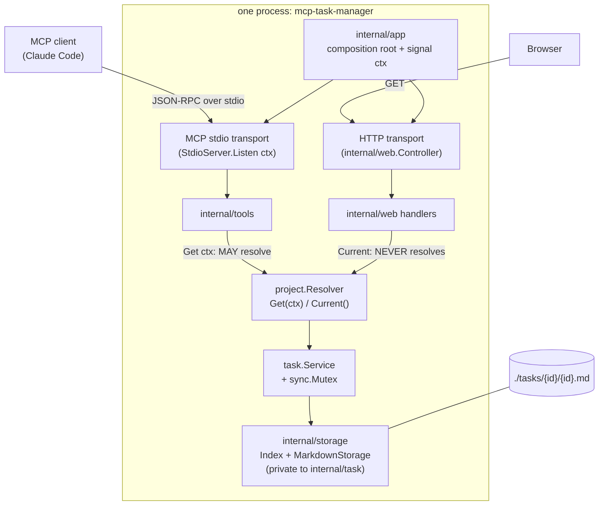
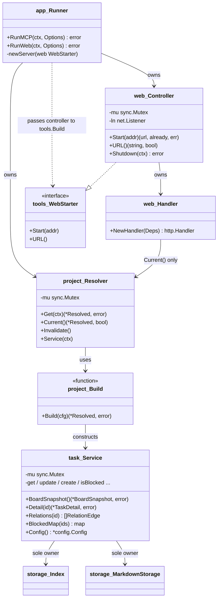
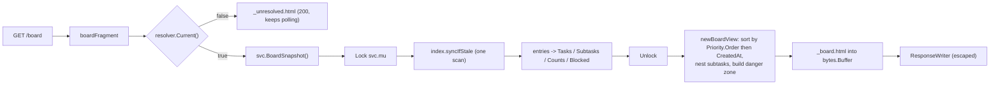

# DESIGN — Web UI module (htmx/tailwind kanban) alongside MCP

All paths absolute under `/Users/iga/Workspace/mcp-task-manager`. Every claim this design hinges on was re-verified against the code; new verifications are marked **[V]**.

---

### Design Summary

Add a read-only kanban dashboard served from the same process and the same `*task.Service` that backs the MCP tools.

Five decisions carry the whole design:

1. **`internal/task` becomes the single, enforced owner of task operations.** The web layer never touches `storage.Index`/`storage.MarkdownStorage`. Five new `Service` methods (`BoardSnapshot`, `Detail`, `Relations`, `BlockedMap`, `Config`) close every boundary leak research §4 names.
2. **One `sync.Mutex` on `task.Service`**, with exported methods locking once and delegating to unexported unlocked twins. Not an `RWMutex` — index *read* methods mutate (`syncIfStale`→`Rebuild`→`reset()` reassigns all three maps), so concurrent read-lock holders would still race.
3. **The HTTP layer never resolves the project.** A new non-resolving `Resolver.Current()` accessor removes the §14 hazard entirely: a GET can no longer trigger `Initialize()` (layout migration + auto-archive) or fire `OnResolve`→`SetTools` from an HTTP goroutine.
4. **A new composition root `internal/app`** owns both transports, one `context.Context` and one signal handler. **[V]** `server.NewStdioServer(srv)` + `(*StdioServer).Listen(ctx, stdin, stdout)` are exported in mcp-go v1.0.0 (`server/stdio.go:367,382,501`), so we replace `server.ServeStdio` (which installs its own hidden signal handler, `stdio.go:840-866`) and get cancellable stdio for free.
5. **`serve web` resolves eagerly and shares via `project.NewStatic`** — closing research's Unknown #1. A new exported `project.Build(cfg)` becomes the single service-construction site, replacing the duplicated body in `cli.initServiceWithConfig`.

**Scope boundaries.** Read-only UI; no mutation routes exist at all (structural, not policy). No new Go module dependencies. No child processes, no cross-process coordination.

**Non-goals (deliberately deferred):** write actions from the UI; SSE/WebSocket live push (htmx polling instead); an archive browsing page; auth on the HTTP endpoint; a CI test workflow; index versioning/caching to avoid rebuild-under-lock.

---

### Current-State Evidence

Re-verified beyond research.md:

- **[V] mcp-go stdio worker pool defaults to 5** (`…/mcp-go@v1.0.0/server/stdio.go:374`, `toolCallWorker` at `stdio.go:443`, queue fed in `processMessage`). **Tool calls already run concurrently in-process today.** Two concurrent `create_task` calls already race on `Index.entries` and can both read the same `NextID()`. The web server is not the first violator — it is the one that makes an existing latent bug routine. This materially strengthens the case for a *Service*-level lock rather than an index-only lock.
- **[V] `(*StdioServer).Listen(ctx, io.Reader, io.Writer) error`** — `stdio.go:501-547`; registers the session, starts workers and the notification pump under `ctx`, returns when `ctx` is cancelled or stdin EOFs, then drains workers. `SetErrorLogger` at `stdio.go:384` defaults to `log.New(os.Stderr, …)` (`stdio.go:369-381`).
- **[V] Service re-entrancy is pervasive** — `grep` for intra-service calls in `internal/task/service.go` yields 21 hits: `s.Get` at 248, 271, 280, 329, 427, 462, 502, 549, 651, 657, 691; `s.Update` at 528, 535, 586, 606, 624; `s.Create` at 227; `s.IsBlocked` at 512; `s.RunAutoArchive` at 148; `s.GetAutoArchiveCandidates` at 863; `s.ArchiveTask` at 869. A naive per-method lock self-deadlocks immediately.
- **[V] `Service.config` is write-once** — assigned only in `NewService` (`service.go:101-109`), never reassigned. So `EnsureProjectExists`/`ProjectFound`/the new `Config()` are safe without the lock.
- **[V] The index and storage are reachable only through the Service** — in `project.resolve` (`resolver.go:101-121`) and `cli.initServiceWithConfig` (`commands.go:21-33`) the `index`/`mdStorage` values are locals handed to `NewService` and dropped. Nothing else retains them. This is what makes the single Service mutex *complete* coverage rather than partial.
- **[V] Tool description schema** — `descriptions/*.yaml` is `{description: string, params: map[string]string}` (`internal/tools/descriptions.go:19-23`); `textFor` and `param` **panic** on a missing file/key (`descriptions.go:53-72`).
- **[V] Config zeroing trap is real** — `Resolve` unmarshals the YAML *over* `DefaultConfig()` (`config.go:130-156`), with no post-normalization step. `auto_archive: {enabled: true}` alone yields `AfterDays: 0`.
- **[V] `.tasks/task-file-storage/`** holds the four workflow artifacts (`task.md`, `research.md`, `design.md`, `plan.md`) of the **already-shipped** attached-files feature (its `task.md` opens "# Task: task-file-storage" and specifies `read_task_file`/`write_task_file`, which exist in CLAUDE.md today). It is tracked (4 files) and has no `{id}.md` record. No archived task under `tasks/archive/` references it.
- **[V] `.current_task`** contains the single line `web-ui-kanban-module` — untracked workflow scratch state.
- **[V] Plugin duality** — `.claude-plugin/marketplace.json` declares `"source": "./"`, `plugins/mcp-task-manager/` already contains `commands/`, `skills/` and its own `.mcp.json` (using `${CLAUDE_PLUGIN_ROOT}/../..`) but **no** `.claude-plugin/plugin.json`.
- **[V] Toolchain** — `go.mod` says `go 1.25.5`, so `http.ServeMux` method patterns, `http.FileServerFS` and `signal.NotifyContext` are all available. `.github/workflows/` holds only `release.yml`.

---

### Proposed Architecture

#### Layer rule (the boundary, point 1)

> `internal/task` is the only package that performs task operations. `internal/storage` is its private implementation detail. `internal/cli`, `internal/tools` and `internal/web` talk to `*task.Service` and nothing below it.

Today this holds *by accident* for cli/tools; the web module would be the first consumer tempted to break it (for relation edges and batch blocked-ness). The design closes the temptation by widening `Service` instead.

**New file `internal/task/view.go` (package `task`):**

```go
// SubtaskCount is a parent's subtask tally.
type SubtaskCount struct{ Total, Done int }

// BoardSnapshot is one consistent read of the whole active backlog, taken
// under a single lock acquisition and a single index sync.
type BoardSnapshot struct {
    Tasks    []*Task                   // every active task (top-level and subtasks), no descriptions
    Subtasks map[string][]*Task        // parent id -> its subtasks
    Blocked  map[string][]BlockingInfo // task id -> unresolved blockers; absent = not blocked
    Counts   map[string]SubtaskCount   // parent id -> tally
    TakenAt  time.Time
}

// TaskDetail is everything a detail view needs about one task, active or archived.
type TaskDetail struct {
    Task      *Task          // full, with Description
    Archived  bool
    Subtasks  []*Task        // empty for archived tasks (see below)
    Blocked   bool
    Blockers  []BlockingInfo
    Relations []RelationEdge // source ∪ target edges; empty for archived tasks
    Files     []string       // attached file names (works for archived too)
}

func (s *Service) BoardSnapshot() (*BoardSnapshot, error)
func (s *Service) Detail(id string) (*TaskDetail, error)
func (s *Service) Relations(taskID string) []RelationEdge
func (s *Service) BlockedMap(ids []string) map[string][]BlockingInfo
func (s *Service) Config() *config.Config // resolved project metadata; treat as read-only
```

Gap-by-gap resolution of research §4:

| Gap | Resolution |
|---|---|
| Full relation edges unreachable | `Service.Relations` wraps `index.GetRelationsForTask` (`index.go:572-590`); `Detail` embeds the result. |
| No batch blocked-ness (`list_tasks` loops `IsBlocked`, N×`syncIfStale`) | `BlockedMap(ids)` does one sync and one pass over `relationsBySource`. **`internal/tools/management.go:394-398` is refactored onto it** — a measurable win and it removes the N-scan pathology from the existing tool too. |
| Project metadata behind an unexported field | `Service.Config()` getter. The web never needs `*project.Resolved` for anything but obtaining the Service. |
| Descriptions absent from list results | **Declined, by design.** Cards carry no description excerpt; an excerpt would cost one file read per card per poll. The detail view loads the description through `Detail`. |
| Archived-task derived data | `Detail` sets `Archived` from `archiveStorage.IsArchived(id)` and, when true, returns empty `Subtasks`/`Relations`/`Blockers` **explicitly and documented** (the active index genuinely does not hold them), while still returning `Files`. The template renders an "Archived — read-only; relations and subtasks are not indexed" note rather than silently showing nothing. |

Deliberately **not** added: an `InProgress()` accessor (the web derives the danger zone from the snapshot) and any watch/notify channel (htmx polls).

#### Race protection (point 2)

**Decision: one `sync.Mutex` on `task.Service`. Nowhere else.**

```go
type Service struct {
    // mu serializes every task operation. It is the only lock over the
    // index and the markdown storage, both of which are reachable solely
    // through this type.
    //
    // DISCIPLINE: exported methods lock once on entry and delegate to an
    // unexported, unlocked twin. Service methods NEVER call each other's
    // exported forms — Go mutexes are not reentrant. When adding a method,
    // add it in this shape or TestServiceNoSelfDeadlock will fail.
    mu sync.Mutex

    storage        Storage
    archiveStorage ArchiveStorage
    fileStorage    FileStorage
    index          Index
    validTypes     []string
    config         *config.Config
}
```

**Where, and why there.** Not `storage.Index`: an index-only lock makes each index call atomic but leaves multi-step *Service* operations non-atomic, and `Create`'s `NextID()`-then-`Set` sequence would still allocate duplicate ids under the mcp-go 5-worker pool **[V]**. Not both: a second lock buys nothing once the outer one serializes all entry, and doubles the deadlock surface. One lock at one layer.

**Why `Mutex`, not `RWMutex`.** Every index query calls `syncIfStale()` on entry (`index.go:176-190`), which on staleness calls `Rebuild()`→`rebuildFromTasks`→`reset()`, reassigning `entries`, `relationsBySource`, `relationsByTarget` (`index.go:119-123`). `Index.Get` also touches disk; `Set`/`Delete` write `builtAt` (`index.go:258-268`). Therefore **`Service` has no read-only methods below it** — a shared read lock would permit two goroutines to rebuild concurrently, which is exactly the map race we are fixing. An `RWMutex` whose readers all take the write lock is a `Mutex` with extra vocabulary. Rejected.

**Re-entrancy discipline, concretely.** Seven exported methods are called from inside other Service methods **[V]** and need unexported unlocked twins; the rest are thin wrappers:

| Exported (locks) | Unlocked twin | Internal callers |
|---|---|---|
| `Get` | `get` | `getWithSubtasks`, `writeTaskFile`, `readTaskFile`, `listTaskFiles`, `update`, `delete`, `startTask`, `completeTask`, `addRelation`, `removeRelation` |
| `Create` | `create` | `CreateSubtask` |
| `Update` | `update` | `startTask`, `completeTask`, `closeSubtasksWith` |
| `IsBlocked` | `isBlocked` | `startTask`, `blockedMap`, `detail` |
| `ArchiveTask` | `archiveTask` | `runAutoArchive` |
| `GetAutoArchiveCandidates` | `autoArchiveCandidates` | `runAutoArchive` |
| `RunAutoArchive` | `runAutoArchive` | `Initialize` |

Plus `list`, `getWithSubtasks`, `subtaskCounts`, `relations`, `blockedMap` as unlocked forms used by the new `boardSnapshot`/`detail` composites. `closeSubtasksWith` and `updateAffectedRelationTasks` are already unexported and stay unlocked (rename-free).

`EnsureProjectExists`, `ProjectFound` and `Config()` take **no** lock: they read only `s.config`, which is write-once **[V]**. Documented in a comment so nobody "fixes" it later.

`Initialize()` locks and calls `runAutoArchive` (unlocked). It runs once, before the Service is published to any goroutine, but locking it costs nothing and keeps the rule uniform.

**Proof sketch.** (a) All mutable shared state lives in `Index` + `MarkdownStorage`; (b) both are reachable only through `Service` **[V]**; (c) every `Service` method that reaches them holds `mu`; (d) no method holding `mu` calls a method that acquires `mu`, because all intra-package calls target unlocked twins; (e) `mu` is never held across a blocking channel/network operation. ⇒ no data race, no self-deadlock, no lock ordering (there is only one lock).

**How `-race` exercises it:**
- `internal/task/concurrency_test.go::TestServiceRace` — 8 reader goroutines (`BoardSnapshot`, `List`, `Detail`, `Relations`) and 4 writers (`Create`, `Update`, `StartTask`, `CompleteTask`, `AddRelation`) × 200 iterations over a `t.TempDir()` backlog seeded with ~30 tasks, subtasks and `blocked_by` edges. Fails today's code loudly; must be clean after.
- `internal/web/race_test.go::TestHandlerRaceAgainstWrites` — `httptest.NewServer(web.NewHandler(...))`, 4 HTTP getters against `/` and `/board` while 2 goroutines mutate through the same `*task.Service`. This is the exact production shape.
- `internal/task/concurrency_test.go::TestServiceNoSelfDeadlock` — calls every exported method once under a `time.AfterFunc(10*time.Second, func(){ panic("deadlock") })` watchdog. Cheap permanent guard for the twin discipline.
- Gate becomes: `go test ./... && go test -race ./internal/task/ ./internal/web/ ./internal/app/`.

#### Process composition (point 3)

**New package `internal/app`** — the composition root, so both transports can be driven from tests without `os.Exit`. `cmd/mcp-task-manager/main.go` shrinks to mode selection; `newServer()`, `toolSet`, `//go:embed icon.png` and `//go:embed instructions.md` **move into `internal/app`** (the assets move with them; `go:embed` cannot cross `../`).

```go
// internal/app/app.go
package app

type Options struct {
    Web    config.WebConfig // effective web settings after flag/env overrides
    Stderr io.Writer        // log sink; never Stdout
}

// RunMCP serves MCP over stdio until ctx is cancelled or stdin closes,
// starting the web dashboard first when opts.Web.Enabled.
func RunMCP(ctx context.Context, opts Options) error

// RunWeb serves the dashboard in the foreground until ctx is cancelled,
// additionally attaching the stdio MCP transport when opts.Web.WithMCP.
func RunWeb(ctx context.Context, opts Options) error

// newServer assembles the MCP server (moved verbatim from main.go, plus the
// WebStarter argument threaded into tools.Build and the OnResolve closure).
func newServer(web tools.WebStarter) (*server.MCPServer, *project.Resolver)
```

**Which entry point resolves the project, and how the other shares it** — the decisive answer to Unknown #1:

| Mode | Resolution | Sharing |
|---|---|---|
| **MCP stdio** (`mcp-task-manager` with no args) | Unchanged: lazy `project.NewResolver(rootsFunc)`, first tool call resolves, roots participate. | The web `Controller` is handed the *same* `*project.Resolver` and reads it via the non-resolving `Current()`. Until the first tool call, the board shows a placeholder. |
| **`serve web`** | **Eager**, at startup: `cfg, _ := config.Load()` (no roots — no MCP client exists yet) → `resolved, err := project.Build(cfg)` → `rs := project.NewStatic(resolved)`. A resolution failure is a startup error with a non-zero exit code, not a runtime surprise. | That one static resolver is passed to `app.newServer`, so `tools.Build` and the web handler share the identical `*config.Config` and `*task.Service`. |

**Reconciling `project.Resolver` with `cli.initServiceWithConfig`:** extract the body of `Resolver.resolve` into a new exported constructor and call it from both places.

```go
// internal/project/resolver.go
// Build constructs the storage, index and task service for an already
// loaded config, running Initialize. It is the single construction site
// for a project: Resolver.resolve and the CLI both go through it.
func Build(cfg *config.Config) (*Resolved, error)
```

`internal/cli/commands.go::initServiceWithConfig` becomes a two-line wrapper over `project.Build` (returning `resolved.Service`), removing the duplicate. Import direction `cli → project` is new but acyclic (`project` imports only `config`, `storage`, `task`).

**Non-resolving accessor** (the mechanism behind point 4):

```go
// internal/project/resolver.go
// Current returns the cached resolution without resolving. It is how
// consumers that must not cause side effects (the HTTP handlers) read the
// project: resolution runs Initialize(), which migrates the layout and may
// auto-archive, and must only ever be triggered by an MCP tool call or by
// an explicit CLI startup.
func (r *Resolver) Current() (*Resolved, bool)
```

**Shutdown story:**

- `main.go`: `ctx, stop := signal.NotifyContext(context.Background(), syscall.SIGINT, syscall.SIGTERM); defer stop()`, passed into `cli.RunWithContext(ctx, …)` or `app.RunMCP(ctx, …)`.
- MCP transport: `stdio := server.NewStdioServer(srv); stdio.SetErrorLogger(log.New(os.Stderr, "", log.LstdFlags)); err := stdio.Listen(ctx, os.Stdin, os.Stdout)` **[V]**. This replaces `server.ServeStdio`, whose own `signal.Notify` would compete with ours and whose context is unreachable.
- Web transport: `Controller.Shutdown(shutdownCtx)` with a 5 s deadline, calling `http.Server.Shutdown`; the `Serve` goroutine returns `http.ErrServerClosed`, which is swallowed.
- Coordination uses a plain `sync.WaitGroup` + a buffered error channel — **no `golang.org/x/sync`**, keeping the "no new dependencies" criterion. Whichever transport returns first cancels a derived context; the other is shut down; `Run*` returns the first non-nil, non-`ErrServerClosed` error.
- `RunWeb` binds the listener **synchronously** before spawning `Serve`, so a port conflict is a startup error and `:0` yields a real URL.

**CLI entry point.** `internal/cli/cli.go` gains (mirroring the existing flaggy pattern, `cli.go:44-183`):

```go
serveCmd := flaggy.NewSubcommand("serve")
serveCmd.Description = "Run a server in the foreground"
webCmd := flaggy.NewSubcommand("web")
webCmd.Description = "Serve the read-only task dashboard"
webCmd.String(&serveAddr, "a", "addr", "Listen address (default from mcp-tasks.yaml, e.g. 127.0.0.1:7777)")
webCmd.Bool(&serveWithMCP, "", "mcp", "Also serve MCP over stdio in this process")
serveCmd.AttachSubcommand(webCmd, 1)
flaggy.AttachSubcommand(serveCmd, 1)
```

dispatch: `if webCmd.Used { return cmdServeWeb(ctx, stdout, stderr, serveAddr, serveWithMCP) }` placed before any `serveCmd.Used` check.

`RunWithArgs(args, stdout, stderr) int` keeps its exact signature (732 lines of tests depend on it) and delegates to a new `RunWithContext(ctx, args, stdout, stderr) int` with `context.Background()`. `Run()` builds the signal context. `cmdServeWeb` blocks until the context is cancelled and returns 0 on clean shutdown, 1 on a startup error.

**`--mcp` default is `false`, and `web.with_mcp` defaults to `false`.** Rationale: a human running `serve web` in a terminal has a TTY on stdin, and a stdio JSON-RPC reader there would consume keystrokes as garbage frames. The flag exists for the case where a wrapper launches `serve web --mcp` with pipes. This is the honest reading of "per config it also serves MCP in the same process".

#### The dangerous side effect (point 4)

**Decision: the HTTP layer is resolution-free. Structurally, not by convention.**

1. `web.Deps` carries `Project func() (*project.Resolved, bool)`, wired to `resolver.Current`. There is **no `context`-taking resolution path reachable from a handler** — the handler literally cannot call `Resolver.Get`. A GET can therefore never run `MigrateFlatLayout`, never delete `.index.json`, never `RunAutoArchive`, and never fire `OnResolve`→`SetTools` from an HTTP goroutine. §14's three hazards all disappear at once.
2. When `Current()` returns `false`, handlers render `_unresolved.html`: a 200 page reading "Waiting for the MCP client to identify the project — the board appears after the first task tool call", carrying the same `hx-get="/board" hx-trigger="every 5s"` poll, so it self-heals. Fragment routes return the same fragment (200) so htmx swaps it cleanly.
3. Each entry point guarantees resolution the right way:
   - `serve web` — eager resolution at startup, `NewStatic`; `Current()` is true from the first request.
   - MCP mode with `web.enabled: true` — the board shows the placeholder until the first tool call resolves. Honest and non-destructive.
   - `start_web_ui` — the handler is wrapped in `withService`, so resolution has *already* happened on the MCP goroutine by the time the listener binds. The tool call is exactly the right place for the side effects to run.
4. `Resolver.Invalidate()` (roots changed) flips `Current()` back to false until the next tool call; the placeholder covers that window. A test asserts it.

**Alternative rejected:** letting the web goroutine resolve at startup with a nil roots provider. It would race the MCP roots resolution and could *pin the wrong project* (cwd marker search) before the client's roots arrive — the resolver caches the first success — and it reintroduces disk mutation from a GET.

#### `start_web_ui` (point 5)

`internal/tools` declares the interface; `internal/web` implements it; `internal/app` wires them. `tools` does **not** import `web`.

```go
// internal/tools/tools.go
// WebStarter starts the read-only web dashboard on demand. A nil WebStarter
// omits start_web_ui from the tool set (CLI-built sets and tests pass nil).
type WebStarter interface {
    // Start binds and serves if not already running and returns the base
    // URL. A second call returns the running URL unchanged and binds nothing.
    // An empty addr means the configured default.
    Start(addr string) (url string, already bool, err error)
    URL() (url string, running bool)
}

func Build(rs *project.Resolver, validTypes, relationTypes []string, web WebStarter) []server.ServerTool
func Register(s *server.MCPServer, rs *project.Resolver, validTypes, relationTypes []string, web WebStarter)
```

`Build` appends `webTools(rs, web)` which returns `nil` when `web == nil`. **Critical:** the `OnResolve` closure in `app.newServer` must capture the same `web` value and pass it to `tools.Build`, or `SetTools` re-publication would silently drop the tool (research §8). A test covers exactly this.

Handler — `withService` needs **no change**; we wrap it with a second closure:

```go
// internal/tools/web.go
func startWebUIHandler(rs *project.Resolver, web WebStarter) server.ToolHandlerFunc {
    return withService(rs, func(ctx context.Context, _ *task.Service, req mcp.CallToolRequest) (*mcp.CallToolResult, error) {
        addr := req.GetString("addr", "")
        url, already, err := web.Start(addr)
        if err != nil {
            return mcp.NewToolResultError("could not start the web dashboard: " + err.Error()), nil
        }
        if already {
            return mcp.NewToolResultText("Task dashboard already running: " + url), nil
        }
        return mcp.NewToolResultText("Task dashboard started: " + url + " (read-only)"), nil
    })
}
```

The `svc` argument is intentionally discarded — `withService`'s resolution **side effect** is what we want: it guarantees `Current()` succeeds for the web handlers before the listener accepts anything.

Tool schema (one optional string param, modelled on `get_next_task`'s parameterless shape plus `list_tasks`' optional params):

```go
mcp.NewTool("start_web_ui",
    mcp.WithDescription(text.Description),
    mcp.WithString("addr", mcp.Description(text.param("addr"))),
)
```

**Idempotency** is in `web.Controller.Start`, under its own mutex: if `c.ln != nil`, return `(c.url, true, nil)` without touching the network. Never an error, never a double bind.

**Required file `internal/tools/descriptions/start_web_ui.yaml`** (absent ⇒ `textFor` panics at package init **[V]**):

```yaml
description: |
  Start the read-only web dashboard for this project's tasks and return its
  URL. The dashboard shows a kanban board (todo / in progress / done) and task
  detail views. It never modifies tasks. Safe to call repeatedly: if the
  dashboard is already running, its existing URL is returned and no second
  listener is bound.
params:
  addr: |
    Optional listen address, e.g. "127.0.0.1:7777" or ":0" for any free port.
    Defaults to the web.addr setting from mcp-tasks.yaml. Ignored if the
    dashboard is already running.
```

A new `TestEveryToolHasDescriptions` iterates `Build(...)` and asserts a YAML file exists for each name, turning that panic trap into a test failure forever.

#### Config (point 6)

```go
// internal/config/config.go
const (
    EnvWebEnabled = "MCP_WEB_ENABLED" // "1"/"true" enables the dashboard
    EnvWebAddr    = "MCP_WEB_ADDR"    // listen address, e.g. 127.0.0.1:7777
)

const DefaultWebAddr = "127.0.0.1:7777"

// WebConfig configures the read-only web dashboard.
type WebConfig struct {
    Enabled bool   `yaml:"enabled"`
    Addr    string `yaml:"addr"`
    WithMCP bool   `yaml:"with_mcp"` // `serve web` also attaches the stdio MCP transport
}

type Config struct {
    TaskTypes     []string          `yaml:"task_types"`
    RelationTypes []string          `yaml:"relation_types,omitempty"`
    AutoArchive   AutoArchiveConfig `yaml:"auto_archive"`
    Web           WebConfig         `yaml:"web"`   // value field, mirrors AutoArchive
    TasksDirName  string            `yaml:"tasks_dir,omitempty"`
    // ... unchanged yaml:"-" runtime fields
}
```

`DefaultConfig()` gains `Web: WebConfig{Enabled: false, Addr: DefaultWebAddr, WithMCP: false}`.

**The partial-section zeroing trap.** `Resolve` unmarshals over `DefaultConfig()` **[V]**, so `web: {enabled: true}` would zero `Addr` to `""` and the server would bind `:0` (random port) — a nasty, silent bug. Fix with one new step immediately after `yaml.Unmarshal` in `Resolve` (`config.go:~152`):

```go
cfg.applyDefaults() // fills fields the YAML left empty back from DefaultConfig
```

```go
func (c *Config) applyDefaults() {
    d := DefaultConfig()
    if len(c.TaskTypes) == 0        { c.TaskTypes = d.TaskTypes }
    if len(c.RelationTypes) == 0    { c.RelationTypes = d.RelationTypes }
    if c.AutoArchive.AfterDays <= 0 { c.AutoArchive.AfterDays = d.AutoArchive.AfterDays }
    if strings.TrimSpace(c.Web.Addr) == "" { c.Web.Addr = d.Web.Addr }
}
```

This also repairs the pre-existing `auto_archive` trap research §9 documented — a one-line bonus fix, covered by its own regression test. Booleans stay as-written (`false` is their default anyway, so the trap does not apply to them).

**Env overrides**, applied after `applyDefaults`, orthogonal and explicit (no implicit enabling — setting an address must not silently open a port):

```go
if v := strings.TrimSpace(os.Getenv(EnvWebAddr)); v != ""    { cfg.Web.Addr = v }
if v := strings.TrimSpace(os.Getenv(EnvWebEnabled)); v != "" {
    if b, err := strconv.ParseBool(v); err == nil { cfg.Web.Enabled = b }
}
```

`mcp-tasks.yaml` (the repo's own) gains, as documentation-by-example:

```yaml
web:
  enabled: false
  addr: 127.0.0.1:7777
```

#### Web package design (point 7)

```
internal/web/
  controller.go        // lifecycle: Start/URL/Shutdown, http.Server, listener
  server.go            // NewHandler(Deps) http.Handler — the route table
  handlers.go          // board, boardFragment, detail, detailPanel, health
  view.go              // view models + pure mapping from task.BoardSnapshot / task.TaskDetail
  templates.go         // embedded template set, parsed once, funcMap
  assets.go            // //go:embed of static/, http.FileServerFS wiring
  templates/
    layout.html        // page shell: <head>, /static/app.css, /static/htmx.min.js
    board.html         // page  = layout + _board
    _board.html        // fragment: danger-zone banner + the three columns
    _card.html         // fragment: one card, nested subtask rows
    detail.html        // page  = layout + _detail (deep-linkable)
    _detail.html       // fragment: the side panel
    _unresolved.html   // placeholder when the project is not resolved yet
  assets/input.css     // Tailwind entry (committed, input to the manual build)
  static/
    app.css            // Tailwind build output (committed)
    htmx.min.js        // htmx 2.0.4 (committed)
  controller_test.go  handlers_test.go  view_test.go  race_test.go
```

```go
type Deps struct {
    Project     func() (*project.Resolved, bool) // non-resolving; resolver.Current
    Logger      *log.Logger                      // defaults to log.New(os.Stderr, "web: ", log.LstdFlags)
    Now         func() time.Time                 // injectable for deterministic tests
    PollSeconds int                              // board poll interval; default 5
}
func NewHandler(d Deps) http.Handler

type Controller struct{ /* mu sync.Mutex; ln net.Listener; srv *http.Server; url string; ... */ }
func NewController(d Deps, defaultAddr string) *Controller
func (c *Controller) Start(addr string) (url string, already bool, err error) // satisfies tools.WebStarter
func (c *Controller) URL() (string, bool)
func (c *Controller) Shutdown(ctx context.Context) error // idempotent
```

**Route table** (`http.ServeMux`, Go 1.22 method patterns):

| Pattern | Handler | Renders |
|---|---|---|
| `GET /` | `board` | full page (`board.html`) |
| `GET /board` | `boardFragment` | `_board.html` only — htmx poll target |
| `GET /tasks/{id}` | `detail` | full page (`detail.html`), deep-linkable |
| `GET /tasks/{id}/panel` | `detailPanel` | `_detail.html` only — htmx swap target |
| `GET /static/` | `http.StripPrefix("/static/", http.FileServerFS(staticFS))` + `Cache-Control: public, max-age=31536000, immutable` | embedded assets |
| `GET /healthz` | `health` | `text/plain; charset=utf-8` → `ok` |

**Read-only is structural:** only `GET` patterns are ever registered, so `ServeMux` answers any other method with 405 by itself, and no handler holds a code path that calls a mutating `Service` method. `TestNoMutatingRoutes` asserts both the 405s and that a full GET sweep leaves the tasks directory byte-identical (recursive listing + mtimes before/after).

**htmx usage (two real partial updates):**
- Board auto-refresh: `<div id="board" hx-get="/board" hx-trigger="every 5s" hx-swap="outerHTML">` — the fragment replaces itself.
- Card open: `hx-get="/tasks/{id}/panel" hx-target="#panel" hx-swap="innerHTML" hx-push-url="/tasks/{id}"` — panel swap plus a shareable URL that the full-page route serves on reload.

**View models — explicit, never `*task.Task` in a template** (derived data is needed on every card, and passing the model would tempt `{{ .Relations }}` renderings that can't resolve titles):

```go
type BoardView struct {
    Project     ProjectView
    Columns     []ColumnView // fixed order: todo, in_progress, done
    DangerZone  []DangerItem // the in_progress tasks
    PollSeconds int
    Generated   string
}
type ColumnView struct{ Status, Title string; Count int; Cards []CardView }
type CardView struct {
    ID, Title, Priority, Type, Status string
    PriorityRank int
    IsSubtask    bool
    ParentID     string
    Blocked      bool
    Blockers     []BlockerView
    SubtaskTotal, SubtaskDone int
    Resolution   string
    InProgress   bool   // drives the danger-zone styling
    UpdatedAgo   string
    Subtasks     []CardView // nested when the parent is in the same column
}
type BlockerView struct{ ID, Status, Title string }
type DangerItem struct{ ID, Title, Type, UpdatedAgo string }
type ProjectView struct{ Root, TasksDir, Source string; TaskCount int }
type DetailView struct {
    Card        CardView
    Description string   // plain text; rendered in <pre class="whitespace-pre-wrap">
    Archived    bool
    Relations   []RelationView
    Files       []string
    CreatedAt, UpdatedAt, ClosedAt, VerifiedAt string // "" when nil
    ResolutionNote string
}
type RelationView struct{ Type, Direction, OtherID, OtherTitle string } // Direction: "outgoing"|"incoming"

func newBoardView(snap *task.BoardSnapshot, cfg *config.Config, now time.Time, poll int) BoardView
func newDetailView(d *task.TaskDetail, now time.Time) DetailView
```

Both mapping functions are pure and are the bulk of `view_test.go`.

**Sorting.** Within each column: `sort.SliceStable` by `task.Priority.Order()` ascending (research §5 — the index sorts by id, *not* priority, so the board must sort itself), then `CreatedAt` ascending (older first, matching CLAUDE.md's documented tiebreaker), then `compareTaskIDs`-equivalent id order. Columns are in the fixed enum order `todo`, `in_progress`, `done`.

**Subtask placement rule (decisive).** A card is placed in the column of **its own** status. A subtask nests inside its parent's card **only when the parent sits in the same column**; otherwise it appears as a standalone card flagged `IsSubtask` with a `↳ #parent` chip that links to the parent's detail. This satisfies "visually marks subtasks **or** nests them" without the ambiguity of a subtask appearing in two columns.

**Danger zone.** Computed as `snap` filtered to `StatusInProgress` (no new Service method). Presented twice: (a) an amber banner above the columns — *"⚠ An agent may be working right now on #12 Task title, #15 … — files in these areas can change under you."*; (b) the in-progress column header and each in-progress card carry an amber ring. Pure presentation; no route behaves differently. Empty set ⇒ the banner is omitted entirely.

**Archived tasks.** **Not on the board** — the snapshot is the active index only. A linear `LoadAllArchived` scan (87 directories today) per 5 s poll would dominate the cost, and the CLI's own default also hides them. The detail route *does* serve archived tasks (`Service.Detail` falls back to the archive), rendering an "Archived — read-only" banner and the explicit "relations and subtasks are not indexed for archived tasks" note. A dedicated `/archive` page is deferred.

**Escaping.** Every field is a plain `string` rendered with `{{ . }}`. No `template.HTML`, no Markdown renderer, no `{{ safeHTML }}` funcMap entry — the funcMap holds only `humanize`-style helpers over strings. A test feeds `<script>alert(1)</script>` as a title, description and attached filename and asserts the literal does not appear unescaped.

**Logging.** `Controller` sets `http.Server.ErrorLog` to `Deps.Logger` (stderr). No `fmt.Print*`/`os.Stdout` anywhere in `internal/web`; the only writer handlers touch is the `http.ResponseWriter`. This satisfies the "never write to stdout in stdio mode" criterion.

**Per-request cost.** One `BoardSnapshot` = one lock acquisition, one `syncIfStale`, zero task-file reads (index entries only). Template execution goes into a `bytes.Buffer` before the `ResponseWriter` so a mid-render error yields a 500 rather than a torn page. The detail route adds exactly one `storage.Load` plus one `ListFiles`.

#### Vendored assets (point 8)

| File | Content | How obtained |
|---|---|---|
| `internal/web/static/htmx.min.js` | htmx **2.0.4** minified (~48 KB) | one-time download from `https://unpkg.com/htmx.org@2.0.4/dist/htmx.min.js`, committed |
| `internal/web/static/app.css` | Tailwind build output | produced by `scripts/build-css.sh`, committed |
| `internal/web/assets/input.css` | `@import "tailwindcss"; @source "../templates";` + a few `@theme` tokens | handwritten, committed |
| `scripts/build-css.sh` | maintainer-only refresh step | downloads the pinned **Tailwind standalone CLI** release binary into `.cache/` (gitignored) if absent, runs it over `assets/input.css` |

**Node-free and offline:** Tailwind ships a self-contained standalone executable (no `npm`, no `node_modules`). It is invoked **only** by the maintainer script, never by `go build`, `go generate` or `go test`. A clean checkout builds and tests with zero network access because `app.css` and `htmx.min.js` are committed.

Embeds live inside the package (embed cannot cross `../`):

```go
//go:embed templates/*.html
var templateFS embed.FS

//go:embed static/app.css static/htmx.min.js
var staticFS embed.FS
```

Files are listed **individually** rather than `static/*` so a stray source map or cache file can never be shipped in the binary.

`.gitignore` must **not** gain `*.css`/`*.js` (it would break the build); it gains `/.cache/` for the CLI download. `TestNoExternalAssetReferences` renders the board and detail pages and fails if any `src=`/`href=` value starts with `http://` or `https://`.

#### Dogfooding (point 9)

**The root `.mcp.json` cannot serve both roles.** For a project-scoped server `${CLAUDE_PLUGIN_ROOT}` expands to empty (measured failure `go: chdir : no such file or directory`), and for a *marketplace-installed* plugin the installed directory is not a Go module at all, so `go run` is wrong there regardless of the variable. Different commands are correct in the two roles. **Split them.**

1. **`/.mcp.json` → project scope only** (Claude Code launches project servers with the repo as cwd and exports `CLAUDE_PROJECT_DIR`):
   ```json
   {
     "mcpServers": {
       "task-manager": {
         "command": "go",
         "args": ["run", "./cmd/mcp-task-manager"],
         "env": { "GOWORK": "off" }
       }
     }
   }
   ```
   No `-C`, no variables. Resolution then lands on this repo via `CLAUDE_PROJECT_DIR` → `mcp-tasks.yaml`'s `tasks_dir: tasks`. **Verification is a real tool call** (`list_tasks` must return `web-ui-kanban-module`), not inspection — an acceptance criterion.
2. **`plugins/mcp-task-manager/.mcp.json` → the distributed plugin**, using the installed binary, no variable at all:
   ```json
   { "mcpServers": { "task-manager": { "command": "mcp-task-manager" } } }
   ```
   README already documents `go install`; that becomes a stated plugin prerequisite.
3. **`.claude-plugin/marketplace.json`**: `"source": "./"` → `"source": "./plugins/mcp-task-manager"`, and `.claude-plugin/plugin.json` is **copied** to `plugins/mcp-task-manager/.claude-plugin/plugin.json` (that directory already carries the plugin's `commands/` and `skills/` **[V]**). Version bumped to 1.5.0. This is what stops the project-scoped file from being handed to plugin installs.
4. **`.tasks/`**: `git mv .tasks/task-file-storage docs/history/task-file-storage` and remove the now-empty `.tasks/`. The four documents are tracked workflow artifacts of the shipped attached-files feature **[V]**; they have archival value but are not a task (no `{id}.md` record), so parking them under `docs/` preserves them without fabricating an archived task. `.tasks/` is **not** gitignored — it is the default tasks-dir name for other projects and ignoring it here would be misleading.
5. **`.gitignore`** gains:
   ```
   # retired index cache (removed automatically by Index.Load, ignored in case an old binary writes one)
   .index.json
   # workflow scratch state
   .current_task
   # tailwind standalone CLI download
   /.cache/
   ```
   `tasks/.index.json` does not currently exist and `Index.Load` unconditionally removes it (`index.go:165-174`), so the entry is belt-and-braces for old binaries — which is exactly what the acceptance criterion asks for ("removed and/or gitignored").

#### Docs impact (point 10)

**CLAUDE.md:**
- Architecture ASCII block (top) — add a `Web UI (kanban)` box as a third peer above `Task Service`, alongside `CLI Commands` and `MCP Tool Handlers`.
- New "### Package boundary" paragraph under Design Decisions: *`internal/task` is the only package that performs task operations; `internal/storage` is private to it.*
- New "### Web UI" section: read-only kanban, one process two transports, `start_web_ui`, embedded htmx/Tailwind, the danger-zone indication, archived tasks absent from the board.
- **"### Concurrency"** — the line *"MVP assumes single-server, no locking"* is replaced by: *"A single `sync.Mutex` on `task.Service` serializes every task operation. It is the only lock over the index and markdown storage, which are reachable solely through the service; exported methods lock once and delegate to unexported unlocked helpers. File writes remain atomic (temp + rename). Cross-process coordination is still out of scope: MCP and web always run in one process."*
- "## MCP Tools" — new "### Web UI" table row for `start_web_ui`.
- "## Configuration" — the `web:` section in the YAML example; `MCP_WEB_ENABLED` / `MCP_WEB_ADDR` rows in the env table.
- "## Project Structure" — `internal/web/**`, `internal/app/**`, `internal/testsupport/`, `scripts/build-css.sh`; `cmd/mcp-task-manager/` loses `icon.png` and `instructions.md`.
- "## Behavior & Error Handling → Validation" — note `applyDefaults` and that a partially specified section no longer zeroes its siblings.

**README.md:**
- `### Running the Server` (:57) — new "Web dashboard" subsection with `mcp-task-manager serve web --addr 127.0.0.1:7777`.
- `### CLI Usage` (:99) — a `serve web` example in the "Other" block (:133).
- `### Claude Code Integration` (:172) — document the **project-scoped** `.mcp.json` form (currently only the plugin path is documented) *and* the plugin's `go install` prerequisite.
- `## MCP Tools` (:261) — `start_web_ui`.
- `### Config File` (:299) — `web:` section; `### Environment Variables` (:318) — two new rows.
- `## Project Structure` (:385) — `internal/web`, `internal/app`.
- New maintainer subsection "Refreshing the vendored CSS" documenting `scripts/build-css.sh` and the pinned htmx version.

#### Testing strategy (point 11)

**New shared helper package `internal/testsupport/`** (a normal internal package that imports `testing`, the way `net/http/httptest` does) — `internal/tools/tools_test.go:114-125`'s `newTestService` is package-local and would otherwise be copied three times:

```go
package testsupport
// NewBacklog builds an isolated project in t.TempDir() and returns a static
// resolver plus its service and directory.
func NewBacklog(t *testing.T) (*project.Resolver, *task.Service, string)
// Seed creates tasks, subtasks and relations from a compact spec.
func Seed(t *testing.T, svc *task.Service, specs ...TaskSpec)
// IsolateEnv clears MCP_TASKS_DIR / MCP_PROJECT_DIR / CLAUDE_PROJECT_DIR /
// MCP_ROOT_SOURCE (lifted from cmd/mcp-task-manager/main_test.go:32-38).
func IsolateEnv(t *testing.T)
```

| Area | File | Tests |
|---|---|---|
| Handlers | `internal/web/handlers_test.go` | `TestBoardRendersThreeColumns`, `TestBoardCardBadges` (blocked / subtask / priority order / subtask counts), `TestDetailPage`, `TestDetailPanelIsFragment` (no `<html>`), `TestDetailUnknownID404`, `TestDetailArchivedTask`, `TestNoMutatingRoutes` (405s **and** byte-identical tasks dir after a full GET sweep), `TestEscaping`, `TestUnresolvedProjectPlaceholder` (resolver whose roots func calls `t.Fatal` if invoked — proves GETs never resolve), `TestInvalidateShowsPlaceholderAgain`, `TestNoExternalAssetReferences`, `TestStaticAssetsServed` |
| View mapping | `internal/web/view_test.go` | priority-then-created-at ordering, subtask nesting rule (same column vs. cross column), danger-zone set, archived detail shape |
| Lifecycle | `internal/web/controller_test.go` | `TestControllerStartIdempotent` (two `Start`s → same URL, `already==true`, one listener), `TestControllerStartPortZero`, `TestControllerShutdown` (dial fails afterwards), `TestShutdownIdempotent` |
| Race | `internal/task/concurrency_test.go`, `internal/web/race_test.go` | `TestServiceRace`, `TestServiceNoSelfDeadlock`, `TestHandlerRaceAgainstWrites` — all under `-race` |
| Composition | `internal/app/app_test.go` (absorbing `cmd/mcp-task-manager/main_test.go`'s in-process client + `rootsHandler` harness) | `TestRunWebStartsAndShutsDown` (ctx cancel → returns nil, port closed), `TestRunMCPStartsWebWhenEnabled`, `TestRunMCPDoesNotStartWebByDefault`, `TestRunMCPWebSharesResolution` (tool call creates a task → the board shows it), `TestStdioListenStopsOnContextCancel` |
| Tools | `internal/tools/tools_test.go` | `TestStartWebUIIdempotent` (fake `WebStarter` recording calls), `TestBuildOmitsStartWebUIWhenNil`, `TestSetToolsRepublicationKeepsStartWebUI`, `TestEveryToolHasDescriptions` |
| Config | `internal/config/config_test.go` | `TestWebDefaults`, `TestPartialWebSectionKeepsDefaultAddr`, `TestPartialAutoArchiveKeepsDefaultAfterDays` (regression for the §9 trap), `TestEnvWebOverrides`, `TestEnvWebEnabledInvalidIgnored` |
| CLI | `internal/cli/cli_test.go` | `TestServeWebReturnsOnContextCancel` (via the new `RunWithContext`), `TestServeWebBadAddrExitsNonZero` |

**Manual validation:** build the binary, run `mcp-task-manager serve web` in this repo, open `http://127.0.0.1:7777/`, confirm the single `web-ui-kanban-module` card appears in *To do*, open its detail panel (attached files `task.md`, `research.md`, `design.md` listed), disconnect the network and reload to prove offline rendering, then start a task via the CLI in another terminal and watch the 5 s poll move the card and raise the danger-zone banner.

**Gate:** `go build ./... && go vet ./... && go test ./... && go test -race ./internal/task/ ./internal/web/ ./internal/app/`.

---

### Context Diagram



### Structure Diagram



### Data Flow Diagram



### Sequence Diagram

```mermaid
sequenceDiagram
  participant U as User/agent
  participant C as MCP client
  participant M as app.RunMCP
  participant S as StdioServer
  participant T as tools
  participant R as project.Resolver
  participant W as web.Controller
  participant B as Browser

  U->>M: start (no args)
  M->>M: signal.NotifyContext(SIGINT,SIGTERM)
  M->>W: NewController(deps{Project: R.Current}, cfg.Web.Addr)
  alt cfg.Web.Enabled
    M->>W: Start("") -> binds listener, go Serve
  end
  M->>S: NewStdioServer(srv); Listen(ctx, stdin, stdout)
  C->>S: initialize
  B->>W: GET /
  W->>R: Current()
  R-->>W: (nil,false)
  W-->>B: placeholder page (no disk side effects)
  C->>S: tools/call start_web_ui
  S->>T: startWebUIHandler
  T->>R: Service(ctx)  %% resolves: roots/list, Initialize(), migration, auto-archive
  R-->>T: *task.Service
  T->>W: Start(addr)
  W-->>T: (url, already=false)
  T-->>C: "Task dashboard started: http://127.0.0.1:7777/"
  B->>W: GET /board (every 5s)
  W->>R: Current() -> (resolved,true)
  W->>W: svc.BoardSnapshot() under svc.mu
  W-->>B: _board.html
  U->>M: SIGINT
  M->>W: Shutdown(5s ctx)
  M->>S: ctx cancelled -> Listen returns, workers drain
  M-->>U: exit 0
```

---

### ADR

- **Title:** One process, one service mutex, and a resolution-free HTTP layer for the kanban web module
- **Status:** Accepted
- **Date:** 2026-09-20
- **Context:** The dashboard must share the MCP server's process, project resolution and `*task.Service`. That service and the in-memory index carry no locks, and every index *read* can mutate state through `syncIfStale`→`Rebuild`. mcp-go's stdio server already dispatches tool calls across 5 workers **[V]**, so writer-writer races exist today. Project resolution is lazy and has heavy side effects (`Initialize`: layout migration, `.index.json` removal, auto-archive) plus an `OnResolve` callback that calls `SetTools`. `Service` methods call each other 21 times **[V]**, so naive per-method locking self-deadlocks. The user's binding constraints: one package owns task operations, race protection must be simple, one launcher, and the board surfaces the in-flight task.
- **Decision:**
  1. Widen `task.Service` with `BoardSnapshot`, `Detail`, `Relations`, `BlockedMap`, `Config`; forbid any other package from touching `internal/storage`.
  2. One `sync.Mutex` on `task.Service`; exported methods lock once and delegate to unexported unlocked twins.
  3. Add `project.Current()` and give the web handler only that — HTTP never resolves and therefore never mutates disk or republishes tools.
  4. Add `internal/app` as the composition root, drive stdio via `NewStdioServer.Listen(ctx, …)` **[V]** so one signal context shuts down both transports.
  5. `serve web` resolves eagerly via a new exported `project.Build(cfg)` and shares through `project.NewStatic`; `cli.initServiceWithConfig` is reduced to a wrapper over `project.Build`.
  6. `tools.Build` gains a `WebStarter` parameter (interface declared in `tools`, implemented by `web.Controller`); `start_web_ui` wraps `withService` unchanged, and the `OnResolve`/`SetTools` closure passes the same starter.
  7. `WebConfig{Enabled, Addr, WithMCP}` as a value field plus a `Config.applyDefaults()` normalization step that also repairs the pre-existing `auto_archive` zeroing trap.
- **Consequences:**
  - Every task operation is serialized process-wide. On this backlog size the cost is negligible; a board poll that triggers a full index rebuild briefly blocks a tool call.
  - The existing `create_task`/`create_task` id-collision race is fixed as a side effect.
  - A board opened before the first MCP tool call shows a placeholder — acceptable, self-healing, and strictly better than a GET migrating directories.
  - The twin-method discipline is a human invariant; `TestServiceNoSelfDeadlock` plus a prominent `Service` doc comment guard it.
  - `tools.Build`'s signature change touches both call sites; forgetting the starter in the `OnResolve` closure would silently drop the tool — covered by a test.
  - The stdio entry point no longer uses `server.ServeStdio`, so our signal handling must be correct; covered by a test.
  - `CLAUDE.md`'s "no locking" contract is invalidated and rewritten.
- **Alternatives Rejected:**
  - **`sync.RWMutex` with `RLock` on reads** — unsound: index reads rebuild and reassign maps, so two read-lock holders race. Taking the write lock in readers makes the `RWMutex` a `Mutex` with more vocabulary.
  - **Lock inside `storage.Index` only** — leaves multi-step service operations non-atomic and keeps the duplicate-`NextID()` race under the 5-worker pool.
  - **Locks at both layers** — buys nothing once the outer lock serializes entry; doubles the deadlock surface. Explicitly against "не мудри там с защитами".
  - **Actor / single-owner goroutine with a command channel** — the classic over-engineered answer; rejected by the user's constraint.
  - **Web goroutine resolves the project itself at startup** — races MCP roots resolution, can pin the wrong (cwd-derived) project permanently, and reintroduces migration + auto-archive on a GET.
  - **Serializing tool calls by setting mcp-go's worker pool to 1** — hides one symptom, leaves CLI/web concurrency unprotected, and slows unrelated calls.
  - **A second binary / child process for the web server** — explicitly excluded by the task ("one process, two transports") and would reintroduce cross-process write races.
  - **A web framework (chi/echo) or server-side Markdown rendering** — new dependencies, and Markdown rendering conflicts with the "no `template.HTML` on task content" criterion.
  - **SSE/WebSocket live updates instead of polling** — needs an index change-notification the service does not have; polling is sufficient for a read-only board.
  - **Keeping the root `.mcp.json` dual-role** — impossible: the correct command differs between the two roles (`go run` in the repo vs. an installed binary), and `${CLAUDE_PLUGIN_ROOT}` expands to empty for project scope.

---

### Risk Analysis

**Correctness**
- *Twin-method discipline drift.* A new exported `Service` method calling another exported one deadlocks. Mitigation: doc comment on the `mu` field, `TestServiceNoSelfDeadlock`.
- *Snapshot atomicity vs. disk.* `BoardSnapshot` is consistent under the lock, but an MCP write between the snapshot and the detail request can 404 a card. Handlers render a "task no longer exists — refresh" panel rather than a bare 500.
- *`Detail` on an archived task* legitimately returns empty relations/subtasks; if the template did not say so, users would read it as "no relations". The explicit banner is a correctness requirement, not polish.
- *`SetTools` republication dropping `start_web_ui`* if the closure forgets the starter — test-covered.

**Lifecycle / ordering**
- Replacing `server.ServeStdio` removes mcp-go's built-in SIGINT/SIGTERM handling; ours must be installed or Ctrl-C regresses. Test-covered.
- In MCP mode the listener binds before any project is resolved; a bind failure at process start must log to stderr and **not** kill the MCP server (the dashboard is optional). Decision: in `RunMCP`, a web start failure is logged and swallowed; in `RunWeb` it is fatal.
- `Resolver.Invalidate()` transiently returns the board to the placeholder. Acceptable and self-healing.
- The tool-started controller and the config-started controller are the **same** `*Controller` instance owned by `app`, so `start_web_ui` after a config-enabled start is a no-op returning the running URL.

**Performance / hot path**
- The 5 s board poll takes the global service lock. `BoardSnapshot` is one lock, one `syncIfStale`, zero file reads on the steady path. When the directory is stale it triggers a full `Rebuild` (parse every task file) *while holding the lock* — the one real contention scenario. Mitigations: 5 s (not 1 s) poll; archived tasks excluded; no per-card descriptions. Deferred: a debounced/versioned index.
- Templates parsed once at package init; rendering into a pooled-free `bytes.Buffer` per request (a few KB) is not a concern at this scale.
- `BlockedMap` replaces `list_tasks`' N×`syncIfStale` loop — a net improvement to existing code.

**Compatibility**
- `tools.Build` / `tools.Register` signature change — internal package, two call sites.
- `cli.RunWithArgs` keeps its signature; only a `RunWithContext` sibling is added, so the 732-line CLI test suite is untouched.
- `.claude-plugin/marketplace.json`'s `source` change means already-installed plugins need a version bump (1.4.2 → 1.5.0) to pick it up.
- Binding a TCP port is new behavior: default `enabled: false`, default addr **loopback only** (`127.0.0.1:7777`). A non-loopback bind is the operator's explicit choice; the surface is read-only and unauthenticated, which the README must state plainly.
- Moving `icon.png`/`instructions.md` into `internal/app` changes no external behavior but touches `release.yml`'s build only if it references those paths (it does not — it builds `./cmd/...`).

**Codegen** — none; see below.

---

### Testing Strategy

See **Testing strategy (point 11)** above for the full table. Summary of the three pillars:

1. **Handler-level web tests** over a `t.TempDir()` backlog via `internal/testsupport`, driven with `httptest.NewRequest`/`NewRecorder`, asserting columns, cards, badges, fragments vs. pages, 404, escaping, offline assets, the placeholder path and the **no-mutation guarantee** (405s plus a byte-identical tasks directory after a GET sweep).
2. **Race tests** at two levels — `internal/task` (service API under concurrent readers/writers) and `internal/web` (real `httptest.Server` against a live writer) — both required to pass `go test -race`, plus a deadlock watchdog.
3. **Process-composition tests** in `internal/app`, reusing the in-process MCP client + `rootsHandler` harness lifted from `cmd/mcp-task-manager/main_test.go:17-43`, covering both directions of startup, the shared resolution, and clean shutdown on context cancellation.

Regression checks: the existing `internal/config`, `internal/cli`, `internal/tools` and `internal/storage` suites must stay green unchanged; the two new config tests specifically pin the partial-section behavior that `applyDefaults` alters.

---

### Codegen Impact

This project has no code generation. `go:embed` is the only build-time input coupling: `internal/web/templates/*.html` and the two named files under `internal/web/static/` must exist at build time or `go build` fails. `scripts/build-css.sh` is a **manual** maintainer step producing `internal/web/static/app.css`; it is deliberately not wired into `go generate` so that no build path requires network access or the Tailwind binary. Neither fast nor full regeneration applies.

---

### File Impact Map

**New**

| Path | Purpose |
|---|---|
| `internal/task/view.go` | `BoardSnapshot`, `TaskDetail`, `SubtaskCount` + the five new Service methods |
| `internal/task/concurrency_test.go` | `TestServiceRace`, `TestServiceNoSelfDeadlock` |
| `internal/app/app.go` | `Options`, `RunMCP`, `RunWeb`, `newServer` (moved), `toolSet` (moved) |
| `internal/app/icon.png`, `internal/app/instructions.md` | moved from `cmd/mcp-task-manager/` (embeds cannot cross `../`) |
| `internal/app/app_test.go` | composition tests (absorbs `cmd/mcp-task-manager/main_test.go`) |
| `internal/web/{controller,server,handlers,view,templates,assets}.go` | the web module |
| `internal/web/templates/{layout,board,_board,_card,detail,_detail,_unresolved}.html` | template set |
| `internal/web/assets/input.css` | Tailwind entry (committed) |
| `internal/web/static/{app.css,htmx.min.js}` | vendored, embedded assets |
| `internal/web/{handlers,view,controller,race}_test.go` | web tests |
| `internal/tools/web.go` | `webTools`, `startWebUIHandler` |
| `internal/tools/descriptions/start_web_ui.yaml` | **mandatory** — absent ⇒ package-init panic |
| `internal/testsupport/testsupport.go` | `NewBacklog`, `Seed`, `IsolateEnv` |
| `scripts/build-css.sh` | manual Tailwind refresh |
| `plugins/mcp-task-manager/.claude-plugin/plugin.json` | plugin manifest at the plugin root |
| `docs/history/task-file-storage/*` | `git mv` of the orphaned `.tasks/` artifacts |

**Modified**

| Path | Change |
|---|---|
| `internal/task/service.go` | add `mu sync.Mutex` + discipline comment; split 7 methods into locked/unlocked pairs; add unlocked forms for `list`, `getWithSubtasks`, `subtaskCounts`; `Config()` getter |
| `internal/task/task.go` | none expected (badge data already present) |
| `internal/project/resolver.go` | export `Build(cfg)`; add `Current()`; `resolve` delegates to `Build` |
| `internal/config/config.go` | `WebConfig`, `Config.Web`, `DefaultWebAddr`, `EnvWebEnabled`, `EnvWebAddr`, `applyDefaults()` + env overrides in `Resolve` |
| `internal/config/config_test.go` | four new tests |
| `internal/tools/tools.go` | `WebStarter` interface; `Build`/`Register` gain the parameter; `Build` appends `webTools` |
| `internal/tools/management.go` | `list_tasks` uses `svc.BlockedMap` instead of the per-task `IsBlocked` loop (:394-398) |
| `internal/tools/tools_test.go` | four new tests |
| `internal/cli/cli.go` | `serve web` subcommand + flags + dispatch; `RunWithContext`; `Run` builds the signal context |
| `internal/cli/commands.go` | `initServiceWithConfig` → wrapper over `project.Build`; new `cmdServeWeb` |
| `internal/cli/cli_test.go` | two new tests |
| `cmd/mcp-task-manager/main.go` | shrinks to mode selection + signal context; embeds and `newServer` move to `internal/app` |
| `cmd/mcp-task-manager/main_test.go` | contents relocated to `internal/app/app_test.go` |
| `mcp-tasks.yaml` | add the `web:` section |
| `.mcp.json` | project-scoped form (no `-C`, no variable) |
| `plugins/mcp-task-manager/.mcp.json` | `{"command":"mcp-task-manager"}` |
| `.claude-plugin/marketplace.json` | `source` → `./plugins/mcp-task-manager`; version 1.5.0 |
| `.claude-plugin/plugin.json` | version 1.5.0 |
| `.gitignore` | `.index.json`, `.current_task`, `/.cache/` |
| `CLAUDE.md`, `README.md` | see point 10 |

**Deleted / moved** — `.tasks/` (contents moved to `docs/history/`); `cmd/mcp-task-manager/icon.png` and `instructions.md` (moved).

---

### Open Questions

All of research.md's Unknowns are now closed:

| Unknown | Resolution |
|---|---|
| Where `serve web` obtains the project | Eagerly at startup via `config.Load()` → new `project.Build(cfg)` → `project.NewStatic`; the same resolver is handed to `tools.Build`, so MCP shares it. `cli.initServiceWithConfig` collapses into `project.Build`. |
| Locking vs. serializing vs. accepting the race | Locking: one `sync.Mutex` on `task.Service` with unlocked twins. `CLAUDE.md`'s "no locking" contract is rewritten. |
| How `start_web_ui` receives addr/controller | `tools.Build(rs, validTypes, relationTypes, WebStarter)`; interface in `tools`, `*web.Controller` implements it; addr from the optional `addr` param falling back to `cfg.Web.Addr`. `withService` is reused unchanged. |
| Whether one `.mcp.json` serves both roles | No. Root file → project scope (`go run ./cmd/mcp-task-manager`); plugin file → installed binary; `marketplace.json` `source` re-pointed at `plugins/mcp-task-manager`. |
| mcp-go cancellable stdio | **[V] Yes** — `NewStdioServer` + `Listen(ctx, stdin, stdout)` are exported (`stdio.go:367,501`). We adopt them and install our own `signal.NotifyContext`. |
| CI test workflow | Out of scope for this task; gates stay local (`go build`/`vet`/`test`/`test -race`). Flagged for a follow-up task. |

Remaining genuinely open (non-blocking, decide during implementation):
1. Exact Tailwind standalone CLI version to pin in `scripts/build-css.sh` — pick the latest v4 release at implementation time and record it in the script header.
2. Whether `docs/history/` is the maintainer's preferred parking spot for the orphaned `.tasks/task-file-storage/` documents, or whether they should simply be deleted. The design assumes preservation; deletion is a one-line change to the plan.