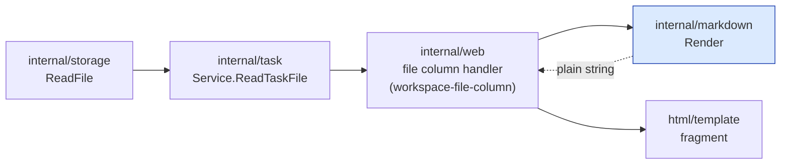
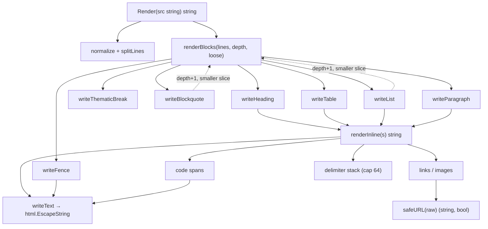
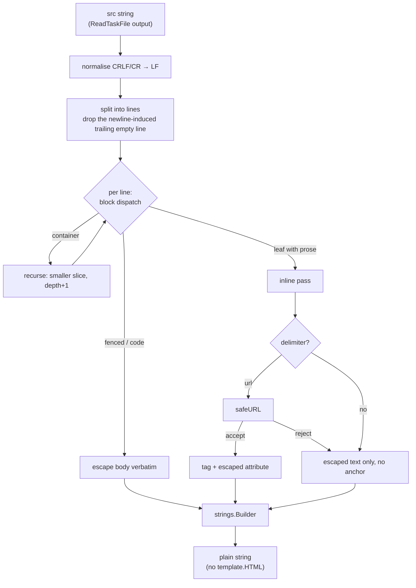
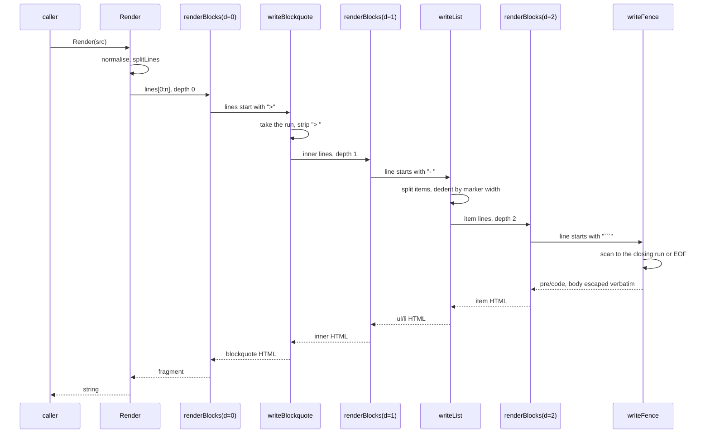

# Design — workspace-markdown

Phase: design, run 1. Built on `research.md` (run 1) and the task
description. One new leaf package, no change to any existing file.

### Design Summary

A new standard-library-only package `internal/markdown` exposes exactly one
symbol:

```go
// Render turns markdown into an HTML fragment. The output is trusted only in
// the sense that it is this package's own markup: every byte that came from
// src is escaped. There is no unsafe mode.
func Render(src string) string
```

Inside, a two-stage renderer with no AST:

1. **Normalise and split** — `\r\n` and lone `\r` become `\n`, the source is
   split into lines, and the trailing empty line a final newline produces is
   dropped. 114 of 173 corpus artifacts have no trailing newline, so both
   shapes must land on the same line slice.
2. **Block loop** writes HTML into a `strings.Builder`, dispatching per line
   on the block starts in a fixed order. Container blocks (blockquote, list
   item) recurse into the same function with a strictly smaller line slice
   and `depth+1`, capped at 16.
3. **Inline pass** renders one text run at a time, left to right, with a
   bounded delimiter stack and no recursion.

The escaping property is structural, not procedural: `writeText` is the only
function in the package that copies source bytes into the output, and it
calls `html.EscapeString`. Every `<` in the output therefore comes from a tag
literal in this package, which a test asserts over the whole corpus.

Two deltas from the task description's subset, both decided on corpus
evidence and flagged for review in the ADR: **GFM task-list checkboxes are
supported** (33 real occurrences; the description's own escape clause asks
for exactly this), and **underscore emphasis is not** (1 real occurrence
against pervasive `snake_case`).

### Current-State Evidence

- `go.mod` declares `go 1.25.5` and three direct requirements; no markdown or
  sanitizer module, direct or indirect, and no `vendor/`. "Zero
  dependencies" is a property to preserve, not to establish.
- `internal/web/templates.go:16-19` states the rule this renderer's output
  will eventually bend: "There is deliberately no safeHTML helper and no
  `template.HTML` anywhere in this package". The wrap point belongs to
  `workspace-file-column`, not here.
- `internal/storage/files.go:85-89` (`MarkdownStorage.ReadFile`) returns the
  whole file as a `string` with no size cap: the renderer's input is an
  unbounded in-memory string by construction.
- `internal/vcs` is the precedent for a leaf package: single purpose,
  standard library only, driven by one consumer through an interface.
- `html.EscapeString` escapes all five required characters, verified:
  `<>&"'` → `&lt;&gt;&amp;&#34;&#39;`. `html.UnescapeString("&#9;")` returns
  a tab, which is why `&` must be escaped inside every emitted `href`.
- Corpus counts behind every subset decision are in `research.md` §1.

### Proposed Architecture

**Package `internal/markdown`**, three source files:

| File | Holds |
| ---- | ----- |
| `markdown.go` | the package doc, `Render`, the block loop and every block writer |
| `inline.go` | the inline pass, the delimiter stack, `writeText` |
| `url.go` | `safeURL`, the five-step accept rule |

**Block dispatch order**, evaluated per line (first match wins):

1. blank line — closes whatever is open, emits nothing
2. fence: `` ``` `` or `~~~`, 3+ of the same character
3. ATX heading: `#{1,6}` followed by a space or end of line
4. thematic break: 3+ of `-`, `*` or `_`, nothing else but spaces
5. blockquote: `>` optionally followed by one space
6. table: this line contains `|` **and** the next line is a delimiter row
7. list: `[-*+]` or `\d+[.)]`, followed by a space
8. paragraph: everything else, gathered until a blank line or another block
   start

`---` is always rule 4, never a setext heading: all 110 "ambiguous"
occurrences in the corpus are YAML frontmatter closers or lines inside fenced
yaml examples (`research.md` §1).

**Emitted tags** — the whitelist the invariant test enforces:

`h1 h2 h3 h4 h5 h6 p pre code ul ol li blockquote hr table thead tbody tr th
td strong em a img br`

**Emitted attributes** — `class` (code language, table alignment, task-list
item), `href`, `src`, `alt`. No `style`, no `id`, no `on*`, no `<script>`,
no `<html>`. A code block's info string becomes `class="language-<info>"`
only when the first word matches `[A-Za-z0-9_+.-]+`; anything else drops the
class and keeps the body.

**Container recursion.** A blockquote's content and a list item's content are
re-entered through the same `renderBlocks(lines []string, depth int)`. The
line slice always shrinks, so termination follows from the slice length;
`depth` guards the Go stack. At `depth == maxDepth` (16) the remaining lines
render as one escaped paragraph instead of recursing — degrade, never panic.

**List looseness.** A list is loose if a blank line separates two of its
items or appears inside an item that has more content after it. A tight
item's single paragraph is emitted bare inside `<li>`; everything else is
wrapped in `<p>`. This is the one place the block writer needs a flag rather
than only the line slice.

**Inline pass.** One left-to-right scan, advancing at least one byte per
iteration:

- backslash followed by ASCII punctuation → that character, escaped, as
  literal text
- a run of N backticks, closed by the next run of exactly N → `<code>`, with
  one leading and one trailing space stripped, body escaped
- `` → `` when the URL passes, else the escaped alt
  text alone
- `[text](url)` → `<a href>` when the URL passes, else the inline-rendered
  text alone, no anchor
- a run of `*` → delimiter stack; `**` prefers `<strong>`, a single `*`
  `<em>`; an unmatched run is literal text
- anything else → `writeText`

`_` is not an emphasis delimiter (see ADR). Emphasis is matched without
recursion and without an AST, using the CommonMark reference technique: an
opener records its byte offset in the output buffer, and a matching closer
splices the open tag in at that offset and appends the close tag. The stack
holds at most 64 entries; delimiters past that render literally.

**Hard breaks.** Inside a paragraph, a line ending in two or more spaces
emits `<br />` before the next line's content; otherwise lines are joined
with `\n`.

### Context Diagram



The new package is a leaf: it imports only `html`, `strings` and `unicode`,
and nothing in the tree imports it until `workspace-file-column` lands. The
dashed edge is the single `template.HTML` wrap point that subtask owns.

### Structure Diagram



Ownership is one-way: `Render` owns the builder, block writers own their line
range, the inline pass owns its own buffer. Nothing holds state across a
`Render` call, so the package has no package-level mutable state and is safe
for the concurrent web reads described in `CLAUDE.md`'s Concurrency section.

### Data Flow Diagram



Every arrow into `strings.Builder` that carries source bytes passes through
`writeText` or the fenced-body escaper. That is the whole escaping argument.

### Sequence Diagram

The nested case — a fenced block inside a list item inside a blockquote —
because it is the one path where recursion, dedenting and verbatim escaping
meet:



An unterminated fence returns at end-of-slice with the block closed
implicitly; the caller's index still advances past the consumed lines, which
is what makes the loop terminate.

### ADR

- `Title`: A hand-written, standard-library-only markdown renderer in its own
  leaf package `internal/markdown`
- `Status`: Accepted
- `Date`: 2026-10-08
- `Context`: The workspace file viewer has to show task artifacts as prose.
  `go.mod` has three direct requirements and no vendor directory, and the
  project's offline guarantee is currently stated only for browser assets;
  goldmark was declined on 2026-10-07 to extend that guarantee to the Go
  build. The corpus is 173 files, 1.2 MB, written by agents following this
  repo's workflow skills, so its construct mix is both known and narrow
  (`research.md` §1). The renderer's output will be the single documented
  exception to `internal/web`'s no-`template.HTML` rule.
- `Decision`:
  1. **Own package, not `internal/web`.** `internal/markdown`, importing
     only `html`, `strings` and `unicode`. It is testable without
     `httptest`, it keeps the trusted-HTML exception down to the one wrap
     point in the web package rather than putting a trusted-HTML producer
     inside the package whose comment forbids one, and the planned
     `web-backlog-graph` column can reuse it. `internal/vcs` is the shape
     being copied. `CLAUDE.md`'s package-boundary rule constrains task
     operations and says nothing about presentation helpers, so this is an
     explicit choice, not a default.
  2. **No AST.** Escape at every emit, through one `writeText`. The
     alternative — build a tree, escape once on render — makes an escaping
     bug a missed call somewhere; this makes it a new code path, which a test
     can see.
  3. **One exported symbol, `Render(src string) string`.** No options
     struct, no renderer type, no unsafe mode — there is nothing to
     misconfigure.
  4. **`---` is always a thematic break.** Setext headings are unused in the
     corpus and `---` is used 266 times as a rule or a frontmatter closer.
  5. **Task-list checkboxes are supported**, as `<li class="task-list-item">`
     with a `☐` / `☑` glyph and no form element. The task description lists
     them out of scope "add later only if a real artifact in `tasks/` needs
     them" — 33 occurrences do, all in `task.md` acceptance-criteria lists,
     which is the artifact the viewer will show most. No `<input>`, so the
     read-only fragment stays free of form markup and
     `workspace-file-column` styles a class.
  6. **Underscore emphasis is not supported.** One real occurrence against
     pervasive `snake_case` identifiers in prose. `*` and `**` only.
  7. **No HTML entity decoding.** 8 occurrences corpus-wide; `&middot;`
     renders literally. "Escape `&` always" is the property the acceptance
     criteria ask for, and it is what makes `java&#9;script:` unreachable.
  8. **Images are parsed.** The corpus has none, but the acceptance criteria
     filter "link and image URLs", so `` renders ``
     for an accepted URL and the escaped alt text for a rejected one.
  9. **Bounded recursion and a bounded delimiter stack** (depth 16, 64
     delimiters), degrading to literal text rather than erroring.
- `Consequences`:
  - `go.mod` and `go.sum` are untouched; the offline guarantee now covers the
    Go build.
  - The subset is a subset. Reference links, footnotes, setext headings,
    autolinks, tilde fences and entities render as literal text. That is
    graceful: the reader sees the source, not broken markup.
  - This repo now owns markdown parsing, including its bugs. The mitigation
    is the corpus test plus a fuzz target, not a dependency to upgrade.
  - A second consumer (`web-backlog-graph`) can import the package without
    touching `internal/web`.
  - `internal/web` will gain exactly one `template.HTML` wrap, in
    `workspace-file-column`, and its templates.go comment will need the
    documented exception added there — not in this subtask.
- `Alternatives Rejected`:
  - **`github.com/yuin/goldmark` (+ `bluemonday`).** CommonMark-correct and
    maintained, but it adds a module (two, with a sanitizer) to a tree that
    has three direct requirements, and the decision to decline it was taken
    on 2026-10-07 before this task existed. Recorded here because it remains
    the right answer if the subset ever has to grow towards real CommonMark.
  - **`internal/web/markdown.go`.** Fewer packages, and "web owns
    rendering" is a real habit in this repo. Rejected: it would put a
    trusted-HTML producer inside the one package that documents having none,
    and it would make the renderer's tests reachable only alongside the HTTP
    surface.
  - **An AST plus a separate escaping render pass.** The conventional shape
    and friendlier to future features, but it moves the escaping guarantee
    from "one function copies source bytes" to "every node type remembered
    to escape", for a subset this small.
  - **A sanitizing post-pass over generated HTML.** Defence in depth, but it
    would be a second parser — the thing this task exists to avoid — and it
    hides producer bugs instead of failing on them.
  - **Rendering ` ```mermaid ` as a diagram.** Explicitly declined in the
    task's clarifications; it stays an ordinary fenced block (25
    occurrences, so this is visible, and deliberate).

### Risk Analysis

**Correctness.** A hand-written parser is wrong in corners by construction.
The mitigations are specific rather than general: the whole-corpus render
test (no panic, terminates), the tag-whitelist invariant over that same
corpus, and a fuzz target. The known-wrong cases are enumerated above and
degrade to literal text.

**Security.** The acceptance criteria are security criteria. Three concrete
hazards and their answers:

| Hazard | Answer |
| ------ | ------ |
| raw HTML in prose, headings, code, link text | `writeText` is the only source-byte path; `html.EscapeString` covers `< > & " '` |
| `javascript:` and friends, including case, control-character and entity tricks | `safeURL`'s five steps (`research.md` §3), plus `&` escaping in the attribute so no decode can rebuild a scheme |
| an attribute break-out via a quote in a URL or a code language | the same escaper runs on every attribute value; `"` → `&#34;`, `'` → `&#39;` |

The residual risk is a tag the whitelist test does not know about, which is
why that test lists tags explicitly rather than pattern-matching.

**Lifecycle / ordering.** None. The package has no state, no init, no
construction order, and nothing to clean up — `Render` is a pure function.
It therefore sits outside `CLAUDE.md`'s twin-discipline and mutex rules
entirely: the web layer calls it after the service lock is released, with a
string it already holds.

**Performance.** Per request, one pass over the file plus one builder.
Largest artifact is ~56 KB, longest line 1 188 characters. Two known
non-linearities, both bounded: splicing an emphasis open tag into the output
buffer is O(output) per match with a 64-delimiter cap, and the output builder
is grown with a `src`-proportional `Grow` to keep reallocation off the hot
path. This is not a per-frame path; it is one file render per user click, and
`workspace-file-column` decides whether to cache.

**Codegen.** None — this project has no code generation.

**Compatibility.** A new package with no importers: nothing can regress.
`go.mod` and `go.sum` must show no diff, which is itself a check.

### Testing Strategy

All in `internal/markdown`, table-driven in the style of
`internal/web/view_test.go`:

| File | Tests |
| ---- | ----- |
| `markdown_test.go` | one table per construct: headings h1–h6, paragraph, bullet and ordered lists, nested lists, tight versus loose, blockquote, nested blockquote, thematic break, fenced block with and without an info string, unterminated fence, fence inside a list, GFM table (alignment, inline code in a cell, a link in a cell, header-only, ragged rows), task-list items, hard break, CRLF input, input with no trailing newline, empty input, whitespace-only input |
| `escape_test.go` | `<script>` in prose, in a heading, in a code block, in a table cell, in link text and in a link title; `"`/`'` in every attribute position; the eight corpus entities rendering literally |
| `url_test.go` | the full accept/reject table from `research.md` §3, one case per row, asserting both the href and that a rejected URL keeps its visible text and emits no `<a` |
| `corpus_test.go` | walk every `*.md` and extensionless artifact under `../../tasks` (skipping cleanly if the directory is absent, so the test survives a checkout without it): must not panic, must return, and **every `<` in the output must begin a whitelisted tag** — the invariant that makes the escaping argument checkable rather than reviewed |
| `fuzz_test.go` | `FuzzRender`, seeded from the corpus plus the pathological inputs: deep nesting, 1 000-level emphasis, a 1 MB single line, a fence opened inside a blockquote inside a list, a table with a header and no body, mixed CRLF. Asserts no panic and the same tag invariant. The first `Fuzz*` target in the tree |

Regression checks: `go build ./...`, `go vet ./...`, `go test ./... -race`,
and `git diff --exit-code go.mod go.sum` as the zero-dependency gate.

Manual validation: none is possible in this subtask — there is no HTTP
surface yet. The substitute is a golden-ish spot check inside
`corpus_test.go` with `-v` on two real artifacts
(`tasks/web-task-workspace/research.md`, which is table- and
code-span-heavy, and `tasks/web-ui-kanban-module/task.md`, which carries the
checkboxes), eyeballed once during implementation and then asserted only on
the invariants, not on exact bytes — exact-byte goldens over a 20 KB file
would be unmaintainable noise.

### Codegen Impact

None. This project has no code generation; no tags, annotations or
generation config change, and no generated file is affected.

### File Impact Map

| Path | Change | Notes |
| ---- | ------ | ----- |
| `internal/markdown/markdown.go` | new | package doc, `Render`, block loop, block writers |
| `internal/markdown/inline.go` | new | inline pass, delimiter stack, `writeText` |
| `internal/markdown/url.go` | new | `safeURL` |
| `internal/markdown/markdown_test.go` | new | construct tables |
| `internal/markdown/escape_test.go` | new | escaping tables |
| `internal/markdown/url_test.go` | new | URL accept/reject table |
| `internal/markdown/corpus_test.go` | new | whole-corpus render + tag invariant |
| `internal/markdown/fuzz_test.go` | new | `FuzzRender` |
| `go.mod`, `go.sum` | **unchanged** | asserted by the build gate |
| `CLAUDE.md` | deferred | the Project Structure tree and a short renderer note land with `workspace-file-column`, when the package has a consumer and the `template.HTML` exception becomes real |
| `internal/web/**` | untouched | this subtask adds no route, template or CSS |

### Open Questions

1. **Does the viewer offer `{id}.md` itself?** If so, something must decide
   whether YAML frontmatter is stripped before rendering; today it would
   render as a thematic break plus a paragraph of `key: value` lines. Not
   this subtask's call — `workspace-file-column` owns it, and this renderer
   deliberately has no frontmatter awareness.
2. **Relative links.** This renderer emits the author's URL verbatim, so
   `[design](design.md)` resolves against whatever URL the viewer is served
   at. Rewriting it to a workspace URL is `workspace-file-column`'s choice;
   one such link exists in the whole corpus.
3. **Checkbox glyph versus class-only.** The design emits both a `☐`/`☑`
   glyph and a `task-list-item` class. If `workspace-file-column` would
   rather draw the box in CSS, the glyph becomes redundant — a one-line
   change then, not a design question now.
4. **Caching.** Whether a rendered artifact is cached per (task, file, mtime)
   belongs to the consumer; `Render` stays pure so that either choice works.
