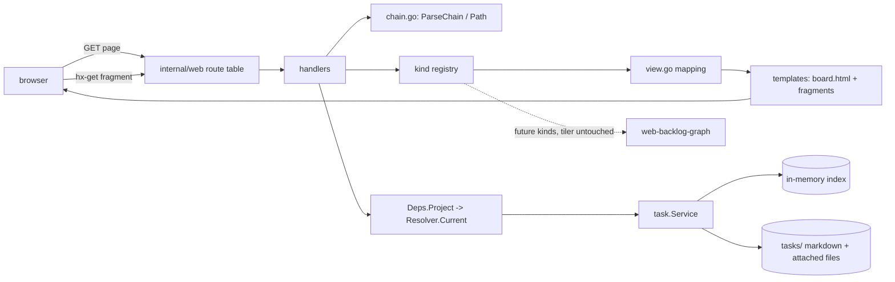
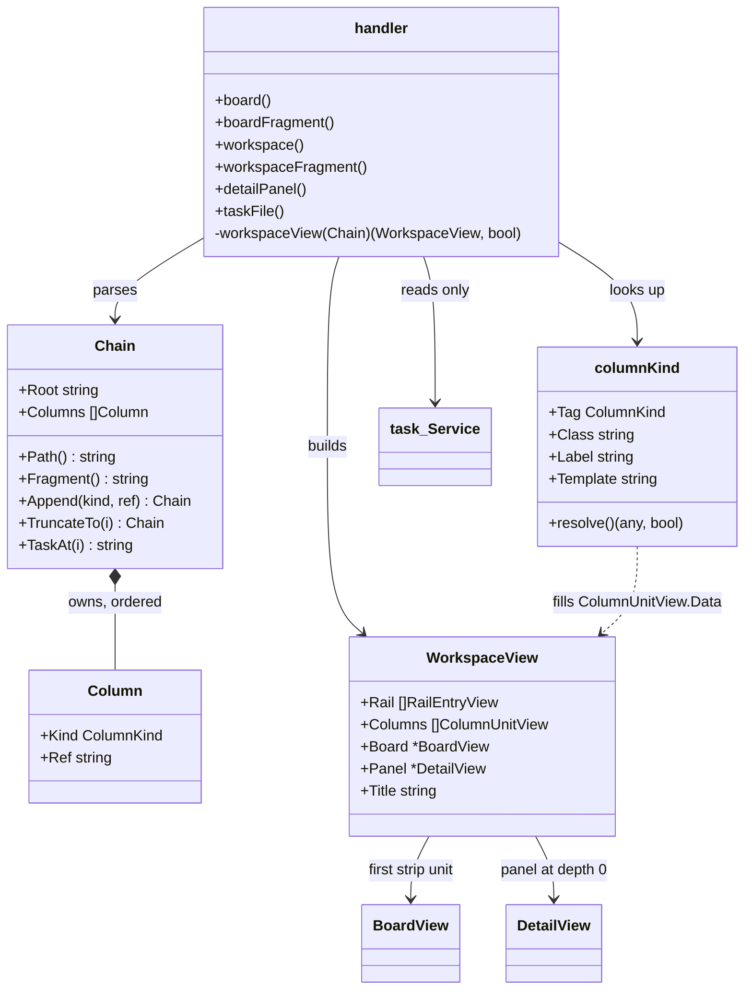
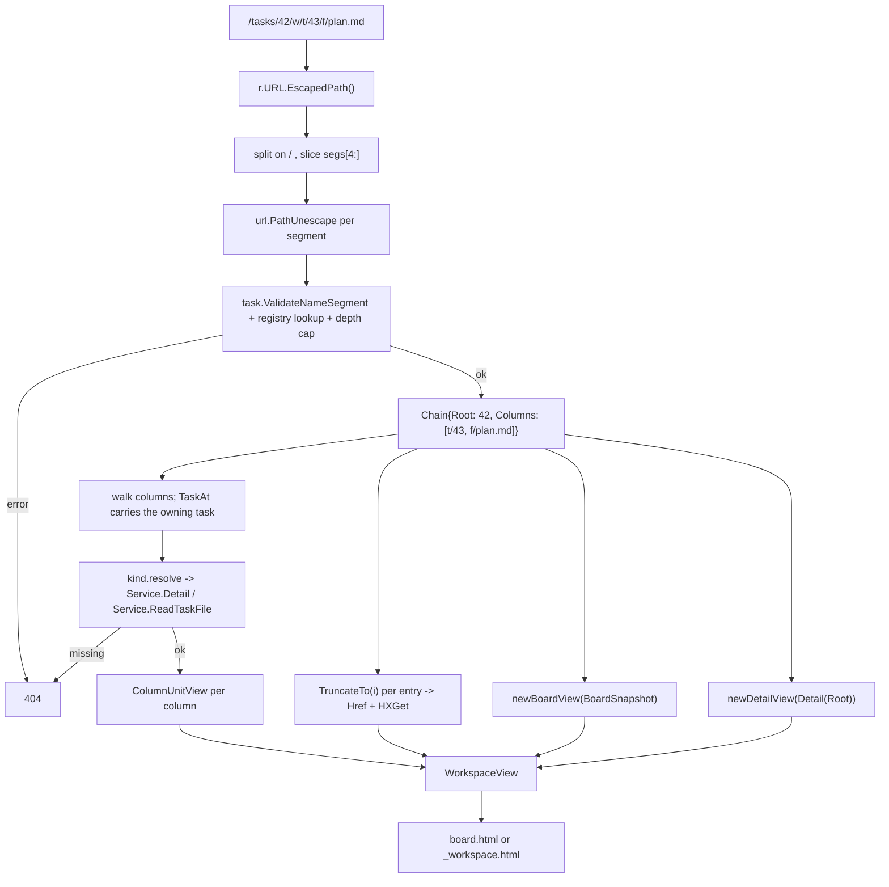

# Design — workspace-tiler

Phase: design, run 1. Built on `research.md` (probe results) and
`clarifications.md` (the four decisions of 2026-10-08). Every claim about the
current tree is cited there or here; no code below.

### Design Summary

Introduce the column chain as a first-class value in `internal/web`, a kind
registry that resolves and renders one column, a two-part page shell (pinned
rail outside, clipped stage inside) and one route family that serves every
chain state as both a page and an htmx fragment.

The board stops being the page and becomes the strip's first unit. `/` renders
a strip of one unit and is byte-for-byte the board it is today apart from two
wrapper `div`s. `/tasks/{id}` renders the same strip with that task's panel
pre-filled, which is what the chain of depth 0 means. Each `type/ref` pair in
the path appends one column to the right of the strip.

Two things the subtask description asks for are **not** built, and the ADR
below carries the reasoning: there is no server-set `translateX` step, and
there is no `/tasks/{id}/w/` state. Placement is `justify-content: flex-end`
inside `overflow-x: clip`, which is what makes heterogeneous column widths and
unbounded depth work without geometry in Go; the depth-0 chain is
`/tasks/{id}`, which is what makes the trailing-slash question disappear.

Scope boundaries: this subtask ships the mechanism and **stub** column bodies
(`clarifications.md`). The task column's real content is
`workspace-task-column`, the rendered file `workspace-file-column`, polling
and scroll preservation `workspace-live`, the graph column
`web-backlog-graph`.

### Current-State Evidence

- Seven GET patterns, read-only by construction, registered in one function
  (`internal/web/server.go:54-65`).
- Handlers read `Deps.Project` → `Resolver.Current` only, and turn an
  unresolved project into 404 on a task route but a placeholder on the board
  (`internal/web/handlers.go:30-36,75-92`, `internal/web/server.go:18-23`).
- `render` buffers before writing, so a template error is a clean 500
  (`internal/web/handlers.go:122-132`).
- The board page is a two-column grid with `#panel` as a sticky `<aside>`
  **outside** the polled `#board`
  (`internal/web/templates/board.html:2-11`,
  `internal/web/templates/_board.html:1`).
- Three template sets; `detailPage` exists only for the standalone page, and
  the package forbids `template.HTML` and any `safeHTML` helper
  (`internal/web/templates.go:16-33`).
- View models are plain strings by doctrine: "No `*task.Task` ever reaches a
  template" (`internal/web/view.go:14-17`).
- Geometry precedent: a named class sets a custom property, CSS computes the
  rest, Go computes nothing (`internal/web/assets/input.css:50-73`). A
  bounded-by-position class set is also precedent
  (`.series-0`…`.series-7`, `internal/web/view.go:109-111`,
  `internal/web/assets/input.css:123-130`).
- `task.ValidateNameSegment` / `ValidateAttachedName` are exported and are the
  one shape rule for ids and file names (`internal/task/name.go:17-38`).
- `markdown.Render` exists, stdlib only, no unsafe mode
  (`internal/markdown/markdown.go:1-37`) — consumed by
  `workspace-file-column`, not here.
- From `research.md`: `PathValue` is decoded (so `%2F` forges a separator);
  `EscapedPath()` keeps the raw form; tail extraction must slice segments, not
  search for `"/w/"`; `ServeMux` cleans with 307; a trailing slash is not
  cleaned; one pattern per family or registration panics; `html/template`
  leaves `#` and `?` unescaped in an `href` path; the Tailwind CLI compiles
  `prefers-reduced-motion`, `overflow-x-clip` and custom-property geometry.

### Proposed Architecture

**1. `internal/web/chain.go` — the chain value.**

`ColumnKind` is a string tag. `Column` is `{Kind, Ref}` with `Ref` decoded.
`Chain` is `{Root string, Columns []Column}`: the root task id plus the
ordered columns. `Chain` offers `Path() string` (canonical URL),
`Fragment() string` (`"/strip" + Path()`), `Append(kind, ref) Chain`,
`TruncateTo(i) Chain`, and `TaskAt(i) string` — the ref of the nearest
preceding `t` column, else `Root`, which is how a file column knows whose
file it is.

`ParseChain(escapedPath string) (Chain, error)` splits the **escaped** path on
`/`, expects `["", "tasks", id, "w", pairs…]`, `url.PathUnescape`es each
segment on its own, and validates: the root and every ref through
`task.ValidateNameSegment`, every kind against the registry, an even number of
tail segments, no empty segment, depth within `maxChainDepth` (16). Any
violation is one sentinel-free error, which the handler turns into 404.

`Path()` escapes every segment with `url.PathEscape`, so the view layer hands
templates a finished string and `html/template`'s `#`/`?` gap never applies.
A chain of depth 0 renders as `/tasks/<id>`; an empty root renders as `/`.

**2. The kind registry.** A package-level `map[ColumnKind]columnKind`, each
entry declaring its tag, its width class (`kind-task`, `kind-file`), its rail
label, its fragment template name, and a `resolve` func returning the
column's view data or "gone". The chain model only ever asks the registry
whether a tag exists. Adding a kind is one map entry plus one template — the
tiler is not reopened, which is the subtask's stated requirement and what
`web-backlog-graph` needs from it.

**3. View models** (`internal/web/view.go`, same plain-strings doctrine):
`WorkspaceView{Project, Title, Rail []RailEntryView, Columns []ColumnUnitView, Board *BoardView, Panel *DetailView, PollSeconds}`;
`RailEntryView{Label, Ref, Href, HXGet, Current bool}`;
`ColumnUnitView{Kind, Class, Template, Working bool, Href, HXGet, Data any}`.
Every `Href`/`HXGet` is computed in Go from `Chain.Path()`/`Fragment()`.

**4. Templates.** `board.html` becomes the one page template for every state
and gains a `{{ define "title" }}` the chain fills (`#id Title`, else
`Task board`). New fragments: `_workspace.html` (rail + stage + strip, the
htmx swap target `#strip`), `_col_task.html` and `_col_file.html` (stubs).
`detail.html` and the `detailPage` set are deleted.

**5. CSS** (`internal/web/assets/input.css`, then `scripts/build-css.sh`):
`.stage { overflow-x: clip; overflow-y: visible }`,
`.strip { display: flex; justify-content: flex-end; gap: … }`,
`.kind-*` width classes, `.rail`, and the first
`@media (prefers-reduced-motion: reduce)` rule in the repository. Below `lg`
the strip becomes `flex-direction: column` and the stage `overflow: visible`,
so nothing slides and nothing is clipped.

**6. Routes** (`internal/web/server.go`): two added patterns,
`GET /tasks/{id}/w/{rest...}` (page) and `GET /strip/{rest...}` (fragment,
`rest` = the page path without its leading slash). `/{$}`, `/board`,
`/tasks/{id}`, `/tasks/{id}/panel`, `/tasks/{id}/files/{name}`, `/static/`
and `/healthz` keep their patterns; `/tasks/{id}` changes only which view it
renders. One pattern per family, because two conflict and panic
(`research.md`).

### Context Diagram



### Structure Diagram



Ownership: the handler owns the `Chain` for one request and nothing outlives
the request. `WorkspaceView` holds `BoardView` and `DetailView` **by value
pointer**, reusing `newBoardView` and `newDetailView` unchanged; no view model
gains a back-reference. The registry is package-level, immutable after init,
and holds no per-request state — so there is nothing to clean up.

### Data Flow Diagram



### Sequence Diagram

```mermaid
sequenceDiagram
  participant U as user
  participant Br as browser/htmx
  participant Mux as ServeMux
  participant H as handler
  participant Ch as chain.go
  participant Svc as task.Service
  participant Tpl as templates

  U->>Br: click a file in the task column
  Note over Br: a href=/tasks/42/w/f/plan.md<br/>hx-get=/strip/tasks/42/w/f/plan.md<br/>hx-target=#strip hx-swap=outerHTML<br/>hx-push-url=/tasks/42/w/f/plan.md
  Br->>Mux: GET /strip/tasks/42/w/f/plan.md
  Mux->>H: workspaceFragment (rest="tasks/42/w/f/plan.md")
  H->>Ch: ParseChain("/" + rest)
  Ch-->>H: Chain or error
  alt malformed / unknown kind / too deep
    H-->>Br: 404
  else resolved project missing
    H-->>Br: 404
  else
    H->>Svc: BoardSnapshot()
    H->>Svc: Detail(root)
    loop per column, left to right
      H->>Svc: Detail(TaskAt) or ReadTaskFile(TaskAt, ref)
    end
    H->>Tpl: _workspace.html (buffered)
    Tpl-->>Br: #strip markup
    Br->>Br: swap #strip, pushState the canonical URL
    Note over Br: htmx caches body innerHTML;<br/>Back replays it or re-GETs the page URL
  end
```

### ADR

- **Title**: Placement by `justify-content: flex-end` in a clipped stage, not
  by a server-set `translateX` step; and `/tasks/{id}` as the depth-0 chain
- **Status**: Accepted, then **revised after the browser pass of 2026-10-08** — see the Revision below, which restores a one-step server-set shift and overturns the right-alignment. Supersedes two lines of the subtask description
  ("a `transform: translateX(...)` driven by a CSS custom property the server
  sets per state" and, by consequence, any `/tasks/{id}/w/` zero-column state)
- **Date**: 2026-10-08
- **Context**: Column widths are declared **per kind** (task narrow, file
  wide, graph wider) and the chain is **unbounded**. The offset that pushes
  older columns off the left edge is therefore the *sum of the widths of the
  columns scrolled past*, which depends on which kinds they were. A single
  `--step` multiplied by a uniform column width is wrong as soon as two kinds
  differ; a class per depth (`.step-0…`) cannot encode a sum over kinds
  either, and computing the sum in Go is exactly the "geometry in Go" the
  same requirement forbids and that `.lanes` / `--lane` exists to avoid
  (`internal/web/assets/input.css:50-73`). Separately, `ServeMux` does not
  clean a trailing slash and the wildcard only matches an empty tail *with*
  one (`research.md`), so a zero-column `/tasks/{id}/w/` would introduce a
  second canonical form for a state `/tasks/{id}` already names.
- **Decision**: The strip is a flex row with `justify-content: flex-end`
  inside a stage with `overflow-x: clip` and `overflow-y: visible`. The
  browser places heterogeneous columns right-aligned at any depth and clips
  what runs off the left; the rail reaches what fell off. No step, no
  `style` attribute, no geometry in Go. The slide is a CSS `animation` on the
  working column only, disabled under `prefers-reduced-motion`. The depth-0
  chain is `/tasks/{id}`; `/tasks/{id}/w/` parses to that same chain and
  renders it, while `Path()` only ever emits `/tasks/{id}` — so
  parse → render → parse is the identity on the *chain*, which is the
  invariant the acceptance criterion is about.
- **Consequences**:
  - "The strip cannot be scrolled horizontally with a mouse or trackpad" and
    "no horizontal scrollbar at any state" become **structural**: `clip` is
    not a scroll container, so there is nothing to scroll and no scrollbar to
    suppress. This matches the package's existing taste for structural
    guarantees over conventions (`internal/web/server.go:49-53`).
  - `overflow-x: clip` rather than `hidden` is load-bearing: `hidden` would
    make the stage a scroll container and force the vertical axis away from
    `visible`, breaking `#panel`'s `lg:sticky lg:top-20`
    (`internal/web/templates/board.html:7`). Verified only against the spec,
    which is why the browser pass is in acceptance.
  - The rail must live **outside** the stage, because content pushed off the
    left is clipped and because `sticky` inside a transformed or clipped
    ancestor is a known trap (`research.md`, Inference).
  - Transitioning a *layout* change is not possible in CSS, so the animation
    is an entrance on the newest column rather than a slide of the whole
    strip. Visually the older columns reflow instantly while the working
    column slides in. If the browser pass judges that wrong, the fallback is
    a fixed uniform column width across kinds plus a bounded `.step-N` class
    set — which trades the per-kind width requirement for the literal slide.
  - No `--step` means nothing to restore after an htmx history replay: the
    settled layout is implied by the markup, which is exactly what a restore
    replays (`research.md`, gap 7).
- **Alternatives Rejected**:
  - *Server-set `--step` custom property per state* (the description's
    literal ask): needs the sum of per-kind widths in Go, or a uniform
    column width. Rejected for the reason in Context.
  - *`.step-0…step-N` bounded class set*, as `.series-0…7` does: same sum
    problem; the class would have to encode a sequence of kinds, not an index.
  - *Horizontal scroll container with `scroll-snap`*: the clearest way to get
    a real slide, and explicitly ruled out by the original input ("свободного
    скроллинга мышкой не надо").
  - *`/tasks/{id}/w/` as the depth-0 state*: two canonical forms for one
    state, plus the 307 that `ServeMux` emits for the slashless form.
  - *One route serving page or fragment by sniffing `HX-Request`*: no
    precedent in this package, which pairs an explicit page route with an
    explicit fragment route (`/board`, `/tasks/{id}/panel`).

#### Revision — 2026-10-08, after the browser pass

The browser pass rejected three things and the fixes collapse into one model,
which also dissolves this ADR's central objection.

What the pass found: the slide was not visible at all; columns scrolled
vertically while the panel did not; opening a file left board columns on the
left instead of putting the task column at the far left; and a subtask read as
opening *over* its parent rather than beside it.

What changed:

- **The board is the only unit that ever leaves.** Opening anything slides the
  board off the left and the **root task's own column** takes its leftmost
  slot — the place the To do column had — with the chain's columns to its
  right and free space allowed on the right. The strip is therefore
  left-aligned (`justify-content: flex-start`), not right-aligned.
- **The objection in Context no longer applies.** Because exactly one unit
  leaves, the offset is a single width — the board's — and not a sum over the
  kinds scrolled past. One custom property carries it, so the original ask (a
  server-set step in a custom property) is what shipped after all: Go sets only
  `strip-shifted`, never pixels.
- **The root column is implicit.** It is not in the URL, since the root
  already is; `WorkspaceView.Root` carries it and its links hang off the
  depth-0 chain, so it opens the first column. This is what makes a subtask
  appear beside its parent.
- **The slide is a keyframe animation, not a transition.** This was the actual
  cause of "no animation": htmx replaces the whole `#strip`, and a freshly
  inserted element has no previous value to transition from, so a transition
  can never run. `@keyframes strip-slide` runs on insertion. The transition is
  kept for a change in place.
- **Every column is one screen tall and scrolls in its own `.pane`.** The
  workspace is `calc(100dvh - var(--shell-chrome))`, the page no longer
  scrolls, and the panel stops being `lg:sticky` — it is one of the panes. All
  of it reverts below `lg`.

A second round of the same pass asked why the leftmost column "turns into
something else". It did: the root column was a bespoke stub while the panel the
user had just been looking at is `_detail.html`. Fixed by making a task column
*be* that plate — `_col_task.html` renders `_detail.html`, at the panel's own
22rem — with `resolveTaskColumn` rebasing its links onto the column's place in
the chain so opening something appends rather than re-roots. This overtakes the
"stubs only" decision in `clarifications.md` for the task column: reusing the
panel is both less code than a stub and what the layout requires. The file
column stays a stub. `workspace-task-column`'s remaining scope is therefore
enrichment - marking the selected file and subtask, keeping blocker and
relation links inside the workspace, the "Open workspace" control - not
building the column.

Unchanged: `overflow-x: clip` with `overflow-y: visible` on the stage, the
per-kind width classes, the rail outside the stage, and the reduced-motion
rule — which now switches off both the slide and the column entrance.

### Risk Analysis

**Correctness**

- *Decoded `%2F` forging a separator* — the one defect that would be a
  security-shaped bug. Mitigated structurally: the parse never looks at
  `PathValue`, only at `EscapedPath()`, and unescapes per segment; a decoded
  `/` then fails `ValidateNameSegment`. Covered by a table test.
- *Tail extraction* — searching for `"/w/"` is wrong for a task whose id is
  `w` (`research.md`). Mitigated by slicing `segs[4:]`; the `id == "w"` case
  is a named test.
- *`#` and `?` in an `href`* — the already-shipped defect. Mitigated by
  computing every href in Go with `url.PathEscape`, which also fixes
  `_detail.html:122` as decided.
- *Negative assertions weaken* — once `/tasks/{id}` contains the whole board,
  "X must not appear on `/tasks/{id}`" no longer isolates the panel. The two
  existing ones survive because they use detail-only strings
  (`internal/web/branch_test.go:105`, `internal/web/handlers_test.go:534`);
  recorded so future tests do not rely on the weaker guarantee.

**Lifecycle / ordering**

- Handlers must keep reading `Resolver.Current()`. A workspace GET that
  resolved the project would migrate the layout and possibly auto-archive —
  the thing `Deps.Project`'s comment forbids
  (`internal/web/server.go:18-23`). `TestUnresolvedProjectPlaceholder` fails
  the build if any request resolves, and the new routes are added to it.
- Unresolved project: the chain routes 404 like `/tasks/{id}`, not placeholder
  like `/board`, keeping that test's contract intact
  (`internal/web/handlers_test.go:309-329`).

**Performance / allocation per request**

- A depth-*N* chain takes the service lock up to *N* + 2 times: one
  `BoardSnapshot`, one `Detail(root)` (plus `detailView`'s second snapshot
  when the root has relations — pre-existing,
  `internal/web/handlers.go:100-103`), and one `Detail` or `ReadTaskFile` per
  column. At the capped depth of 16 that is a bounded but real cost on a path
  the board polls every 5 s (`internal/web/server.go:12-15`). Accepted for
  this subtask and flagged for `workspace-live`, which owns polling: the
  obvious fix is one composite read in `internal/task/view.go`, which is
  where the package boundary says it belongs.
- `ReadTaskFile` returns a whole file with no size cap
  (`internal/storage/files.go:99-106`). The stub column renders it as escaped
  text, so a large artifact is a large response. `workspace-file-column` owns
  any cap; noted, not solved here.
- `maxChainDepth = 16` bounds both the lock count and the URL. Realistic
  depth-10 URLs measure 270 characters (`research.md`), so the cap is about
  cost, not length.

**Codegen** — this project has none. No generated file is touched.

**Compatibility**

- `/tasks/{id}` keeps its URL, its 200, its 404-on-unknown and its archive
  fallback; only the surrounding document changes. README:99 ("A done task
  stays reachable at `/tasks/{id}`") stays true.
- Deleting `detail.html` and the `detailPage` set removes a surface nothing
  links to except `detail.html`'s own back link.
- `app.css` must be rebuilt or the new classes do not exist; the CLI is
  cached locally (`.cache/tailwindcss-macos-arm64-v4.3.3`), so the step is
  offline. An `assets_test.go` assertion fails loudly if the rebuild is
  forgotten — the existing mechanism (`internal/web/assets_test.go:15-69`).

### Testing Strategy

**New — `internal/web/chain_test.go` (unit, no HTTP)**

- Parse/render table: every valid shape, including text ids
  (`web-task-workspace`), depth 10, and refs containing `.`, space, `+`, `%`,
  `#`, `?`, unicode and a leading/trailing space.
- Round-trip: `parse → Path() → parse` is the identity on the chain for every
  row, and `/tasks/{id}/w/` canonicalizes to `/tasks/{id}`.
- Rejected: odd tail, empty segment, unknown kind, `%2F` in a ref, `%2E%2E`
  in a ref, dots-only ref, depth above the cap.
- `id == "w"` and `id == "tasks"` as the root — the tail-extraction trap.
- `Append` produces the href a link carries; `TruncateTo(i)` is exactly the
  prefix; `TaskAt` picks the nearest preceding task column, else the root.

**New — handler tests in `internal/web/handlers_test.go`**

- Deep link per state: `/`, `/tasks/{id}`, one task column, one file column,
  a task-then-file chain — each 200, a full document, and the expected
  columns and rail entries present.
- `/tasks/{id}` is board **and** panel: the page contains both a board column
  heading and the panel's task title.
- The fragment route `/strip/...` returns a fragment (no `<html`) for the same
  states, mirroring `TestDetailPanelIsFragment`.
- Rail hrefs: entry *i*'s `href` equals the truncated chain path, and the last
  entry is marked current.
- 404s: unknown kind, malformed pair, dots-only ref, over-deep chain, a chain
  naming a deleted task, a file that does not exist — all 404, never 500.
- Title: `#id Title` for an open task, `Task board` for `/`.
- Escaping fix: a task with a file named `a#b.md` renders a link whose href
  contains `a%23b.md`, and that href resolves.

**Regression — existing tests to extend, not rewrite**

- `TestNoMutatingRoutes`' path list and `TestNoExternalAssetReferences`' two
  paths gain the chain and fragment paths; the GET sweep must still leave the
  tasks directory byte-identical (`snapshotDir` compares path, mtime and
  size, so reads are safe — `research.md`).
- `TestEscaping` gains a chain path.
- `TestUnresolvedProjectPlaceholder` gains a chain path expecting 404.
- `race_test.go`'s fetch list gains a chain path, under `-race`.
- `TestDetailPage`, `TestDetailArchivedTask`, `TestDetailUnknownID404`,
  `TestBoardShowsPhaseFromRecords`, `TestPhaseNoteEscaped`,
  `TestBoardShowsBranchChip`, `TestCopyButtonHasNoHtmxAttributes` are expected
  to pass **unchanged**; `research.md` checked each. If any fails, the
  migration is wrong, not the test.
- `view_test.go` assertions touching `DetailView.Files` adapt to the field
  becoming a link view.

**New — `internal/web/assets_test.go`**

- The compiled `app.css` contains `.stage`, `.strip`, the `kind-*` width
  classes, `.rail`, and a `prefers-reduced-motion` block — the first such
  assertion in the repo, written like `TestAppCSSDefinesLaneClasses`.
- No new `app.js` behaviour, so `TestAppJSStatsToggles`' ban on `fetch(`,
  `hx-` and `htmx-history-cache` is untouched: the rail is plain links.

**Manual validation** (acceptance, per `clarifications.md`)

Via the `open_board` skill: walk a chain to depth 4+ at desktop width and
below `lg`; confirm no horizontal scrollbar at any state, that trackpad and
wheel cannot pan the strip, that the rail stays pinned while columns scroll
off, that `#panel` is still sticky, that browser Back steps the chain back,
and that a reload of a deep link reproduces the layout.

### Codegen Impact

None. This project has no code generation; `go.mod` is not touched (the
markdown renderer that made that true already landed in `963f828`). The one
generated artifact in the repository is the compiled Tailwind output
`internal/web/static/app.css`, regenerated by `scripts/build-css.sh` — a full
rebuild, which is the only mode the script has, and offline here because the
pinned CLI is cached.

### File Impact Map

| File | Change |
| ---- | ------ |
| `internal/web/chain.go` | **new** — `ColumnKind`, `Column`, `Chain`, `ParseChain`, `Path`/`Fragment`/`Append`/`TruncateTo`/`TaskAt`, `maxChainDepth` |
| `internal/web/kinds.go` | **new** — the kind registry: tag, width class, rail label, template, `resolve` |
| `internal/web/chain_test.go` | **new** — parse/render/round-trip/append/truncate tables |
| `internal/web/server.go` | `GET /tasks/{id}/w/{rest...}` and `GET /strip/{rest...}` added to the one route function |
| `internal/web/handlers.go` | `workspace` + `workspaceFragment` handlers, `workspaceView`; `detail` now renders the board page with the panel filled |
| `internal/web/view.go` | `WorkspaceView`, `RailEntryView`, `ColumnUnitView`, `FileLinkView`; `DetailView.Files` becomes link views; href computation with `url.PathEscape` |
| `internal/web/templates/board.html` | wraps the existing grid as the strip's first unit; gains the `title` block and the rail/stage/strip shell |
| `internal/web/templates/_workspace.html` | **new** — the `#strip` swap target: rail, stage, strip, units |
| `internal/web/templates/_col_task.html` | **new** — stub task column |
| `internal/web/templates/_col_file.html` | **new** — stub file column (escaped text, no markdown) |
| `internal/web/templates/_detail.html` | attached-file links use the precomputed href (the `#`/`?` fix); subtask and relation links keep the chain |
| `internal/web/templates/detail.html` | **deleted** |
| `internal/web/templates.go` | `detailPage` set removed |
| `internal/web/assets/input.css` | `.stage`, `.strip`, `.kind-*`, `.rail`, the working-column animation, the first `prefers-reduced-motion` block, the below-`lg` stack |
| `internal/web/static/app.css` | regenerated by `scripts/build-css.sh` |
| `internal/web/assets_test.go` | assertions for the new classes and the reduced-motion block |
| `internal/web/handlers_test.go` | new route tests; three path lists extended |
| `internal/web/race_test.go` | fetch list gains a chain path |
| `internal/web/view_test.go` | `DetailView.Files` assertions adapt |
| `CLAUDE.md` | Web UI section: the workspace, the chain URL scheme, the route family, the repurposed `/tasks/{id}`; project structure gains `chain.go`, `kinds.go` and the new templates |
| `README.md` | Web Dashboard section gains the workspace paragraph |

Not touched: `internal/task`, `internal/storage`, `internal/markdown`,
`internal/app`, `internal/project`, `go.mod`.

### Open Questions

- Whether the entrance animation on the working column reads as "the strip
  slid" or as "a column appeared" is a judgement no test can make. The
  browser pass decides; the ADR names the fallback (uniform width plus a
  bounded step class) if it reads wrong.
- The rail's label for a file column at depth > 0 — file name alone, or
  `task/file` — is a presentation choice `workspace-task-column` may want to
  revisit once the task column is real. Shipping the file name alone.
